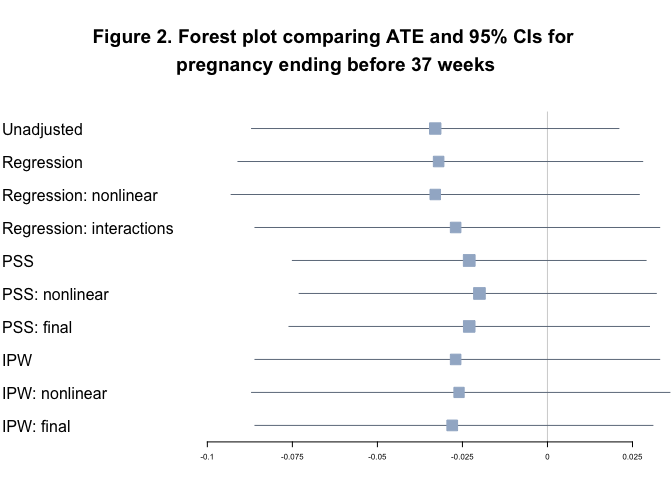

PUBH 7485 Homework 2
================

-   <a href="#create-table-1" id="toc-create-table-1">Create Table 1</a>
-   <a href="#question-2-forest-plot-of-estimates-and-95-cis"
    id="toc-question-2-forest-plot-of-estimates-and-95-cis">Question 2:
    Forest plot of estimates and 95% CIs</a>

``` r
# Read in data
load(here("data", "OPT_Study_PUBH7485_8485_2022.Rdata"))
```

# Create Table 1

``` r
# Pare down variables

opt_causal <- opt_causal %>%
  dplyr::select(Group, Clinic, Age, Black, White, Nat.Am, Education, Public.Asstce, BMI,
                Hypertension, Diabetes, BL.Cig.Day, BL.Drks.Day, N.prev.preg,
                Any.live.ptb.sb.sp.ab.in.ab, N.qualifying.teeth, BL.GE, BL..BOP,
                BL.PD.avg, BL.CAL.avg, BL.Calc.I, BL.Pl.I, Preg.ended...37.wk,
                Birthweight, Preg.ended)


# Vector of variables to summarize
myVars <- c(
  "Clinic", "Age", "Black", "White", "Nat.Am",
  "Asian", "Hisp", "Education", "Public.Asstce", "Hypertension",
  "Diabetes", "BL.Diab.Type", "BMI", "Use.Tob", "BL.Cig.Day", "Use.Alc",
  "BL.Drks.Day", "Drug.Add", "Prev.preg", "N.prev.preg", "Live.PTB",
  "Any.stillbirth", "Spont.ab", "Induced.ab", "Any.live.ptb.sb.sp.ab.in.ab",
  "N.living.kids", "N.qualifying.teeth", "BL.GE", "BL..BOP", "BL.PD.avg",
  "BL..PD.4", "BL..PD.5", "BL.CAL.avg", "BL..CAL.2", "BL..CAL.3",
  "BL.Calc.I", "BL.Pl.I", "Preg.ended...37.wk", "Birthweight"
)

# Vector of categorical variables that need transformation
catVars <- c(
  "Clinic", "Group", "Black", "White", "Nat.Am",
  "Asian", "Hisp", "Education", "Public.Asstce", "Hypertension",
  "Diabetes", "BL.Diab.Type", "Use.Tob", "Use.Alc", "Drug.Add", "Prev.preg", "Live.PTB",
  "Any.stillbirth", "Spont.ab", "Induced.ab", "Any.live.ptb.sb.sp.ab.in.ab", 
  "Preg.ended...37.wk"
)


# Change variable labels
opt_causal <- set_variable_labels(opt_causal,
  Clinic = "Clinic location",
  Age = "Age (y)",
  Black = "Race: Black",
  White = "Race: White",
  Nat.Am = "Race: Native American",
  Education = "Level of Education",
  Public.Asstce = "Received public assistance for delivery",
  Hypertension = "Chronic hypertension at baseline",
  Diabetes = "Diabetes at baseline",
  BMI = "Body mass index",
  BL.Cig.Day = "# cigarettes per day",
  BL.Drks.Day = "# drinks per day",
  N.prev.preg = "# previous pregnancies",
  Any.live.ptb.sb.sp.ab.in.ab = "Previous live pre-term birth, stillbirth,
or spontaneous/induced abortion",
  N.qualifying.teeth = "# of qualifying teeth",
  BL.GE = "Whole-mouth average gingival index",
  BL..BOP = "Fraction of sites bleeding
on probing",
  BL.PD.avg = "Whole-mouth average pocket depth",
  BL.CAL.avg = "Whole-mouth average clinical attachment level",
  BL.Calc.I = "Whole-mouth average calculus index",
  BL.Pl.I = "Whole-mouth average plaque index",
  Preg.ended...37.wk = "Pregnancy ended before 37 weeks",
  Birthweight = "Birth weight (g)"
)

# Create Unweighted Table 1
tabUnmatched <- CreateTableOne(vars = myVars, strata = "Group", data = opt_causal, factorVars = catVars, test = FALSE)

tab1Mat <- print(tabUnmatched, smd = TRUE, showAllLevels = TRUE, exact = "stage", quote = FALSE, noSpaces = TRUE, printToggle = FALSE, varLabels = TRUE)

write.csv(tab1Mat, file = "homework2_table1_unwt.csv")
```

### **Question 1:**

1.  Consider estimating the causal treatment effect using i) propensity
    score stratification and ii) inverse probability weighting (for the
    purposes of this assignment, please use the IPW2 estimator for the
    course notes). For each of these scenarios, please report the
    estimated average (causal) treatment effect, standard error, and 95%
    confidence interval in a table. Please have a separate table for
    each outcome and for each estimation approach (propensity score
    stratification and inverse probability weighting). Note that
    Birth.outcome and GA.at.outcome are additional outcome variables and
    PID is the patient identifier none of which should not be included
    in the regression models.

<!-- -->

1)  Consider a logistic model for treatment assignment with just main
    effect terms for the covariates.
2)  Add in nonlinear terms for the continuous covariates but still no
    interactions.
3)  (BONUS) Consider some other model for treatment assignment such as a
    random forest.
4)  Consider a “final” propensity model to estimate the ATE which may
    include interactions and nonlinear terms. Variable selection may
    also be considered here as well. For this, in addition to providing
    the summary measures of the ATE described above, please describe how
    you arrived at your “final” propensity model.  
5)  Create a line plot of the weighted standardized mean difference
    using the propensity score model from (a) – (d) above as well as the
    unweighted standardized mean difference. Comment on the balance that
    weighting was able to achieve.

``` r
# Function to impute missing values in continuous variables
imp_med <- function(x) {
  ifelse(is.na(x), median(x, na.rm = TRUE), x)
}

# Functions to impute missing values in categorical variables
calc_mode <- function(x) {
  distinct_values <- unique(x)
  distinct_tabulate <- tabulate(match(x, distinct_values))
  distinct_values[which.max(distinct_tabulate)]
}

imp_cat <- function(x) {
  if_else(is.na(x), calc_mode(x), x)
}

# Create vector of continuous variables
cont_vars <- c(
  "Age", "BMI", "BL.Cig.Day", "BL.Drks.Day", "N.prev.preg",
  "BL.GE", "BL..BOP", "BL.PD.avg", "BL.CAL.avg", "BL.Calc.I", "BL.Pl.I", 
  "Birthweight"
)

# Create vector of categorical variables
cat_vars <- c(
  "Clinic", "Black", "White", "Nat.Am", "Education",
  "Public.Asstce", "Hypertension", "Diabetes","Prev.preg", 
  "Any.live.ptb.sb.sp.ab.in.ab", "Preg.ended...37.wk"
)

# Impute median for continuous variables
for (i in cont_vars) {
  opt_causal[[i]] <- imp_med(opt_causal[[i]])
}

# Impute most common category for continuous variables
for (i in cat_vars) {
  opt_causal[[i]] <- imp_cat(opt_causal[[i]])
}

# Check for missing data
opt_causal %>%
  is.na() %>%
  colSums()
```

    ##                       Group                      Clinic 
    ##                           0                           0 
    ##                         Age                       Black 
    ##                           0                           0 
    ##                       White                      Nat.Am 
    ##                           0                           0 
    ##                   Education               Public.Asstce 
    ##                           0                           0 
    ##                         BMI                Hypertension 
    ##                           0                           0 
    ##                    Diabetes                  BL.Cig.Day 
    ##                           0                           0 
    ##                 BL.Drks.Day                 N.prev.preg 
    ##                           0                           0 
    ## Any.live.ptb.sb.sp.ab.in.ab          N.qualifying.teeth 
    ##                           0                           0 
    ##                       BL.GE                     BL..BOP 
    ##                           0                           0 
    ##                   BL.PD.avg                  BL.CAL.avg 
    ##                           0                           0 
    ##                   BL.Calc.I                     BL.Pl.I 
    ##                           0                           0 
    ##          Preg.ended...37.wk                 Birthweight 
    ##                           0                           0 
    ##                  Preg.ended 
    ##                           0

## Get propensity score

``` r
# Create propensity models
# logistic main effects
p1 <- glm(Group ~ (Clinic + Age + Black + White + Nat.Am + Education + Public.Asstce + BMI + Hypertension + Diabetes + BL.Cig.Day + BL.Drks.Day + N.prev.preg + Any.live.ptb.sb.sp.ab.in.ab + N.qualifying.teeth + BL.GE + BL..BOP + BL.PD.avg + BL.CAL.avg + BL.Calc.I + BL.Pl.I), data = opt_causal, family = "binomial")
round(summary(p1)$coefficients, digits = 3)
```

    ##                                Estimate Std. Error z value Pr(>|z|)
    ## (Intercept)                       0.251      1.132   0.222    0.825
    ## ClinicMN                         -0.772      0.429  -1.798    0.072
    ## ClinicMS                         -0.935      0.678  -1.378    0.168
    ## ClinicNY                         -0.641      0.585  -1.096    0.273
    ## Age                              -0.013      0.021  -0.630    0.529
    ## BlackYes                         -0.105      0.479  -0.219    0.827
    ## WhiteYes                         -0.689      0.410  -1.680    0.093
    ## Nat.AmYes                         1.002      0.435   2.302    0.021
    ## EducationLT 8 yrs                -0.300      0.270  -1.112    0.266
    ## EducationMT 12 yrs                0.156      0.252   0.617    0.537
    ## Public.AsstceYes                 -0.189      0.238  -0.793    0.428
    ## BMI                               0.011      0.015   0.733    0.464
    ## HypertensionY                     0.334      0.606   0.552    0.581
    ## DiabetesYes                       0.903      0.555   1.628    0.103
    ## BL.Cig.Day                        0.059      0.032   1.862    0.063
    ## BL.Drks.Day                      -0.057      0.245  -0.233    0.815
    ## N.prev.preg                      -0.031      0.074  -0.421    0.674
    ## Any.live.ptb.sb.sp.ab.in.abYes   -0.257      0.243  -1.058    0.290
    ## N.qualifying.teeth               -0.043      0.026  -1.652    0.098
    ## BL.GE                             0.707      0.508   1.392    0.164
    ## BL..BOP                          -0.004      0.009  -0.442    0.659
    ## BL.PD.avg                        -0.660      0.418  -1.580    0.114
    ## BL.CAL.avg                        0.913      0.373   2.447    0.014
    ## BL.Calc.I                         0.118      0.285   0.414    0.679
    ## BL.Pl.I                          -0.037      0.308  -0.119    0.905

``` r
# Add non-linear terms
p2 <-  glm(Group ~ (Clinic + Age + I(Age^2) + Black + White + Nat.Am + Education + Public.Asstce + BMI + I(BMI^2) + Hypertension + Diabetes + BL.Cig.Day + I(BL.Cig.Day^2) + BL.Drks.Day + I(BL.Drks.Day^2) + N.prev.preg + I(N.prev.preg^2) + Any.live.ptb.sb.sp.ab.in.ab + N.qualifying.teeth + I(N.qualifying.teeth^2) + BL.GE + I(BL.GE^2) + BL..BOP + I(BL..BOP^2) + BL.PD.avg + I(BL.PD.avg^2) + BL.CAL.avg + I(BL.CAL.avg^2) + BL.Calc.I + I(BL.Calc.I^2) + BL.Pl.I + I(BL.Pl.I^2)), data = opt_causal, family = binomial)
round(summary(p2)$coefficients, digits = 3)
```

    ##                                Estimate Std. Error z value Pr(>|z|)
    ## (Intercept)                      -1.658      3.591  -0.462    0.644
    ## ClinicMN                         -0.842      0.504  -1.671    0.095
    ## ClinicMS                         -0.933      0.759  -1.228    0.219
    ## ClinicNY                         -0.655      0.681  -0.962    0.336
    ## Age                              -0.067      0.155  -0.432    0.665
    ## I(Age^2)                          0.001      0.003   0.338    0.735
    ## BlackYes                         -0.180      0.495  -0.364    0.716
    ## WhiteYes                         -0.714      0.425  -1.678    0.093
    ## Nat.AmYes                         1.013      0.445   2.274    0.023
    ## EducationLT 8 yrs                -0.287      0.271  -1.060    0.289
    ## EducationMT 12 yrs                0.177      0.259   0.683    0.495
    ## Public.AsstceYes                 -0.197      0.243  -0.810    0.418
    ## BMI                              -0.010      0.066  -0.149    0.882
    ## I(BMI^2)                          0.000      0.001   0.319    0.750
    ## HypertensionY                     0.393      0.624   0.630    0.529
    ## DiabetesYes                       1.083      0.576   1.880    0.060
    ## BL.Cig.Day                        0.089      0.070   1.264    0.206
    ## I(BL.Cig.Day^2)                  -0.002      0.003  -0.509    0.611
    ## BL.Drks.Day                       0.610      1.384   0.441    0.659
    ## I(BL.Drks.Day^2)                 -0.136      0.292  -0.467    0.640
    ## N.prev.preg                      -0.067      0.156  -0.433    0.665
    ## I(N.prev.preg^2)                  0.007      0.020   0.364    0.716
    ## Any.live.ptb.sb.sp.ab.in.abYes   -0.240      0.257  -0.933    0.351
    ## N.qualifying.teeth               -0.050      0.084  -0.603    0.547
    ## I(N.qualifying.teeth^2)           0.000      0.002   0.029    0.977
    ## BL.GE                             2.693      2.104   1.280    0.201
    ## I(BL.GE^2)                       -0.624      0.641  -0.972    0.331
    ## BL..BOP                          -0.024      0.050  -0.479    0.632
    ## I(BL..BOP^2)                      0.000      0.000   0.310    0.757
    ## BL.PD.avg                         1.257      1.687   0.745    0.456
    ## I(BL.PD.avg^2)                   -0.289      0.245  -1.180    0.238
    ## BL.CAL.avg                        0.233      0.891   0.262    0.793
    ## I(BL.CAL.avg^2)                   0.242      0.237   1.019    0.308
    ## BL.Calc.I                         0.876      0.780   1.123    0.261
    ## I(BL.Calc.I^2)                   -0.301      0.308  -0.979    0.328
    ## BL.Pl.I                          -1.068      0.932  -1.146    0.252
    ## I(BL.Pl.I^2)                      0.397      0.354   1.122    0.262

## Use stepwise selection for final propensity model

``` r
# Full model 1 - adding nonlinear and interaction terms
fullmodel1 <- glm(Group ~ (Clinic + Age + I(Age^2) + Black + White + Nat.Am + Education + Public.Asstce + BMI + I(BMI^2) + Hypertension + Diabetes + BL.Cig.Day + I(BL.Cig.Day^2) + BL.Drks.Day + I(BL.Drks.Day^2) + N.prev.preg + I(N.prev.preg^2) + Any.live.ptb.sb.sp.ab.in.ab + N.qualifying.teeth + I(N.qualifying.teeth^2) + BL.GE + I(BL.GE^2) + BL..BOP + I(BL..BOP^2) + BL.PD.avg + I(BL.PD.avg^2) + BL.CAL.avg + I(BL.CAL.avg^2) + BL.Calc.I + I(BL.Calc.I^2) + BL.Pl.I + I(BL.Pl.I^2) + Group*White + Group*Nat.Am + Group*N.prev.preg + Group*Any.live.ptb.sb.sp.ab.in.ab), data = opt_causal, family = "binomial")

model.stepwise <- step(fullmodel1, direction = "both", scope = list(upper = ~ Clinic + Age + I(Age^2) + Black + White + Nat.Am + Education + Public.Asstce + BMI + I(BMI^2) + Hypertension + Diabetes + BL.Cig.Day + I(BL.Cig.Day^2) + BL.Drks.Day + I(BL.Drks.Day^2) + N.prev.preg + I(N.prev.preg^2) + Any.live.ptb.sb.sp.ab.in.ab + N.qualifying.teeth + I(N.qualifying.teeth^2) + BL.GE + I(BL.GE^2) + BL..BOP + I(BL..BOP^2) + BL.PD.avg + I(BL.PD.avg^2) + BL.CAL.avg + I(BL.CAL.avg^2) + BL.Calc.I + I(BL.Calc.I^2) + BL.Pl.I + I(BL.Pl.I^2) + Group*White + Group*Nat.Am + Group*N.prev.preg + Group*Any.live.ptb.sb.sp.ab.in.ab, lower = ~ 1))
```

    ## Start:  AIC=138
    ## Group ~ (Clinic + Age + I(Age^2) + Black + White + Nat.Am + Education + 
    ##     Public.Asstce + BMI + I(BMI^2) + Hypertension + Diabetes + 
    ##     BL.Cig.Day + I(BL.Cig.Day^2) + BL.Drks.Day + I(BL.Drks.Day^2) + 
    ##     N.prev.preg + I(N.prev.preg^2) + Any.live.ptb.sb.sp.ab.in.ab + 
    ##     N.qualifying.teeth + I(N.qualifying.teeth^2) + BL.GE + I(BL.GE^2) + 
    ##     BL..BOP + I(BL..BOP^2) + BL.PD.avg + I(BL.PD.avg^2) + BL.CAL.avg + 
    ##     I(BL.CAL.avg^2) + BL.Calc.I + I(BL.Calc.I^2) + BL.Pl.I + 
    ##     I(BL.Pl.I^2) + Group * White + Group * Nat.Am + Group * N.prev.preg + 
    ##     Group * Any.live.ptb.sb.sp.ab.in.ab)
    ## 
    ##                                     Df Deviance  AIC
    ## - Clinic                             3       60  136
    ## - BL.Drks.Day                        1       56  136
    ## - I(BL.Drks.Day^2)                   1       56  136
    ## - I(N.prev.preg^2)                   1       56  136
    ## - I(Age^2)                           1       56  136
    ## - Age                                1       56  136
    ## - BL.CAL.avg                         1       56  136
    ## - Diabetes                           1       57  137
    ## - I(N.qualifying.teeth^2)            1       57  137
    ## - I(BL.PD.avg^2)                     1       57  137
    ## - N.qualifying.teeth                 1       57  137
    ## - BL.PD.avg                          1       57  137
    ## - I(BL.CAL.avg^2)                    1       57  137
    ## - I(BMI^2)                           1       58  138
    ## - BMI                                1       58  138
    ## <none>                                       56  138
    ## - Black                              1       58  138
    ## - BL.Cig.Day                         1       61  141
    ## - I(BL.Cig.Day^2)                    1       61  141
    ## - Group:White                        1       98  178
    ## - Group:Nat.Am                       1      111  191
    ## - Group:N.prev.preg                  1      163  243
    ## - Group:Any.live.ptb.sb.sp.ab.in.ab  1     1658 1738
    ## - Hypertension                       1     1802 1882
    ## - I(BL..BOP^2)                       1     2018 2098
    ## - I(BL.Pl.I^2)                       1     2018 2098
    ## - Public.Asstce                      1     2091 2171
    ## - I(BL.GE^2)                         1     2163 2243
    ## - BL.GE                              1     2235 2315
    ## - I(BL.Calc.I^2)                     1     2307 2387
    ## - BL.Pl.I                            1     2307 2387
    ## - BL..BOP                            1     2379 2459
    ## - BL.Calc.I                          1     2379 2459
    ## - Education                          2     2667 2745
    ## 
    ## Step:  AIC=136
    ## Group ~ Age + I(Age^2) + Black + White + Nat.Am + Education + 
    ##     Public.Asstce + BMI + I(BMI^2) + Hypertension + Diabetes + 
    ##     BL.Cig.Day + I(BL.Cig.Day^2) + BL.Drks.Day + I(BL.Drks.Day^2) + 
    ##     N.prev.preg + I(N.prev.preg^2) + Any.live.ptb.sb.sp.ab.in.ab + 
    ##     N.qualifying.teeth + I(N.qualifying.teeth^2) + BL.GE + I(BL.GE^2) + 
    ##     BL..BOP + I(BL..BOP^2) + BL.PD.avg + I(BL.PD.avg^2) + BL.CAL.avg + 
    ##     I(BL.CAL.avg^2) + BL.Calc.I + I(BL.Calc.I^2) + BL.Pl.I + 
    ##     I(BL.Pl.I^2) + Group + Group:White + Group:Nat.Am + Group:N.prev.preg + 
    ##     Group:Any.live.ptb.sb.sp.ab.in.ab
    ## 
    ##                                     Df Deviance  AIC
    ## - I(N.prev.preg^2)                   1       60  134
    ## - BL.Drks.Day                        1       60  134
    ## - I(BL.Drks.Day^2)                   1       60  134
    ## - Group:Any.live.ptb.sb.sp.ab.in.ab  1       60  134
    ## - I(Age^2)                           1       60  134
    ## - I(BL.Pl.I^2)                       1       60  134
    ## - Age                                1       60  134
    ## - BL.Calc.I                          1       60  134
    ## - I(BL..BOP^2)                       1       60  134
    ## - BL..BOP                            1       60  134
    ## - Diabetes                           1       60  134
    ## - Hypertension                       1       60  134
    ## - I(N.qualifying.teeth^2)            1       60  134
    ## - I(BL.PD.avg^2)                     1       60  134
    ## - N.qualifying.teeth                 1       60  134
    ## - Education                          2       62  134
    ## - BL.PD.avg                          1       60  134
    ## - I(BL.Calc.I^2)                     1       60  134
    ## - BL.CAL.avg                         1       61  135
    ## - Public.Asstce                      1       61  135
    ## - BMI                                1       61  135
    ## - I(BMI^2)                           1       61  135
    ## - I(BL.CAL.avg^2)                    1       61  135
    ## <none>                                       60  136
    ## - Black                              1       62  136
    ## + Clinic                             3       56  138
    ## - BL.GE                              1       65  139
    ## - BL.Cig.Day                         1       65  139
    ## - I(BL.Cig.Day^2)                    1       65  139
    ## - Group:White                        1      100  174
    ## - Group:Nat.Am                       1      115  189
    ## - Group:N.prev.preg                  1      170  244
    ## - BL.Pl.I                            1     2018 2092
    ## - I(BL.GE^2)                         1     2091 2165
    ## 
    ## Step:  AIC=134
    ## Group ~ Age + I(Age^2) + Black + White + Nat.Am + Education + 
    ##     Public.Asstce + BMI + I(BMI^2) + Hypertension + Diabetes + 
    ##     BL.Cig.Day + I(BL.Cig.Day^2) + BL.Drks.Day + I(BL.Drks.Day^2) + 
    ##     N.prev.preg + Any.live.ptb.sb.sp.ab.in.ab + N.qualifying.teeth + 
    ##     I(N.qualifying.teeth^2) + BL.GE + I(BL.GE^2) + BL..BOP + 
    ##     I(BL..BOP^2) + BL.PD.avg + I(BL.PD.avg^2) + BL.CAL.avg + 
    ##     I(BL.CAL.avg^2) + BL.Calc.I + I(BL.Calc.I^2) + BL.Pl.I + 
    ##     I(BL.Pl.I^2) + Group + Group:White + Group:Nat.Am + Group:N.prev.preg + 
    ##     Group:Any.live.ptb.sb.sp.ab.in.ab
    ## 
    ##                                     Df Deviance  AIC
    ## - BL.Drks.Day                        1       60  132
    ## - I(BL.Drks.Day^2)                   1       60  132
    ## - Group:Any.live.ptb.sb.sp.ab.in.ab  1       60  132
    ## - I(Age^2)                           1       60  132
    ## - I(BL.Pl.I^2)                       1       60  132
    ## - Age                                1       60  132
    ## - BL.Calc.I                          1       60  132
    ## - I(BL..BOP^2)                       1       60  132
    ## - BL..BOP                            1       60  132
    ## - Diabetes                           1       60  132
    ## - Hypertension                       1       60  132
    ## - I(N.qualifying.teeth^2)            1       60  132
    ## - I(BL.PD.avg^2)                     1       60  132
    ## - BL.Pl.I                            1       60  132
    ## - N.qualifying.teeth                 1       60  132
    ## - Education                          2       62  132
    ## - BL.PD.avg                          1       60  132
    ## - I(BL.Calc.I^2)                     1       60  132
    ## - BL.CAL.avg                         1       61  133
    ## - Public.Asstce                      1       61  133
    ## - BMI                                1       61  133
    ## - I(BMI^2)                           1       61  133
    ## - I(BL.CAL.avg^2)                    1       61  133
    ## <none>                                       60  134
    ## - Black                              1       62  134
    ## + I(N.prev.preg^2)                   1       60  136
    ## + Clinic                             3       56  136
    ## - BL.GE                              1       65  137
    ## - BL.Cig.Day                         1       65  137
    ## - I(BL.Cig.Day^2)                    1       65  137
    ## - I(BL.GE^2)                         1       66  138
    ## - Group:Nat.Am                       1      115  187
    ## - Group:N.prev.preg                  1      171  243
    ## - Group:White                        1     2811 2883
    ## 
    ## Step:  AIC=132
    ## Group ~ Age + I(Age^2) + Black + White + Nat.Am + Education + 
    ##     Public.Asstce + BMI + I(BMI^2) + Hypertension + Diabetes + 
    ##     BL.Cig.Day + I(BL.Cig.Day^2) + I(BL.Drks.Day^2) + N.prev.preg + 
    ##     Any.live.ptb.sb.sp.ab.in.ab + N.qualifying.teeth + I(N.qualifying.teeth^2) + 
    ##     BL.GE + I(BL.GE^2) + BL..BOP + I(BL..BOP^2) + BL.PD.avg + 
    ##     I(BL.PD.avg^2) + BL.CAL.avg + I(BL.CAL.avg^2) + BL.Calc.I + 
    ##     I(BL.Calc.I^2) + BL.Pl.I + I(BL.Pl.I^2) + Group + Group:White + 
    ##     Group:Nat.Am + Group:N.prev.preg + Group:Any.live.ptb.sb.sp.ab.in.ab
    ## 
    ##                                     Df Deviance AIC
    ## - Group:Any.live.ptb.sb.sp.ab.in.ab  1     59.9 130
    ## - I(Age^2)                           1     59.9 130
    ## - I(BL.Pl.I^2)                       1     59.9 130
    ## - Age                                1     59.9 130
    ## - BL.Calc.I                          1     59.9 130
    ## - I(BL..BOP^2)                       1     60.0 130
    ## - BL..BOP                            1     60.0 130
    ## - Diabetes                           1     60.0 130
    ## - Hypertension                       1     60.1 130
    ## - I(N.qualifying.teeth^2)            1     60.1 130
    ## - I(BL.PD.avg^2)                     1     60.2 130
    ## - BL.Pl.I                            1     60.2 130
    ## - N.qualifying.teeth                 1     60.3 130
    ## - Education                          2     62.3 130
    ## - BL.PD.avg                          1     60.4 130
    ## - I(BL.Calc.I^2)                     1     60.4 130
    ## - BL.CAL.avg                         1     60.7 131
    ## - Public.Asstce                      1     60.9 131
    ## - BMI                                1     60.9 131
    ## - I(BMI^2)                           1     61.1 131
    ## - I(BL.CAL.avg^2)                    1     61.3 131
    ## <none>                                     59.9 132
    ## - Black                              1     62.2 132
    ## + BL.Drks.Day                        1     59.9 134
    ## + I(N.prev.preg^2)                   1     59.9 134
    ## + Clinic                             3     56.0 134
    ## - I(BL.Drks.Day^2)                   1     64.4 134
    ## - BL.GE                              1     65.1 135
    ## - BL.Cig.Day                         1     65.2 135
    ## - I(BL.Cig.Day^2)                    1     65.5 136
    ## - I(BL.GE^2)                         1     66.4 136
    ## - Group:White                        1    101.2 171
    ## - Group:Nat.Am                       1    114.5 184
    ## - Group:N.prev.preg                  1    170.7 241
    ## 
    ## Step:  AIC=130
    ## Group ~ Age + I(Age^2) + Black + White + Nat.Am + Education + 
    ##     Public.Asstce + BMI + I(BMI^2) + Hypertension + Diabetes + 
    ##     BL.Cig.Day + I(BL.Cig.Day^2) + I(BL.Drks.Day^2) + N.prev.preg + 
    ##     Any.live.ptb.sb.sp.ab.in.ab + N.qualifying.teeth + I(N.qualifying.teeth^2) + 
    ##     BL.GE + I(BL.GE^2) + BL..BOP + I(BL..BOP^2) + BL.PD.avg + 
    ##     I(BL.PD.avg^2) + BL.CAL.avg + I(BL.CAL.avg^2) + BL.Calc.I + 
    ##     I(BL.Calc.I^2) + BL.Pl.I + I(BL.Pl.I^2) + Group + Group:White + 
    ##     Group:Nat.Am + Group:N.prev.preg
    ## 
    ##                                     Df Deviance  AIC
    ## - Any.live.ptb.sb.sp.ab.in.ab        1       60  128
    ## - I(Age^2)                           1       60  128
    ## - I(BL.Pl.I^2)                       1       60  128
    ## - Age                                1       60  128
    ## - BL.Calc.I                          1       60  128
    ## - I(BL..BOP^2)                       1       60  128
    ## - BL..BOP                            1       60  128
    ## - Diabetes                           1       60  128
    ## - Hypertension                       1       60  128
    ## - I(N.qualifying.teeth^2)            1       60  128
    ## - I(BL.PD.avg^2)                     1       60  128
    ## - BL.Pl.I                            1       60  128
    ## - N.qualifying.teeth                 1       60  128
    ## - Education                          2       62  128
    ## - BL.PD.avg                          1       60  128
    ## - I(BL.Calc.I^2)                     1       60  128
    ## - BL.CAL.avg                         1       61  129
    ## - Public.Asstce                      1       61  129
    ## - BMI                                1       61  129
    ## - I(BMI^2)                           1       61  129
    ## - I(BL.CAL.avg^2)                    1       61  129
    ## <none>                                       60  130
    ## + Group:Any.live.ptb.sb.sp.ab.in.ab  1       60  132
    ## + BL.Drks.Day                        1       60  132
    ## + I(N.prev.preg^2)                   1       60  132
    ## + Clinic                             3       56  132
    ## - I(BL.Drks.Day^2)                   1       64  132
    ## - BL.GE                              1       65  133
    ## - BL.Cig.Day                         1       65  133
    ## - I(BL.Cig.Day^2)                    1       65  133
    ## - I(BL.GE^2)                         1       66  134
    ## - Group:White                        1      101  169
    ## - Group:Nat.Am                       1      115  183
    ## - Group:N.prev.preg                  1      291  359
    ## - Black                              1     2235 2303
    ## 
    ## Step:  AIC=128
    ## Group ~ Age + I(Age^2) + Black + White + Nat.Am + Education + 
    ##     Public.Asstce + BMI + I(BMI^2) + Hypertension + Diabetes + 
    ##     BL.Cig.Day + I(BL.Cig.Day^2) + I(BL.Drks.Day^2) + N.prev.preg + 
    ##     N.qualifying.teeth + I(N.qualifying.teeth^2) + BL.GE + I(BL.GE^2) + 
    ##     BL..BOP + I(BL..BOP^2) + BL.PD.avg + I(BL.PD.avg^2) + BL.CAL.avg + 
    ##     I(BL.CAL.avg^2) + BL.Calc.I + I(BL.Calc.I^2) + BL.Pl.I + 
    ##     I(BL.Pl.I^2) + Group + Group:White + Group:Nat.Am + Group:N.prev.preg
    ## 
    ##                               Df Deviance  AIC
    ## - I(Age^2)                     1       60  126
    ## - I(BL.Pl.I^2)                 1       60  126
    ## - Age                          1       60  126
    ## - BL.Calc.I                    1       60  126
    ## - I(BL..BOP^2)                 1       60  126
    ## - BL..BOP                      1       60  126
    ## - Hypertension                 1       60  126
    ## - I(N.qualifying.teeth^2)      1       60  126
    ## - I(BL.PD.avg^2)               1       60  126
    ## - BL.Pl.I                      1       60  126
    ## - N.qualifying.teeth           1       60  126
    ## - Education                    2       62  126
    ## - BL.PD.avg                    1       60  126
    ## - I(BL.Calc.I^2)               1       60  126
    ## - BL.CAL.avg                   1       61  127
    ## - Public.Asstce                1       61  127
    ## - BMI                          1       61  127
    ## - I(BMI^2)                     1       61  127
    ## <none>                                 60  128
    ## - Black                        1       62  128
    ## + Any.live.ptb.sb.sp.ab.in.ab  1       60  130
    ## + BL.Drks.Day                  1       60  130
    ## + Clinic                       3       56  130
    ## - I(BL.Drks.Day^2)             1       64  130
    ## - BL.GE                        1       65  131
    ## - BL.Cig.Day                   1       65  131
    ## - I(BL.Cig.Day^2)              1       65  131
    ## - I(BL.GE^2)                   1       66  132
    ## - Group:White                  1      101  167
    ## - Group:Nat.Am                 1      115  181
    ## - Group:N.prev.preg            1      296  362
    ## - Diabetes                     1     1946 2012
    ## + I(N.prev.preg^2)             1     2091 2161
    ## - I(BL.CAL.avg^2)              1     2235 2301
    ## 
    ## Step:  AIC=126
    ## Group ~ Age + Black + White + Nat.Am + Education + Public.Asstce + 
    ##     BMI + I(BMI^2) + Hypertension + Diabetes + BL.Cig.Day + I(BL.Cig.Day^2) + 
    ##     I(BL.Drks.Day^2) + N.prev.preg + N.qualifying.teeth + I(N.qualifying.teeth^2) + 
    ##     BL.GE + I(BL.GE^2) + BL..BOP + I(BL..BOP^2) + BL.PD.avg + 
    ##     I(BL.PD.avg^2) + BL.CAL.avg + I(BL.CAL.avg^2) + BL.Calc.I + 
    ##     I(BL.Calc.I^2) + BL.Pl.I + I(BL.Pl.I^2) + Group + Group:White + 
    ##     Group:Nat.Am + Group:N.prev.preg
    ## 
    ##                               Df Deviance  AIC
    ## - I(BL.Pl.I^2)                 1       60  124
    ## - BL.Calc.I                    1       60  124
    ## - I(BL..BOP^2)                 1       60  124
    ## - BL..BOP                      1       60  124
    ## - Hypertension                 1       60  124
    ## - I(N.qualifying.teeth^2)      1       60  124
    ## - BL.Pl.I                      1       60  124
    ## - N.qualifying.teeth           1       60  124
    ## - Education                    2       62  124
    ## - BL.PD.avg                    1       60  124
    ## - I(BL.Calc.I^2)               1       60  124
    ## - Age                          1       61  125
    ## - Public.Asstce                1       61  125
    ## - BMI                          1       61  125
    ## - I(BMI^2)                     1       61  125
    ## <none>                                 60  126
    ## - Black                        1       62  126
    ## + I(Age^2)                     1       60  128
    ## + Any.live.ptb.sb.sp.ab.in.ab  1       60  128
    ## + BL.Drks.Day                  1       60  128
    ## + Clinic                       3       56  128
    ## - I(BL.Drks.Day^2)             1       64  128
    ## - BL.GE                        1       65  129
    ## - BL.Cig.Day                   1       65  129
    ## - I(BL.Cig.Day^2)              1       66  130
    ## - I(BL.GE^2)                   1       66  130
    ## - Group:White                  1      101  165
    ## - Group:Nat.Am                 1      116  180
    ## - Group:N.prev.preg            1      296  360
    ## - BL.CAL.avg                   1     1802 1866
    ## - I(BL.PD.avg^2)               1     1874 1938
    ## - I(BL.CAL.avg^2)              1     1874 1938
    ## - Diabetes                     1     2163 2227
    ## + I(N.prev.preg^2)             1     2163 2231
    ## 
    ## Step:  AIC=124
    ## Group ~ Age + Black + White + Nat.Am + Education + Public.Asstce + 
    ##     BMI + I(BMI^2) + Hypertension + Diabetes + BL.Cig.Day + I(BL.Cig.Day^2) + 
    ##     I(BL.Drks.Day^2) + N.prev.preg + N.qualifying.teeth + I(N.qualifying.teeth^2) + 
    ##     BL.GE + I(BL.GE^2) + BL..BOP + I(BL..BOP^2) + BL.PD.avg + 
    ##     I(BL.PD.avg^2) + BL.CAL.avg + I(BL.CAL.avg^2) + BL.Calc.I + 
    ##     I(BL.Calc.I^2) + BL.Pl.I + Group + Group:White + Group:Nat.Am + 
    ##     Group:N.prev.preg
    ## 
    ##                               Df Deviance AIC
    ## - I(BL..BOP^2)                 1     60.0 122
    ## - BL.Calc.I                    1     60.0 122
    ## - BL..BOP                      1     60.0 122
    ## - Hypertension                 1     60.1 122
    ## - Diabetes                     1     60.1 122
    ## - I(N.qualifying.teeth^2)      1     60.2 122
    ## - I(BL.PD.avg^2)               1     60.3 122
    ## - N.qualifying.teeth           1     60.4 122
    ## - I(BL.Calc.I^2)               1     60.5 123
    ## - BL.PD.avg                    1     60.6 123
    ## - Education                    2     62.7 123
    ## - Age                          1     60.7 123
    ## - BL.CAL.avg                   1     60.8 123
    ## - BMI                          1     60.9 123
    ## - Public.Asstce                1     61.1 123
    ## - BL.Pl.I                      1     61.1 123
    ## - I(BMI^2)                     1     61.2 123
    ## - I(BL.CAL.avg^2)              1     61.4 123
    ## <none>                               59.9 124
    ## - Black                        1     62.3 124
    ## + I(BL.Pl.I^2)                 1     59.9 126
    ## + I(Age^2)                     1     59.9 126
    ## + BL.Drks.Day                  1     59.9 126
    ## + Any.live.ptb.sb.sp.ab.in.ab  1     59.9 126
    ## + I(N.prev.preg^2)             1     59.9 126
    ## + Clinic                       3     56.1 126
    ## - BL.GE                        1     65.3 127
    ## - I(BL.Drks.Day^2)             1     65.7 128
    ## - BL.Cig.Day                   1     66.0 128
    ## - I(BL.GE^2)                   1     66.7 129
    ## - I(BL.Cig.Day^2)              1     66.7 129
    ## - Group:White                  1    104.5 167
    ## - Group:Nat.Am                 1    118.5 181
    ## - Group:N.prev.preg            1    295.9 358
    ## 
    ## Step:  AIC=122
    ## Group ~ Age + Black + White + Nat.Am + Education + Public.Asstce + 
    ##     BMI + I(BMI^2) + Hypertension + Diabetes + BL.Cig.Day + I(BL.Cig.Day^2) + 
    ##     I(BL.Drks.Day^2) + N.prev.preg + N.qualifying.teeth + I(N.qualifying.teeth^2) + 
    ##     BL.GE + I(BL.GE^2) + BL..BOP + BL.PD.avg + I(BL.PD.avg^2) + 
    ##     BL.CAL.avg + I(BL.CAL.avg^2) + BL.Calc.I + I(BL.Calc.I^2) + 
    ##     BL.Pl.I + Group + Group:White + Group:Nat.Am + Group:N.prev.preg
    ## 
    ##                               Df Deviance AIC
    ## - BL..BOP                      1     60.1 120
    ## - BL.Calc.I                    1     60.2 120
    ## - Diabetes                     1     60.2 120
    ## - I(N.qualifying.teeth^2)      1     60.3 120
    ## - Hypertension                 1     60.4 120
    ## - N.qualifying.teeth           1     60.5 121
    ## - I(BL.PD.avg^2)               1     60.6 121
    ## - Age                          1     60.8 121
    ## - I(BL.Calc.I^2)               1     60.8 121
    ## - BL.CAL.avg                   1     60.8 121
    ## - BL.PD.avg                    1     60.9 121
    ## - Education                    2     63.1 121
    ## - BL.Pl.I                      1     61.1 121
    ## - Public.Asstce                1     61.2 121
    ## - BMI                          1     61.4 121
    ## - I(BL.CAL.avg^2)              1     61.5 121
    ## - I(BMI^2)                     1     61.8 122
    ## <none>                               60.0 122
    ## - Black                        1     62.4 122
    ## + I(BL..BOP^2)                 1     59.9 124
    ## + I(BL.Pl.I^2)                 1     60.0 124
    ## + I(Age^2)                     1     60.0 124
    ## + BL.Drks.Day                  1     60.0 124
    ## + Any.live.ptb.sb.sp.ab.in.ab  1     60.0 124
    ## + I(N.prev.preg^2)             1     60.0 124
    ## + Clinic                       3     56.1 124
    ## - I(BL.Drks.Day^2)             1     66.3 126
    ## - BL.Cig.Day                   1     66.4 126
    ## - BL.GE                        1     66.6 127
    ## - I(BL.Cig.Day^2)              1     67.1 127
    ## - I(BL.GE^2)                   1     68.2 128
    ## - Group:White                  1    104.6 165
    ## - Group:Nat.Am                 1    118.5 179
    ## - Group:N.prev.preg            1    296.9 357
    ## 
    ## Step:  AIC=120
    ## Group ~ Age + Black + White + Nat.Am + Education + Public.Asstce + 
    ##     BMI + I(BMI^2) + Hypertension + Diabetes + BL.Cig.Day + I(BL.Cig.Day^2) + 
    ##     I(BL.Drks.Day^2) + N.prev.preg + N.qualifying.teeth + I(N.qualifying.teeth^2) + 
    ##     BL.GE + I(BL.GE^2) + BL.PD.avg + I(BL.PD.avg^2) + BL.CAL.avg + 
    ##     I(BL.CAL.avg^2) + BL.Calc.I + I(BL.Calc.I^2) + BL.Pl.I + 
    ##     Group + Group:White + Group:Nat.Am + Group:N.prev.preg
    ## 
    ##                               Df Deviance AIC
    ## - BL.Calc.I                    1     60.2 118
    ## - Diabetes                     1     60.3 118
    ## - I(N.qualifying.teeth^2)      1     60.3 118
    ## - Hypertension                 1     60.4 118
    ## - N.qualifying.teeth           1     60.5 119
    ## - I(BL.PD.avg^2)               1     60.6 119
    ## - I(BL.Calc.I^2)               1     60.8 119
    ## - Age                          1     60.8 119
    ## - BL.CAL.avg                   1     60.8 119
    ## - BL.PD.avg                    1     60.9 119
    ## - Education                    2     63.1 119
    ## - Public.Asstce                1     61.2 119
    ## - BL.Pl.I                      1     61.3 119
    ## - BMI                          1     61.4 119
    ## - I(BL.CAL.avg^2)              1     61.5 119
    ## - I(BMI^2)                     1     61.8 120
    ## <none>                               60.1 120
    ## - Black                        1     62.4 120
    ## + I(BL.Pl.I^2)                 1     60.0 122
    ## + BL..BOP                      1     60.0 122
    ## + I(BL..BOP^2)                 1     60.0 122
    ## + I(Age^2)                     1     60.0 122
    ## + BL.Drks.Day                  1     60.1 122
    ## + Any.live.ptb.sb.sp.ab.in.ab  1     60.1 122
    ## + I(N.prev.preg^2)             1     60.1 122
    ## + Clinic                       3     56.3 122
    ## - I(BL.Drks.Day^2)             1     66.5 125
    ## - BL.Cig.Day                   1     66.6 125
    ## - BL.GE                        1     66.7 125
    ## - I(BL.Cig.Day^2)              1     67.3 125
    ## - I(BL.GE^2)                   1     68.2 126
    ## - Group:White                  1    105.0 163
    ## - Group:Nat.Am                 1    118.6 177
    ## - Group:N.prev.preg            1    297.9 356
    ## 
    ## Step:  AIC=118
    ## Group ~ Age + Black + White + Nat.Am + Education + Public.Asstce + 
    ##     BMI + I(BMI^2) + Hypertension + Diabetes + BL.Cig.Day + I(BL.Cig.Day^2) + 
    ##     I(BL.Drks.Day^2) + N.prev.preg + N.qualifying.teeth + I(N.qualifying.teeth^2) + 
    ##     BL.GE + I(BL.GE^2) + BL.PD.avg + I(BL.PD.avg^2) + BL.CAL.avg + 
    ##     I(BL.CAL.avg^2) + I(BL.Calc.I^2) + BL.Pl.I + Group + Group:White + 
    ##     Group:Nat.Am + Group:N.prev.preg
    ## 
    ##                               Df Deviance  AIC
    ## - Diabetes                     1       61  117
    ## - Hypertension                 1       61  117
    ## - I(N.qualifying.teeth^2)      1       61  117
    ## - Age                          1       61  117
    ## - N.qualifying.teeth           1       61  117
    ## - I(BL.PD.avg^2)               1       61  117
    ## - Education                    2       63  117
    ## - BL.CAL.avg                   1       61  117
    ## - BL.Pl.I                      1       61  117
    ## - BL.PD.avg                    1       61  117
    ## - Public.Asstce                1       61  117
    ## - I(BL.CAL.avg^2)              1       62  118
    ## - BMI                          1       62  118
    ## <none>                                 60  118
    ## - I(BMI^2)                     1       62  118
    ## - I(BL.Calc.I^2)               1       62  118
    ## - Black                        1       63  119
    ## + BL.Calc.I                    1       60  120
    ## + I(BL.Pl.I^2)                 1       60  120
    ## + BL..BOP                      1       60  120
    ## + I(Age^2)                     1       60  120
    ## + I(BL..BOP^2)                 1       60  120
    ## + Any.live.ptb.sb.sp.ab.in.ab  1       60  120
    ## + BL.Drks.Day                  1       60  120
    ## + Clinic                       3       56  120
    ## - BL.Cig.Day                   1       67  123
    ## - BL.GE                        1       67  123
    ## - I(BL.Drks.Day^2)             1       67  123
    ## - I(BL.Cig.Day^2)              1       67  123
    ## - I(BL.GE^2)                   1       68  124
    ## - Group:White                  1      105  161
    ## - Group:Nat.Am                 1      119  175
    ## - Group:N.prev.preg            1      299  355
    ## + I(N.prev.preg^2)             1     2235 2295
    ## 
    ## Step:  AIC=117
    ## Group ~ Age + Black + White + Nat.Am + Education + Public.Asstce + 
    ##     BMI + I(BMI^2) + Hypertension + BL.Cig.Day + I(BL.Cig.Day^2) + 
    ##     I(BL.Drks.Day^2) + N.prev.preg + N.qualifying.teeth + I(N.qualifying.teeth^2) + 
    ##     BL.GE + I(BL.GE^2) + BL.PD.avg + I(BL.PD.avg^2) + BL.CAL.avg + 
    ##     I(BL.CAL.avg^2) + I(BL.Calc.I^2) + BL.Pl.I + Group + Group:White + 
    ##     Group:Nat.Am + Group:N.prev.preg
    ## 
    ##                               Df Deviance AIC
    ## - I(N.qualifying.teeth^2)      1     60.9 115
    ## - Hypertension                 1     60.9 115
    ## - I(BL.PD.avg^2)               1     61.1 115
    ## - N.qualifying.teeth           1     61.2 115
    ## - BL.PD.avg                    1     61.4 115
    ## - BL.CAL.avg                   1     61.5 115
    ## - Education                    2     63.5 116
    ## - Age                          1     61.6 116
    ## - Public.Asstce                1     61.8 116
    ## - BL.Pl.I                      1     61.9 116
    ## - BMI                          1     62.1 116
    ## - I(BL.CAL.avg^2)              1     62.1 116
    ## - I(BMI^2)                     1     62.4 116
    ## <none>                               60.5 117
    ## - Black                        1     62.7 117
    ## + Diabetes                     1     60.2 118
    ## - I(BL.Calc.I^2)               1     64.2 118
    ## + BL.Calc.I                    1     60.3 118
    ## + I(BL.Pl.I^2)                 1     60.4 118
    ## + BL..BOP                      1     60.5 119
    ## + I(Age^2)                     1     60.5 119
    ## + I(BL..BOP^2)                 1     60.5 119
    ## + Any.live.ptb.sb.sp.ab.in.ab  1     60.5 119
    ## + BL.Drks.Day                  1     60.5 119
    ## + I(N.prev.preg^2)             1     60.5 119
    ## + Clinic                       3     57.2 119
    ## - BL.Cig.Day                   1     67.4 121
    ## - I(BL.Drks.Day^2)             1     67.5 121
    ## - BL.GE                        1     67.8 122
    ## - I(BL.Cig.Day^2)              1     68.2 122
    ## - I(BL.GE^2)                   1     69.4 123
    ## - Group:White                  1    105.5 160
    ## - Group:Nat.Am                 1    119.3 173
    ## - Group:N.prev.preg            1    300.1 354
    ## 
    ## Step:  AIC=115
    ## Group ~ Age + Black + White + Nat.Am + Education + Public.Asstce + 
    ##     BMI + I(BMI^2) + Hypertension + BL.Cig.Day + I(BL.Cig.Day^2) + 
    ##     I(BL.Drks.Day^2) + N.prev.preg + N.qualifying.teeth + BL.GE + 
    ##     I(BL.GE^2) + BL.PD.avg + I(BL.PD.avg^2) + BL.CAL.avg + I(BL.CAL.avg^2) + 
    ##     I(BL.Calc.I^2) + BL.Pl.I + Group + Group:White + Group:Nat.Am + 
    ##     Group:N.prev.preg
    ## 
    ##                               Df Deviance AIC
    ## - Hypertension                 1     61.1 113
    ## - I(BL.PD.avg^2)               1     61.1 113
    ## - BL.PD.avg                    1     61.4 113
    ## - BL.CAL.avg                   1     61.5 114
    ## - Education                    2     63.6 114
    ## - N.qualifying.teeth           1     61.7 114
    ## - I(BL.CAL.avg^2)              1     62.1 114
    ## - BMI                          1     62.2 114
    ## - Age                          1     62.4 114
    ## - I(BMI^2)                     1     62.5 115
    ## - Public.Asstce                1     62.5 115
    ## <none>                               60.9 115
    ## - Black                        1     63.1 115
    ## - BL.Pl.I                      1     63.4 115
    ## + BL.Calc.I                    1     60.5 116
    ## + I(N.qualifying.teeth^2)      1     60.5 117
    ## + Diabetes                     1     60.6 117
    ## + I(BL.Pl.I^2)                 1     60.7 117
    ## - I(BL.Calc.I^2)               1     64.9 117
    ## + I(Age^2)                     1     60.9 117
    ## + I(BL..BOP^2)                 1     60.9 117
    ## + BL..BOP                      1     60.9 117
    ## + Any.live.ptb.sb.sp.ab.in.ab  1     60.9 117
    ## + I(N.prev.preg^2)             1     60.9 117
    ## + BL.Drks.Day                  1     60.9 117
    ## + Clinic                       3     57.9 118
    ## - I(BL.Drks.Day^2)             1     67.6 120
    ## - BL.Cig.Day                   1     67.7 120
    ## - BL.GE                        1     68.0 120
    ## - I(BL.Cig.Day^2)              1     68.5 121
    ## - I(BL.GE^2)                   1     69.7 122
    ## - Group:White                  1    105.7 158
    ## - Group:Nat.Am                 1    119.6 172
    ## - Group:N.prev.preg            1    300.3 352
    ## 
    ## Step:  AIC=113
    ## Group ~ Age + Black + White + Nat.Am + Education + Public.Asstce + 
    ##     BMI + I(BMI^2) + BL.Cig.Day + I(BL.Cig.Day^2) + I(BL.Drks.Day^2) + 
    ##     N.prev.preg + N.qualifying.teeth + BL.GE + I(BL.GE^2) + BL.PD.avg + 
    ##     I(BL.PD.avg^2) + BL.CAL.avg + I(BL.CAL.avg^2) + I(BL.Calc.I^2) + 
    ##     BL.Pl.I + Group + Group:White + Group:Nat.Am + Group:N.prev.preg
    ## 
    ##                               Df Deviance AIC
    ## - I(BL.PD.avg^2)               1     61.3 111
    ## - BL.PD.avg                    1     61.6 112
    ## - BL.CAL.avg                   1     61.7 112
    ## - Education                    2     63.7 112
    ## - BMI                          1     62.2 112
    ## - I(BL.CAL.avg^2)              1     62.2 112
    ## - N.qualifying.teeth           1     62.2 112
    ## - I(BMI^2)                     1     62.6 113
    ## - Age                          1     62.7 113
    ## - Public.Asstce                1     62.9 113
    ## <none>                               61.1 113
    ## - Black                        1     63.2 113
    ## - BL.Pl.I                      1     63.7 114
    ## + BL.Calc.I                    1     60.7 115
    ## + Diabetes                     1     60.8 115
    ## + Hypertension                 1     60.9 115
    ## + I(N.qualifying.teeth^2)      1     60.9 115
    ## - I(BL.Calc.I^2)               1     65.0 115
    ## + I(BL.Pl.I^2)                 1     61.0 115
    ## + I(BL..BOP^2)                 1     61.1 115
    ## + I(Age^2)                     1     61.1 115
    ## + BL..BOP                      1     61.1 115
    ## + BL.Drks.Day                  1     61.1 115
    ## + I(N.prev.preg^2)             1     61.1 115
    ## + Any.live.ptb.sb.sp.ab.in.ab  1     61.1 115
    ## + Clinic                       3     58.1 116
    ## - I(BL.Drks.Day^2)             1     67.6 118
    ## - BL.Cig.Day                   1     67.8 118
    ## - BL.GE                        1     68.0 118
    ## - I(BL.Cig.Day^2)              1     68.6 119
    ## - I(BL.GE^2)                   1     69.7 120
    ## - Group:White                  1    105.9 156
    ## - Group:Nat.Am                 1    120.0 170
    ## - Group:N.prev.preg            1    300.3 350
    ## 
    ## Step:  AIC=111
    ## Group ~ Age + Black + White + Nat.Am + Education + Public.Asstce + 
    ##     BMI + I(BMI^2) + BL.Cig.Day + I(BL.Cig.Day^2) + I(BL.Drks.Day^2) + 
    ##     N.prev.preg + N.qualifying.teeth + BL.GE + I(BL.GE^2) + BL.PD.avg + 
    ##     BL.CAL.avg + I(BL.CAL.avg^2) + I(BL.Calc.I^2) + BL.Pl.I + 
    ##     Group + Group:White + Group:Nat.Am + Group:N.prev.preg
    ## 
    ##                               Df Deviance  AIC
    ## - Education                    2       64  110
    ## - BL.CAL.avg                   1       62  110
    ## - BMI                          1       62  110
    ## - N.qualifying.teeth           1       62  110
    ## - I(BL.CAL.avg^2)              1       63  111
    ## - I(BMI^2)                     1       63  111
    ## - Public.Asstce                1       63  111
    ## - Age                          1       63  111
    ## - Black                        1       63  111
    ## <none>                                 61  111
    ## - BL.PD.avg                    1       64  112
    ## - BL.Pl.I                      1       65  113
    ## + BL.Calc.I                    1       61  113
    ## + I(BL.PD.avg^2)               1       61  113
    ## + Hypertension                 1       61  113
    ## + I(BL..BOP^2)                 1       61  113
    ## + Diabetes                     1       61  113
    ## + I(Age^2)                     1       61  113
    ## + BL..BOP                      1       61  113
    ## - I(BL.Calc.I^2)               1       65  113
    ## + I(N.qualifying.teeth^2)      1       61  113
    ## + Any.live.ptb.sb.sp.ab.in.ab  1       61  113
    ## + BL.Drks.Day                  1       61  113
    ## + I(N.prev.preg^2)             1       61  113
    ## + Clinic                       3       58  114
    ## - I(BL.Drks.Day^2)             1       68  116
    ## - BL.GE                        1       68  116
    ## - BL.Cig.Day                   1       68  116
    ## - I(BL.Cig.Day^2)              1       69  117
    ## - I(BL.GE^2)                   1       70  118
    ## - Group:White                  1      107  155
    ## - Group:Nat.Am                 1      123  171
    ## - Group:N.prev.preg            1      301  349
    ## + I(BL.Pl.I^2)                 1     2018 2070
    ## 
    ## Step:  AIC=110
    ## Group ~ Age + Black + White + Nat.Am + Public.Asstce + BMI + 
    ##     I(BMI^2) + BL.Cig.Day + I(BL.Cig.Day^2) + I(BL.Drks.Day^2) + 
    ##     N.prev.preg + N.qualifying.teeth + BL.GE + I(BL.GE^2) + BL.PD.avg + 
    ##     BL.CAL.avg + I(BL.CAL.avg^2) + I(BL.Calc.I^2) + BL.Pl.I + 
    ##     Group + Group:White + Group:Nat.Am + Group:N.prev.preg
    ## 
    ##                               Df Deviance AIC
    ## - BL.CAL.avg                   1     64.0 108
    ## - I(BL.CAL.avg^2)              1     64.3 108
    ## - N.qualifying.teeth           1     64.6 109
    ## - Public.Asstce                1     64.8 109
    ## - BMI                          1     65.2 109
    ## - I(BMI^2)                     1     65.6 110
    ## - BL.PD.avg                    1     65.6 110
    ## <none>                               63.8 110
    ## - Age                          1     66.1 110
    ## + Clinic                       3     58.7 111
    ## - Black                        1     66.9 111
    ## + Education                    2     61.3 111
    ## + I(BL.Pl.I^2)                 1     63.4 111
    ## - I(BL.Calc.I^2)               1     67.4 111
    ## + Diabetes                     1     63.6 112
    ## + Hypertension                 1     63.6 112
    ## + BL.Calc.I                    1     63.6 112
    ## + I(BL..BOP^2)                 1     63.7 112
    ## + I(BL.PD.avg^2)               1     63.7 112
    ## + I(Age^2)                     1     63.8 112
    ## + BL..BOP                      1     63.8 112
    ## + I(N.qualifying.teeth^2)      1     63.8 112
    ## + Any.live.ptb.sb.sp.ab.in.ab  1     63.8 112
    ## + BL.Drks.Day                  1     63.8 112
    ## + I(N.prev.preg^2)             1     63.8 112
    ## - BL.Pl.I                      1     69.6 114
    ## - BL.GE                        1     70.2 114
    ## - I(BL.Drks.Day^2)             1     70.7 115
    ## - BL.Cig.Day                   1     71.0 115
    ## - I(BL.GE^2)                   1     71.7 116
    ## - I(BL.Cig.Day^2)              1     71.8 116
    ## - Group:White                  1    108.1 152
    ## - Group:Nat.Am                 1    124.6 169
    ## - Group:N.prev.preg            1    300.8 345
    ## 
    ## Step:  AIC=108
    ## Group ~ Age + Black + White + Nat.Am + Public.Asstce + BMI + 
    ##     I(BMI^2) + BL.Cig.Day + I(BL.Cig.Day^2) + I(BL.Drks.Day^2) + 
    ##     N.prev.preg + N.qualifying.teeth + BL.GE + I(BL.GE^2) + BL.PD.avg + 
    ##     I(BL.CAL.avg^2) + I(BL.Calc.I^2) + BL.Pl.I + Group + Group:White + 
    ##     Group:Nat.Am + Group:N.prev.preg
    ## 
    ##                               Df Deviance  AIC
    ## - N.qualifying.teeth           1       65  107
    ## - Public.Asstce                1       65  107
    ## - BL.PD.avg                    1       66  108
    ## <none>                                 64  108
    ## - I(BL.CAL.avg^2)              1       66  108
    ## - I(BMI^2)                     1       66  108
    ## - Age                          1       66  108
    ## + Clinic                       3       59  109
    ## - Black                        1       67  109
    ## + BL.CAL.avg                   1       64  110
    ## + BL.Calc.I                    1       64  110
    ## + Diabetes                     1       64  110
    ## - I(BL.Calc.I^2)               1       68  110
    ## + Hypertension                 1       64  110
    ## + I(BL..BOP^2)                 1       64  110
    ## + I(BL.PD.avg^2)               1       64  110
    ## + Education                    2       62  110
    ## + I(N.qualifying.teeth^2)      1       64  110
    ## + BL..BOP                      1       64  110
    ## + I(Age^2)                     1       64  110
    ## + Any.live.ptb.sb.sp.ab.in.ab  1       64  110
    ## + BL.Drks.Day                  1       64  110
    ## + I(N.prev.preg^2)             1       64  110
    ## - BL.Pl.I                      1       70  112
    ## - I(BL.Drks.Day^2)             1       71  113
    ## - BL.Cig.Day                   1       72  114
    ## - BL.GE                        1       72  114
    ## - I(BL.Cig.Day^2)              1       72  114
    ## - I(BL.GE^2)                   1       74  116
    ## - Group:White                  1      109  151
    ## - Group:Nat.Am                 1      126  168
    ## - Group:N.prev.preg            1      301  343
    ## + I(BL.Pl.I^2)                 1     1802 1848
    ## - BMI                          1     2595 2637
    ## 
    ## Step:  AIC=107
    ## Group ~ Age + Black + White + Nat.Am + Public.Asstce + BMI + 
    ##     I(BMI^2) + BL.Cig.Day + I(BL.Cig.Day^2) + I(BL.Drks.Day^2) + 
    ##     N.prev.preg + BL.GE + I(BL.GE^2) + BL.PD.avg + I(BL.CAL.avg^2) + 
    ##     I(BL.Calc.I^2) + BL.Pl.I + Group + Group:White + Group:Nat.Am + 
    ##     Group:N.prev.preg
    ## 
    ##                               Df Deviance AIC
    ## - BL.PD.avg                    1     65.7 106
    ## - Public.Asstce                1     65.9 106
    ## - BMI                          1     66.1 106
    ## - I(BMI^2)                     1     66.5 106
    ## <none>                               64.7 107
    ## - Age                          1     66.9 107
    ## + Clinic                       3     59.4 107
    ## - I(BL.CAL.avg^2)              1     67.9 108
    ## + I(BL.Pl.I^2)                 1     63.9 108
    ## + I(N.qualifying.teeth^2)      1     64.0 108
    ## + N.qualifying.teeth           1     64.0 108
    ## - I(BL.Calc.I^2)               1     68.2 108
    ## - Black                        1     68.3 108
    ## + Hypertension                 1     64.3 108
    ## + I(BL..BOP^2)                 1     64.4 108
    ## + Diabetes                     1     64.5 108
    ## + BL..BOP                      1     64.6 109
    ## + Education                    2     62.6 109
    ## + BL.Calc.I                    1     64.6 109
    ## + BL.CAL.avg                   1     64.6 109
    ## + I(BL.PD.avg^2)               1     64.7 109
    ## + I(Age^2)                     1     64.7 109
    ## + I(N.prev.preg^2)             1     64.7 109
    ## + BL.Drks.Day                  1     64.7 109
    ## + Any.live.ptb.sb.sp.ab.in.ab  1     64.7 109
    ## - BL.Pl.I                      1     70.3 110
    ## - I(BL.Drks.Day^2)             1     71.2 111
    ## - BL.Cig.Day                   1     71.7 112
    ## - I(BL.Cig.Day^2)              1     72.5 112
    ## - BL.GE                        1     73.0 113
    ## - I(BL.GE^2)                   1     74.5 114
    ## - Group:White                  1    109.4 149
    ## - Group:Nat.Am                 1    126.0 166
    ## - Group:N.prev.preg            1    300.8 341
    ## 
    ## Step:  AIC=106
    ## Group ~ Age + Black + White + Nat.Am + Public.Asstce + BMI + 
    ##     I(BMI^2) + BL.Cig.Day + I(BL.Cig.Day^2) + I(BL.Drks.Day^2) + 
    ##     N.prev.preg + BL.GE + I(BL.GE^2) + I(BL.CAL.avg^2) + I(BL.Calc.I^2) + 
    ##     BL.Pl.I + Group + Group:White + Group:Nat.Am + Group:N.prev.preg
    ## 
    ##                               Df Deviance AIC
    ## - Public.Asstce                1     66.5 104
    ## - BMI                          1     67.0 105
    ## - I(BMI^2)                     1     67.3 105
    ## <none>                               65.7 106
    ## - I(BL.CAL.avg^2)              1     68.0 106
    ## - I(BL.Calc.I^2)               1     68.2 106
    ## - Age                          1     68.4 106
    ## + BL.PD.avg                    1     64.7 107
    ## + I(BL.PD.avg^2)               1     64.7 107
    ## + I(BL.Pl.I^2)                 1     64.9 107
    ## + Diabetes                     1     65.0 107
    ## + Hypertension                 1     65.4 107
    ## + Clinic                       3     61.6 108
    ## + I(Age^2)                     1     65.6 108
    ## + BL.Calc.I                    1     65.6 108
    ## + BL.CAL.avg                   1     65.7 108
    ## + I(BL..BOP^2)                 1     65.7 108
    ## + N.qualifying.teeth           1     65.7 108
    ## + BL..BOP                      1     65.7 108
    ## + I(N.qualifying.teeth^2)      1     65.7 108
    ## + Any.live.ptb.sb.sp.ab.in.ab  1     65.7 108
    ## + BL.Drks.Day                  1     65.7 108
    ## + I(N.prev.preg^2)             1     65.7 108
    ## - Black                        1     70.3 108
    ## + Education                    2     64.6 109
    ## - BL.Pl.I                      1     71.5 109
    ## - I(BL.Drks.Day^2)             1     71.9 110
    ## - BL.Cig.Day                   1     72.8 111
    ## - BL.GE                        1     73.2 111
    ## - I(BL.Cig.Day^2)              1     73.6 112
    ## - I(BL.GE^2)                   1     74.6 113
    ## - Group:White                  1    110.6 149
    ## - Group:Nat.Am                 1    127.7 166
    ## - Group:N.prev.preg            1    304.0 342
    ## 
    ## Step:  AIC=104
    ## Group ~ Age + Black + White + Nat.Am + BMI + I(BMI^2) + BL.Cig.Day + 
    ##     I(BL.Cig.Day^2) + I(BL.Drks.Day^2) + N.prev.preg + BL.GE + 
    ##     I(BL.GE^2) + I(BL.CAL.avg^2) + I(BL.Calc.I^2) + BL.Pl.I + 
    ##     Group + Group:White + Group:Nat.Am + Group:N.prev.preg
    ## 
    ##                               Df Deviance AIC
    ## - BMI                          1     67.5 104
    ## - I(BMI^2)                     1     67.8 104
    ## <none>                               66.5 104
    ## - I(BL.Calc.I^2)               1     69.4 105
    ## - I(BL.CAL.avg^2)              1     69.6 106
    ## + Public.Asstce                1     65.7 106
    ## + I(BL.Pl.I^2)                 1     65.7 106
    ## + Diabetes                     1     65.7 106
    ## + I(BL.PD.avg^2)               1     65.9 106
    ## + BL.PD.avg                    1     65.9 106
    ## - Age                          1     70.0 106
    ## + Hypertension                 1     66.1 106
    ## + BL.CAL.avg                   1     66.3 106
    ## + BL.Calc.I                    1     66.4 106
    ## + I(Age^2)                     1     66.4 106
    ## + I(BL..BOP^2)                 1     66.4 106
    ## + N.qualifying.teeth           1     66.5 106
    ## + BL..BOP                      1     66.5 106
    ## + I(N.qualifying.teeth^2)      1     66.5 106
    ## + BL.Drks.Day                  1     66.5 106
    ## + Any.live.ptb.sb.sp.ab.in.ab  1     66.5 106
    ## + I(N.prev.preg^2)             1     66.5 106
    ## + Clinic                       3     62.8 107
    ## - Black                        1     71.5 107
    ## + Education                    2     65.8 108
    ## - BL.Pl.I                      1     72.0 108
    ## - I(BL.Drks.Day^2)             1     72.3 108
    ## - BL.Cig.Day                   1     73.3 109
    ## - BL.GE                        1     73.9 110
    ## - I(BL.Cig.Day^2)              1     74.1 110
    ## - I(BL.GE^2)                   1     75.2 111
    ## - Group:White                  1    111.8 148
    ## - Group:Nat.Am                 1    127.8 164
    ## - Group:N.prev.preg            1    304.2 340
    ## 
    ## Step:  AIC=104
    ## Group ~ Age + Black + White + Nat.Am + I(BMI^2) + BL.Cig.Day + 
    ##     I(BL.Cig.Day^2) + I(BL.Drks.Day^2) + N.prev.preg + BL.GE + 
    ##     I(BL.GE^2) + I(BL.CAL.avg^2) + I(BL.Calc.I^2) + BL.Pl.I + 
    ##     Group + Group:White + Group:Nat.Am + Group:N.prev.preg
    ## 
    ##                               Df Deviance AIC
    ## - I(BMI^2)                     1     68.5 102
    ## <none>                               67.5 104
    ## + BMI                          1     66.5 104
    ## + I(BL.Pl.I^2)                 1     66.8 105
    ## + Diabetes                     1     66.9 105
    ## - I(BL.Calc.I^2)               1     70.9 105
    ## + I(BL.PD.avg^2)               1     66.9 105
    ## + Public.Asstce                1     67.0 105
    ## + BL.PD.avg                    1     67.0 105
    ## + BL.CAL.avg                   1     67.3 105
    ## + BL.Calc.I                    1     67.3 105
    ## - I(BL.CAL.avg^2)              1     71.3 105
    ## + I(Age^2)                     1     67.4 105
    ## + I(BL..BOP^2)                 1     67.5 105
    ## + N.qualifying.teeth           1     67.5 105
    ## + I(N.qualifying.teeth^2)      1     67.5 106
    ## + Hypertension                 1     67.5 106
    ## + BL..BOP                      1     67.5 106
    ## + Any.live.ptb.sb.sp.ab.in.ab  1     67.5 106
    ## + BL.Drks.Day                  1     67.5 106
    ## + I(N.prev.preg^2)             1     67.5 106
    ## - Age                          1     71.9 106
    ## + Clinic                       3     64.0 106
    ## - Black                        1     72.1 106
    ## + Education                    2     66.5 107
    ## - I(BL.Drks.Day^2)             1     74.0 108
    ## - BL.Cig.Day                   1     74.8 109
    ## - BL.GE                        1     75.0 109
    ## - I(BL.Cig.Day^2)              1     75.7 110
    ## - BL.Pl.I                      1     76.1 110
    ## - I(BL.GE^2)                   1     76.5 110
    ## - Group:White                  1    114.6 149
    ## - Group:Nat.Am                 1    131.3 165
    ## - Group:N.prev.preg            1    304.4 338
    ## 
    ## Step:  AIC=102
    ## Group ~ Age + Black + White + Nat.Am + BL.Cig.Day + I(BL.Cig.Day^2) + 
    ##     I(BL.Drks.Day^2) + N.prev.preg + BL.GE + I(BL.GE^2) + I(BL.CAL.avg^2) + 
    ##     I(BL.Calc.I^2) + BL.Pl.I + Group + Group:White + Group:Nat.Am + 
    ##     Group:N.prev.preg
    ## 
    ##                               Df Deviance AIC
    ## <none>                               68.5 102
    ## + I(BMI^2)                     1     67.5 104
    ## + I(BL.Pl.I^2)                 1     67.8 104
    ## + BMI                          1     67.8 104
    ## + Diabetes                     1     67.9 104
    ## + I(BL.PD.avg^2)               1     68.0 104
    ## - I(BL.CAL.avg^2)              1     72.0 104
    ## + BL.PD.avg                    1     68.0 104
    ## + Public.Asstce                1     68.1 104
    ## + Clinic                       3     64.1 104
    ## - I(BL.Calc.I^2)               1     72.2 104
    ## + BL.Calc.I                    1     68.2 104
    ## + BL.CAL.avg                   1     68.3 104
    ## + Hypertension                 1     68.3 104
    ## + I(Age^2)                     1     68.3 104
    ## + N.qualifying.teeth           1     68.5 104
    ## + BL..BOP                      1     68.5 104
    ## + I(N.qualifying.teeth^2)      1     68.5 104
    ## + I(BL..BOP^2)                 1     68.5 104
    ## + Any.live.ptb.sb.sp.ab.in.ab  1     68.5 104
    ## + BL.Drks.Day                  1     68.5 104
    ## + I(N.prev.preg^2)             1     68.5 104
    ## - Black                        1     72.8 105
    ## + Education                    2     67.5 105
    ## - I(BL.Drks.Day^2)             1     74.0 106
    ## - BL.Cig.Day                   1     74.9 107
    ## - BL.GE                        1     75.1 107
    ## - Age                          1     75.2 107
    ## - I(BL.Cig.Day^2)              1     75.8 108
    ## - I(BL.GE^2)                   1     76.6 109
    ## - BL.Pl.I                      1     77.6 110
    ## - Group:White                  1    115.0 147
    ## - Group:Nat.Am                 1    131.5 163
    ## - Group:N.prev.preg            1    305.7 338

``` r
summary(model.stepwise)
```

    ## 
    ## Call:
    ## glm(formula = Group ~ Age + Black + White + Nat.Am + BL.Cig.Day + 
    ##     I(BL.Cig.Day^2) + I(BL.Drks.Day^2) + N.prev.preg + BL.GE + 
    ##     I(BL.GE^2) + I(BL.CAL.avg^2) + I(BL.Calc.I^2) + BL.Pl.I + 
    ##     Group + Group:White + Group:Nat.Am + Group:N.prev.preg, family = "binomial", 
    ##     data = opt_causal)
    ## 
    ## Deviance Residuals: 
    ##    Min      1Q  Median      3Q     Max  
    ##  -2.49    0.00    0.00    0.00    2.18  
    ## 
    ## Coefficients:
    ##                     Estimate Std. Error z value Pr(>|z|)   
    ## (Intercept)          -97.615  52045.630    0.00   0.9985   
    ## Age                   -0.244      0.110   -2.22   0.0264 * 
    ## BlackYes             116.856  52045.629    0.00   0.9982   
    ## WhiteYes             -23.109  44462.629    0.00   0.9996   
    ## Nat.AmYes             91.978  55109.268    0.00   0.9987   
    ## BL.Cig.Day            -8.700   1193.429   -0.01   0.9942   
    ## I(BL.Cig.Day^2)        0.482     61.221    0.01   0.9937   
    ## I(BL.Drks.Day^2)      -3.944    510.061   -0.01   0.9938   
    ## N.prev.preg          -23.831   8035.032    0.00   0.9976   
    ## BL.GE                -22.243      9.229   -2.41   0.0160 * 
    ## I(BL.GE^2)             8.327      3.192    2.61   0.0091 **
    ## I(BL.CAL.avg^2)        0.536      0.306    1.75   0.0798 . 
    ## I(BL.Calc.I^2)         0.493      0.265    1.86   0.0632 . 
    ## BL.Pl.I               -2.341      0.878   -2.66   0.0077 **
    ## GroupT:WhiteYes      201.879  40463.934    0.00   0.9960   
    ## GroupT:Nat.AmYes      51.939  31020.955    0.00   0.9987   
    ## GroupT:N.prev.preg   175.808  18849.724    0.01   0.9926   
    ## ---
    ## Signif. codes:  0 '***' 0.001 '**' 0.01 '*' 0.05 '.' 0.1 ' ' 1
    ## 
    ## (Dispersion parameter for binomial family taken to be 1)
    ## 
    ##     Null deviance: 732.289  on 589  degrees of freedom
    ## Residual deviance:  68.487  on 573  degrees of freedom
    ## AIC: 102.5
    ## 
    ## Number of Fisher Scoring iterations: 25

``` r
# Note: This version performs much worse in regard to balancing SMD

# Try with no interaction terms, only nonlinear
fullmodel2 <- glm(Group ~ (Clinic + Age + I(Age^2) + Black + White + Nat.Am + Education + Public.Asstce + BMI + I(BMI^2) + Hypertension + Diabetes + BL.Cig.Day + I(BL.Cig.Day^2) + BL.Drks.Day + I(BL.Drks.Day^2) + N.prev.preg + I(N.prev.preg^2) + Any.live.ptb.sb.sp.ab.in.ab + N.qualifying.teeth + I(N.qualifying.teeth^2) + BL.GE + I(BL.GE^2) + BL..BOP + I(BL..BOP^2) + BL.PD.avg + I(BL.PD.avg^2) + BL.CAL.avg + I(BL.CAL.avg^2) + BL.Calc.I + I(BL.Calc.I^2) + BL.Pl.I + I(BL.Pl.I^2)), data = opt_causal, family = "binomial")

model.stepwise <- step(fullmodel2, direction = "both", scope = list(upper = ~ Clinic + Age + I(Age^2) + Black + White + Nat.Am + Education + Public.Asstce + BMI + I(BMI^2) + Hypertension + Diabetes + BL.Cig.Day + I(BL.Cig.Day^2) + BL.Drks.Day + I(BL.Drks.Day^2) + N.prev.preg + I(N.prev.preg^2) + Any.live.ptb.sb.sp.ab.in.ab + N.qualifying.teeth + I(N.qualifying.teeth^2) + BL.GE + I(BL.GE^2) + BL..BOP + I(BL..BOP^2) + BL.PD.avg + I(BL.PD.avg^2) + BL.CAL.avg + I(BL.CAL.avg^2) + BL.Calc.I + I(BL.Calc.I^2) + BL.Pl.I + I(BL.Pl.I^2), lower = ~ 1))
```

    ## Start:  AIC=749
    ## Group ~ (Clinic + Age + I(Age^2) + Black + White + Nat.Am + Education + 
    ##     Public.Asstce + BMI + I(BMI^2) + Hypertension + Diabetes + 
    ##     BL.Cig.Day + I(BL.Cig.Day^2) + BL.Drks.Day + I(BL.Drks.Day^2) + 
    ##     N.prev.preg + I(N.prev.preg^2) + Any.live.ptb.sb.sp.ab.in.ab + 
    ##     N.qualifying.teeth + I(N.qualifying.teeth^2) + BL.GE + I(BL.GE^2) + 
    ##     BL..BOP + I(BL..BOP^2) + BL.PD.avg + I(BL.PD.avg^2) + BL.CAL.avg + 
    ##     I(BL.CAL.avg^2) + BL.Calc.I + I(BL.Calc.I^2) + BL.Pl.I + 
    ##     I(BL.Pl.I^2))
    ## 
    ##                               Df Deviance AIC
    ## - Clinic                       3      678 746
    ## - Education                    2      677 747
    ## - I(N.qualifying.teeth^2)      1      675 747
    ## - BMI                          1      675 747
    ## - BL.CAL.avg                   1      675 747
    ## - I(BL..BOP^2)                 1      675 747
    ## - I(BMI^2)                     1      675 747
    ## - I(Age^2)                     1      675 747
    ## - I(N.prev.preg^2)             1      675 747
    ## - Black                        1      675 747
    ## - BL.Drks.Day                  1      675 747
    ## - Age                          1      675 747
    ## - N.prev.preg                  1      675 747
    ## - I(BL.Drks.Day^2)             1      675 747
    ## - BL..BOP                      1      675 747
    ## - I(BL.Cig.Day^2)              1      675 747
    ## - N.qualifying.teeth           1      675 747
    ## - Hypertension                 1      675 747
    ## - BL.PD.avg                    1      676 748
    ## - Public.Asstce                1      676 748
    ## - Any.live.ptb.sb.sp.ab.in.ab  1      676 748
    ## - I(BL.GE^2)                   1      676 748
    ## - I(BL.Calc.I^2)               1      676 748
    ## - I(BL.CAL.avg^2)              1      676 748
    ## - I(BL.Pl.I^2)                 1      676 748
    ## - BL.Calc.I                    1      676 748
    ## - BL.Pl.I                      1      676 748
    ## - I(BL.PD.avg^2)               1      676 748
    ## - BL.Cig.Day                   1      677 749
    ## - BL.GE                        1      677 749
    ## <none>                                675 749
    ## - White                        1      678 750
    ## - Diabetes                     1      678 750
    ## - Nat.Am                       1      680 752
    ## 
    ## Step:  AIC=746
    ## Group ~ Age + I(Age^2) + Black + White + Nat.Am + Education + 
    ##     Public.Asstce + BMI + I(BMI^2) + Hypertension + Diabetes + 
    ##     BL.Cig.Day + I(BL.Cig.Day^2) + BL.Drks.Day + I(BL.Drks.Day^2) + 
    ##     N.prev.preg + I(N.prev.preg^2) + Any.live.ptb.sb.sp.ab.in.ab + 
    ##     N.qualifying.teeth + I(N.qualifying.teeth^2) + BL.GE + I(BL.GE^2) + 
    ##     BL..BOP + I(BL..BOP^2) + BL.PD.avg + I(BL.PD.avg^2) + BL.CAL.avg + 
    ##     I(BL.CAL.avg^2) + BL.Calc.I + I(BL.Calc.I^2) + BL.Pl.I + 
    ##     I(BL.Pl.I^2)
    ## 
    ##                               Df Deviance AIC
    ## - Education                    2      680 744
    ## - I(N.qualifying.teeth^2)      1      678 744
    ## - I(BL..BOP^2)                 1      678 744
    ## - BMI                          1      678 744
    ## - Black                        1      678 744
    ## - I(Age^2)                     1      678 744
    ## - I(BMI^2)                     1      678 744
    ## - I(N.prev.preg^2)             1      678 744
    ## - BL..BOP                      1      678 744
    ## - N.qualifying.teeth           1      678 744
    ## - I(BL.GE^2)                   1      678 744
    ## - BL.Drks.Day                  1      678 744
    ## - Age                          1      678 744
    ## - N.prev.preg                  1      678 744
    ## - I(BL.Drks.Day^2)             1      678 744
    ## - BL.CAL.avg                   1      678 744
    ## - I(BL.Cig.Day^2)              1      678 744
    ## - Hypertension                 1      679 745
    ## - Public.Asstce                1      679 745
    ## - BL.GE                        1      679 745
    ## - Any.live.ptb.sb.sp.ab.in.ab  1      679 745
    ## - BL.Calc.I                    1      679 745
    ## - BL.PD.avg                    1      680 746
    ## - I(BL.Calc.I^2)               1      680 746
    ## - I(BL.Pl.I^2)                 1      680 746
    ## - BL.Cig.Day                   1      680 746
    ## - BL.Pl.I                      1      680 746
    ## <none>                                678 746
    ## - I(BL.CAL.avg^2)              1      680 746
    ## - I(BL.PD.avg^2)               1      680 746
    ## - White                        1      681 747
    ## - Diabetes                     1      681 747
    ## + Clinic                       3      675 749
    ## - Nat.Am                       1      684 750
    ## 
    ## Step:  AIC=744
    ## Group ~ Age + I(Age^2) + Black + White + Nat.Am + Public.Asstce + 
    ##     BMI + I(BMI^2) + Hypertension + Diabetes + BL.Cig.Day + I(BL.Cig.Day^2) + 
    ##     BL.Drks.Day + I(BL.Drks.Day^2) + N.prev.preg + I(N.prev.preg^2) + 
    ##     Any.live.ptb.sb.sp.ab.in.ab + N.qualifying.teeth + I(N.qualifying.teeth^2) + 
    ##     BL.GE + I(BL.GE^2) + BL..BOP + I(BL..BOP^2) + BL.PD.avg + 
    ##     I(BL.PD.avg^2) + BL.CAL.avg + I(BL.CAL.avg^2) + BL.Calc.I + 
    ##     I(BL.Calc.I^2) + BL.Pl.I + I(BL.Pl.I^2)
    ## 
    ##                               Df Deviance AIC
    ## - I(N.qualifying.teeth^2)      1      680 742
    ## - Black                        1      680 742
    ## - I(BL..BOP^2)                 1      680 742
    ## - I(Age^2)                     1      680 742
    ## - N.qualifying.teeth           1      680 742
    ## - BL..BOP                      1      680 742
    ## - Age                          1      680 742
    ## - I(BL.GE^2)                   1      680 742
    ## - BMI                          1      680 742
    ## - BL.CAL.avg                   1      680 742
    ## - Public.Asstce                1      680 742
    ## - I(N.prev.preg^2)             1      680 742
    ## - BL.Drks.Day                  1      680 742
    ## - I(BL.Cig.Day^2)              1      680 742
    ## - I(BL.Drks.Day^2)             1      680 742
    ## - I(BMI^2)                     1      680 742
    ## - Hypertension                 1      680 742
    ## - BL.GE                        1      680 742
    ## - N.prev.preg                  1      680 742
    ## - Any.live.ptb.sb.sp.ab.in.ab  1      681 743
    ## - BL.Calc.I                    1      681 743
    ## - BL.PD.avg                    1      681 743
    ## - I(BL.Calc.I^2)               1      681 743
    ## - I(BL.Pl.I^2)                 1      681 743
    ## - BL.Pl.I                      1      681 743
    ## - BL.Cig.Day                   1      681 743
    ## <none>                                680 744
    ## - I(BL.CAL.avg^2)              1      682 744
    ## - I(BL.PD.avg^2)               1      682 744
    ## - White                        1      682 744
    ## - Diabetes                     1      683 745
    ## + Education                    2      678 746
    ## + Clinic                       3      677 747
    ## - Nat.Am                       1      685 747
    ## 
    ## Step:  AIC=742
    ## Group ~ Age + I(Age^2) + Black + White + Nat.Am + Public.Asstce + 
    ##     BMI + I(BMI^2) + Hypertension + Diabetes + BL.Cig.Day + I(BL.Cig.Day^2) + 
    ##     BL.Drks.Day + I(BL.Drks.Day^2) + N.prev.preg + I(N.prev.preg^2) + 
    ##     Any.live.ptb.sb.sp.ab.in.ab + N.qualifying.teeth + BL.GE + 
    ##     I(BL.GE^2) + BL..BOP + I(BL..BOP^2) + BL.PD.avg + I(BL.PD.avg^2) + 
    ##     BL.CAL.avg + I(BL.CAL.avg^2) + BL.Calc.I + I(BL.Calc.I^2) + 
    ##     BL.Pl.I + I(BL.Pl.I^2)
    ## 
    ##                               Df Deviance AIC
    ## - Black                        1      680 740
    ## - I(BL..BOP^2)                 1      680 740
    ## - I(Age^2)                     1      680 740
    ## - BL..BOP                      1      680 740
    ## - Age                          1      680 740
    ## - I(BL.GE^2)                   1      680 740
    ## - BMI                          1      680 740
    ## - BL.CAL.avg                   1      680 740
    ## - Public.Asstce                1      680 740
    ## - BL.Drks.Day                  1      680 740
    ## - I(N.prev.preg^2)             1      680 740
    ## - I(BL.Cig.Day^2)              1      680 740
    ## - I(BL.Drks.Day^2)             1      680 740
    ## - I(BMI^2)                     1      680 740
    ## - Hypertension                 1      680 740
    ## - BL.GE                        1      680 740
    ## - N.prev.preg                  1      680 740
    ## - Any.live.ptb.sb.sp.ab.in.ab  1      681 741
    ## - BL.Calc.I                    1      681 741
    ## - N.qualifying.teeth           1      681 741
    ## - BL.PD.avg                    1      681 741
    ## - I(BL.Calc.I^2)               1      681 741
    ## - I(BL.Pl.I^2)                 1      681 741
    ## - BL.Pl.I                      1      681 741
    ## - BL.Cig.Day                   1      681 741
    ## <none>                                680 742
    ## - I(BL.CAL.avg^2)              1      682 742
    ## - I(BL.PD.avg^2)               1      682 742
    ## - White                        1      682 742
    ## - Diabetes                     1      683 743
    ## + I(N.qualifying.teeth^2)      1      680 744
    ## + Education                    2      678 744
    ## + Clinic                       3      677 745
    ## - Nat.Am                       1      685 745
    ## 
    ## Step:  AIC=740
    ## Group ~ Age + I(Age^2) + White + Nat.Am + Public.Asstce + BMI + 
    ##     I(BMI^2) + Hypertension + Diabetes + BL.Cig.Day + I(BL.Cig.Day^2) + 
    ##     BL.Drks.Day + I(BL.Drks.Day^2) + N.prev.preg + I(N.prev.preg^2) + 
    ##     Any.live.ptb.sb.sp.ab.in.ab + N.qualifying.teeth + BL.GE + 
    ##     I(BL.GE^2) + BL..BOP + I(BL..BOP^2) + BL.PD.avg + I(BL.PD.avg^2) + 
    ##     BL.CAL.avg + I(BL.CAL.avg^2) + BL.Calc.I + I(BL.Calc.I^2) + 
    ##     BL.Pl.I + I(BL.Pl.I^2)
    ## 
    ##                               Df Deviance AIC
    ## - I(BL..BOP^2)                 1      680 738
    ## - I(Age^2)                     1      680 738
    ## - BL..BOP                      1      680 738
    ## - Age                          1      680 738
    ## - I(BL.GE^2)                   1      680 738
    ## - BMI                          1      680 738
    ## - BL.CAL.avg                   1      680 738
    ## - I(N.prev.preg^2)             1      680 738
    ## - BL.Drks.Day                  1      680 738
    ## - Public.Asstce                1      680 738
    ## - I(BL.Cig.Day^2)              1      680 738
    ## - I(BL.Drks.Day^2)             1      680 738
    ## - I(BMI^2)                     1      680 738
    ## - Hypertension                 1      680 738
    ## - BL.GE                        1      680 738
    ## - N.prev.preg                  1      680 738
    ## - Any.live.ptb.sb.sp.ab.in.ab  1      681 739
    ## - BL.Calc.I                    1      681 739
    ## - N.qualifying.teeth           1      681 739
    ## - BL.PD.avg                    1      681 739
    ## - I(BL.Calc.I^2)               1      681 739
    ## - I(BL.Pl.I^2)                 1      681 739
    ## - BL.Pl.I                      1      681 739
    ## - BL.Cig.Day                   1      681 739
    ## <none>                                680 740
    ## - I(BL.CAL.avg^2)              1      682 740
    ## - I(BL.PD.avg^2)               1      682 740
    ## - Diabetes                     1      683 741
    ## + Black                        1      680 742
    ## + I(N.qualifying.teeth^2)      1      680 742
    ## + Education                    2      678 742
    ## + Clinic                       3      677 743
    ## - White                        1      685 743
    ## - Nat.Am                       1      697 755
    ## 
    ## Step:  AIC=738
    ## Group ~ Age + I(Age^2) + White + Nat.Am + Public.Asstce + BMI + 
    ##     I(BMI^2) + Hypertension + Diabetes + BL.Cig.Day + I(BL.Cig.Day^2) + 
    ##     BL.Drks.Day + I(BL.Drks.Day^2) + N.prev.preg + I(N.prev.preg^2) + 
    ##     Any.live.ptb.sb.sp.ab.in.ab + N.qualifying.teeth + BL.GE + 
    ##     I(BL.GE^2) + BL..BOP + BL.PD.avg + I(BL.PD.avg^2) + BL.CAL.avg + 
    ##     I(BL.CAL.avg^2) + BL.Calc.I + I(BL.Calc.I^2) + BL.Pl.I + 
    ##     I(BL.Pl.I^2)
    ## 
    ##                               Df Deviance AIC
    ## - I(Age^2)                     1      680 736
    ## - Age                          1      680 736
    ## - I(BL.GE^2)                   1      680 736
    ## - BMI                          1      680 736
    ## - BL.CAL.avg                   1      680 736
    ## - BL.Drks.Day                  1      680 736
    ## - I(BL.Cig.Day^2)              1      680 736
    ## - I(N.prev.preg^2)             1      680 736
    ## - Public.Asstce                1      680 736
    ## - I(BL.Drks.Day^2)             1      680 736
    ## - I(BMI^2)                     1      680 736
    ## - Hypertension                 1      680 736
    ## - BL.GE                        1      680 736
    ## - N.prev.preg                  1      680 736
    ## - BL..BOP                      1      681 737
    ## - Any.live.ptb.sb.sp.ab.in.ab  1      681 737
    ## - BL.Calc.I                    1      681 737
    ## - N.qualifying.teeth           1      681 737
    ## - BL.PD.avg                    1      681 737
    ## - I(BL.Calc.I^2)               1      681 737
    ## - I(BL.Pl.I^2)                 1      681 737
    ## - BL.Pl.I                      1      681 737
    ## - BL.Cig.Day                   1      681 737
    ## <none>                                680 738
    ## - I(BL.PD.avg^2)               1      682 738
    ## - I(BL.CAL.avg^2)              1      682 738
    ## - Diabetes                     1      683 739
    ## + I(BL..BOP^2)                 1      680 740
    ## + Black                        1      680 740
    ## + I(N.qualifying.teeth^2)      1      680 740
    ## + Education                    2      678 740
    ## - White                        1      685 741
    ## + Clinic                       3      677 741
    ## - Nat.Am                       1      697 753
    ## 
    ## Step:  AIC=736
    ## Group ~ Age + White + Nat.Am + Public.Asstce + BMI + I(BMI^2) + 
    ##     Hypertension + Diabetes + BL.Cig.Day + I(BL.Cig.Day^2) + 
    ##     BL.Drks.Day + I(BL.Drks.Day^2) + N.prev.preg + I(N.prev.preg^2) + 
    ##     Any.live.ptb.sb.sp.ab.in.ab + N.qualifying.teeth + BL.GE + 
    ##     I(BL.GE^2) + BL..BOP + BL.PD.avg + I(BL.PD.avg^2) + BL.CAL.avg + 
    ##     I(BL.CAL.avg^2) + BL.Calc.I + I(BL.Calc.I^2) + BL.Pl.I + 
    ##     I(BL.Pl.I^2)
    ## 
    ##                               Df Deviance AIC
    ## - Age                          1      680 734
    ## - I(BL.GE^2)                   1      680 734
    ## - BMI                          1      680 734
    ## - BL.Drks.Day                  1      680 734
    ## - I(BL.Cig.Day^2)              1      680 734
    ## - BL.CAL.avg                   1      680 734
    ## - Public.Asstce                1      680 734
    ## - I(BL.Drks.Day^2)             1      680 734
    ## - I(BMI^2)                     1      680 734
    ## - Hypertension                 1      680 734
    ## - BL.GE                        1      680 734
    ## - I(N.prev.preg^2)             1      680 734
    ## - N.prev.preg                  1      681 735
    ## - BL..BOP                      1      681 735
    ## - Any.live.ptb.sb.sp.ab.in.ab  1      681 735
    ## - BL.Calc.I                    1      681 735
    ## - N.qualifying.teeth           1      681 735
    ## - I(BL.Calc.I^2)               1      681 735
    ## - BL.PD.avg                    1      681 735
    ## - I(BL.Pl.I^2)                 1      681 735
    ## - BL.Pl.I                      1      681 735
    ## - BL.Cig.Day                   1      681 735
    ## <none>                                680 736
    ## - I(BL.PD.avg^2)               1      682 736
    ## - I(BL.CAL.avg^2)              1      682 736
    ## - Diabetes                     1      683 737
    ## + I(Age^2)                     1      680 738
    ## + I(BL..BOP^2)                 1      680 738
    ## + Black                        1      680 738
    ## + I(N.qualifying.teeth^2)      1      680 738
    ## + Education                    2      679 739
    ## - White                        1      685 739
    ## + Clinic                       3      677 739
    ## - Nat.Am                       1      697 751
    ## 
    ## Step:  AIC=734
    ## Group ~ White + Nat.Am + Public.Asstce + BMI + I(BMI^2) + Hypertension + 
    ##     Diabetes + BL.Cig.Day + I(BL.Cig.Day^2) + BL.Drks.Day + I(BL.Drks.Day^2) + 
    ##     N.prev.preg + I(N.prev.preg^2) + Any.live.ptb.sb.sp.ab.in.ab + 
    ##     N.qualifying.teeth + BL.GE + I(BL.GE^2) + BL..BOP + BL.PD.avg + 
    ##     I(BL.PD.avg^2) + BL.CAL.avg + I(BL.CAL.avg^2) + BL.Calc.I + 
    ##     I(BL.Calc.I^2) + BL.Pl.I + I(BL.Pl.I^2)
    ## 
    ##                               Df Deviance AIC
    ## - I(BL.GE^2)                   1      680 732
    ## - BMI                          1      680 732
    ## - BL.Drks.Day                  1      680 732
    ## - Public.Asstce                1      680 732
    ## - BL.CAL.avg                   1      680 732
    ## - I(BL.Drks.Day^2)             1      680 732
    ## - I(BL.Cig.Day^2)              1      680 732
    ## - I(BMI^2)                     1      680 732
    ## - Hypertension                 1      680 732
    ## - BL.GE                        1      680 732
    ## - I(N.prev.preg^2)             1      680 732
    ## - BL..BOP                      1      681 733
    ## - N.prev.preg                  1      681 733
    ## - Any.live.ptb.sb.sp.ab.in.ab  1      681 733
    ## - BL.Calc.I                    1      681 733
    ## - N.qualifying.teeth           1      681 733
    ## - I(BL.Calc.I^2)               1      681 733
    ## - BL.PD.avg                    1      681 733
    ## - I(BL.Pl.I^2)                 1      681 733
    ## - BL.Pl.I                      1      681 733
    ## - BL.Cig.Day                   1      682 734
    ## <none>                                680 734
    ## - I(BL.PD.avg^2)               1      682 734
    ## - I(BL.CAL.avg^2)              1      682 734
    ## - Diabetes                     1      683 735
    ## + Age                          1      680 736
    ## + I(BL..BOP^2)                 1      680 736
    ## + I(Age^2)                     1      680 736
    ## + Black                        1      680 736
    ## + I(N.qualifying.teeth^2)      1      680 736
    ## + Education                    2      679 737
    ## - White                        1      685 737
    ## + Clinic                       3      677 737
    ## - Nat.Am                       1      697 749
    ## 
    ## Step:  AIC=732
    ## Group ~ White + Nat.Am + Public.Asstce + BMI + I(BMI^2) + Hypertension + 
    ##     Diabetes + BL.Cig.Day + I(BL.Cig.Day^2) + BL.Drks.Day + I(BL.Drks.Day^2) + 
    ##     N.prev.preg + I(N.prev.preg^2) + Any.live.ptb.sb.sp.ab.in.ab + 
    ##     N.qualifying.teeth + BL.GE + BL..BOP + BL.PD.avg + I(BL.PD.avg^2) + 
    ##     BL.CAL.avg + I(BL.CAL.avg^2) + BL.Calc.I + I(BL.Calc.I^2) + 
    ##     BL.Pl.I + I(BL.Pl.I^2)
    ## 
    ##                               Df Deviance AIC
    ## - BMI                          1      680 730
    ## - BL.CAL.avg                   1      680 730
    ## - Public.Asstce                1      680 730
    ## - BL.Drks.Day                  1      680 730
    ## - I(BL.Cig.Day^2)              1      680 730
    ## - I(BL.Drks.Day^2)             1      680 730
    ## - I(BMI^2)                     1      680 730
    ## - Hypertension                 1      680 730
    ## - I(N.prev.preg^2)             1      681 731
    ## - BL..BOP                      1      681 731
    ## - N.prev.preg                  1      681 731
    ## - Any.live.ptb.sb.sp.ab.in.ab  1      681 731
    ## - BL.GE                        1      681 731
    ## - BL.PD.avg                    1      681 731
    ## - N.qualifying.teeth           1      681 731
    ## - I(BL.Pl.I^2)                 1      681 731
    ## - BL.Pl.I                      1      681 731
    ## - BL.Calc.I                    1      681 731
    ## - I(BL.Calc.I^2)               1      682 732
    ## - BL.Cig.Day                   1      682 732
    ## <none>                                680 732
    ## - I(BL.PD.avg^2)               1      682 732
    ## - I(BL.CAL.avg^2)              1      682 732
    ## - Diabetes                     1      683 733
    ## + I(BL.GE^2)                   1      680 734
    ## + Age                          1      680 734
    ## + I(Age^2)                     1      680 734
    ## + I(BL..BOP^2)                 1      680 734
    ## + Black                        1      680 734
    ## + I(N.qualifying.teeth^2)      1      680 734
    ## + Education                    2      679 735
    ## - White                        1      685 735
    ## + Clinic                       3      678 736
    ## - Nat.Am                       1      697 747
    ## 
    ## Step:  AIC=730
    ## Group ~ White + Nat.Am + Public.Asstce + I(BMI^2) + Hypertension + 
    ##     Diabetes + BL.Cig.Day + I(BL.Cig.Day^2) + BL.Drks.Day + I(BL.Drks.Day^2) + 
    ##     N.prev.preg + I(N.prev.preg^2) + Any.live.ptb.sb.sp.ab.in.ab + 
    ##     N.qualifying.teeth + BL.GE + BL..BOP + BL.PD.avg + I(BL.PD.avg^2) + 
    ##     BL.CAL.avg + I(BL.CAL.avg^2) + BL.Calc.I + I(BL.Calc.I^2) + 
    ##     BL.Pl.I + I(BL.Pl.I^2)
    ## 
    ##                               Df Deviance AIC
    ## - BL.CAL.avg                   1      680 728
    ## - I(BL.Cig.Day^2)              1      681 729
    ## - BL.Drks.Day                  1      681 729
    ## - Public.Asstce                1      681 729
    ## - I(BL.Drks.Day^2)             1      681 729
    ## - I(BMI^2)                     1      681 729
    ## - Hypertension                 1      681 729
    ## - I(N.prev.preg^2)             1      681 729
    ## - BL..BOP                      1      681 729
    ## - N.prev.preg                  1      681 729
    ## - Any.live.ptb.sb.sp.ab.in.ab  1      681 729
    ## - BL.GE                        1      681 729
    ## - N.qualifying.teeth           1      681 729
    ## - BL.PD.avg                    1      681 729
    ## - BL.Pl.I                      1      682 730
    ## - I(BL.Pl.I^2)                 1      682 730
    ## - BL.Calc.I                    1      682 730
    ## - I(BL.Calc.I^2)               1      682 730
    ## - BL.Cig.Day                   1      682 730
    ## <none>                                680 730
    ## - I(BL.PD.avg^2)               1      682 730
    ## - I(BL.CAL.avg^2)              1      682 730
    ## - Diabetes                     1      683 731
    ## + BMI                          1      680 732
    ## + I(BL.GE^2)                   1      680 732
    ## + Age                          1      680 732
    ## + I(Age^2)                     1      680 732
    ## + I(BL..BOP^2)                 1      680 732
    ## + Black                        1      680 732
    ## + I(N.qualifying.teeth^2)      1      680 732
    ## + Education                    2      679 733
    ## - White                        1      685 733
    ## + Clinic                       3      678 734
    ## - Nat.Am                       1      698 746
    ## 
    ## Step:  AIC=728
    ## Group ~ White + Nat.Am + Public.Asstce + I(BMI^2) + Hypertension + 
    ##     Diabetes + BL.Cig.Day + I(BL.Cig.Day^2) + BL.Drks.Day + I(BL.Drks.Day^2) + 
    ##     N.prev.preg + I(N.prev.preg^2) + Any.live.ptb.sb.sp.ab.in.ab + 
    ##     N.qualifying.teeth + BL.GE + BL..BOP + BL.PD.avg + I(BL.PD.avg^2) + 
    ##     I(BL.CAL.avg^2) + BL.Calc.I + I(BL.Calc.I^2) + BL.Pl.I + 
    ##     I(BL.Pl.I^2)
    ## 
    ##                               Df Deviance AIC
    ## - I(BL.Cig.Day^2)              1      681 727
    ## - Public.Asstce                1      681 727
    ## - BL.Drks.Day                  1      681 727
    ## - I(BL.Drks.Day^2)             1      681 727
    ## - Hypertension                 1      681 727
    ## - I(BMI^2)                     1      681 727
    ## - I(N.prev.preg^2)             1      681 727
    ## - BL..BOP                      1      681 727
    ## - N.prev.preg                  1      681 727
    ## - BL.GE                        1      681 727
    ## - Any.live.ptb.sb.sp.ab.in.ab  1      681 727
    ## - BL.PD.avg                    1      681 727
    ## - BL.Pl.I                      1      682 728
    ## - BL.Calc.I                    1      682 728
    ## - I(BL.Pl.I^2)                 1      682 728
    ## - BL.Cig.Day                   1      682 728
    ## - I(BL.Calc.I^2)               1      682 728
    ## <none>                                680 728
    ## - N.qualifying.teeth           1      683 729
    ## - I(BL.PD.avg^2)               1      683 729
    ## - Diabetes                     1      683 729
    ## + BL.CAL.avg                   1      680 730
    ## + BMI                          1      680 730
    ## + Age                          1      680 730
    ## + I(BL.GE^2)                   1      680 730
    ## + I(BL..BOP^2)                 1      680 730
    ## + I(Age^2)                     1      680 730
    ## + Black                        1      680 730
    ## + I(N.qualifying.teeth^2)      1      680 730
    ## + Education                    2      679 731
    ## - White                        1      685 731
    ## + Clinic                       3      678 732
    ## - I(BL.CAL.avg^2)              1      689 735
    ## - Nat.Am                       1      701 747
    ## 
    ## Step:  AIC=727
    ## Group ~ White + Nat.Am + Public.Asstce + I(BMI^2) + Hypertension + 
    ##     Diabetes + BL.Cig.Day + BL.Drks.Day + I(BL.Drks.Day^2) + 
    ##     N.prev.preg + I(N.prev.preg^2) + Any.live.ptb.sb.sp.ab.in.ab + 
    ##     N.qualifying.teeth + BL.GE + BL..BOP + BL.PD.avg + I(BL.PD.avg^2) + 
    ##     I(BL.CAL.avg^2) + BL.Calc.I + I(BL.Calc.I^2) + BL.Pl.I + 
    ##     I(BL.Pl.I^2)
    ## 
    ##                               Df Deviance AIC
    ## - Public.Asstce                1      681 725
    ## - BL.Drks.Day                  1      681 725
    ## - Hypertension                 1      681 725
    ## - I(BL.Drks.Day^2)             1      681 725
    ## - I(BMI^2)                     1      681 725
    ## - I(N.prev.preg^2)             1      681 725
    ## - BL..BOP                      1      681 725
    ## - N.prev.preg                  1      681 725
    ## - BL.GE                        1      681 725
    ## - Any.live.ptb.sb.sp.ab.in.ab  1      681 725
    ## - BL.PD.avg                    1      682 726
    ## - BL.Pl.I                      1      682 726
    ## - BL.Calc.I                    1      682 726
    ## - I(BL.Pl.I^2)                 1      682 726
    ## - I(BL.Calc.I^2)               1      682 726
    ## <none>                                681 727
    ## - I(BL.PD.avg^2)               1      683 727
    ## - N.qualifying.teeth           1      683 727
    ## - Diabetes                     1      683 727
    ## - BL.Cig.Day                   1      684 728
    ## + I(BL.Cig.Day^2)              1      680 728
    ## + BMI                          1      681 729
    ## + BL.CAL.avg                   1      681 729
    ## + Age                          1      681 729
    ## + I(Age^2)                     1      681 729
    ## + I(BL.GE^2)                   1      681 729
    ## + Black                        1      681 729
    ## + I(BL..BOP^2)                 1      681 729
    ## + I(N.qualifying.teeth^2)      1      681 729
    ## + Education                    2      679 729
    ## - White                        1      685 729
    ## + Clinic                       3      678 730
    ## - I(BL.CAL.avg^2)              1      689 733
    ## - Nat.Am                       1      701 745
    ## 
    ## Step:  AIC=725
    ## Group ~ White + Nat.Am + I(BMI^2) + Hypertension + Diabetes + 
    ##     BL.Cig.Day + BL.Drks.Day + I(BL.Drks.Day^2) + N.prev.preg + 
    ##     I(N.prev.preg^2) + Any.live.ptb.sb.sp.ab.in.ab + N.qualifying.teeth + 
    ##     BL.GE + BL..BOP + BL.PD.avg + I(BL.PD.avg^2) + I(BL.CAL.avg^2) + 
    ##     BL.Calc.I + I(BL.Calc.I^2) + BL.Pl.I + I(BL.Pl.I^2)
    ## 
    ##                               Df Deviance AIC
    ## - BL.Drks.Day                  1      681 723
    ## - Hypertension                 1      681 723
    ## - I(BL.Drks.Day^2)             1      681 723
    ## - I(BMI^2)                     1      681 723
    ## - I(N.prev.preg^2)             1      681 723
    ## - BL..BOP                      1      681 723
    ## - Any.live.ptb.sb.sp.ab.in.ab  1      682 724
    ## - N.prev.preg                  1      682 724
    ## - BL.PD.avg                    1      682 724
    ## - BL.GE                        1      682 724
    ## - BL.Pl.I                      1      682 724
    ## - BL.Calc.I                    1      682 724
    ## - I(BL.Pl.I^2)                 1      682 724
    ## - I(BL.Calc.I^2)               1      682 724
    ## <none>                                681 725
    ## - I(BL.PD.avg^2)               1      683 725
    ## - N.qualifying.teeth           1      683 725
    ## - Diabetes                     1      683 725
    ## - BL.Cig.Day                   1      684 726
    ## + Public.Asstce                1      681 727
    ## + BMI                          1      681 727
    ## + I(BL.Cig.Day^2)              1      681 727
    ## + BL.CAL.avg                   1      681 727
    ## + I(BL.GE^2)                   1      681 727
    ## + Age                          1      681 727
    ## + Black                        1      681 727
    ## + I(BL..BOP^2)                 1      681 727
    ## + I(Age^2)                     1      681 727
    ## + I(N.qualifying.teeth^2)      1      681 727
    ## + Education                    2      680 728
    ## - White                        1      686 728
    ## + Clinic                       3      679 729
    ## - I(BL.CAL.avg^2)              1      690 732
    ## - Nat.Am                       1      701 743
    ## 
    ## Step:  AIC=723
    ## Group ~ White + Nat.Am + I(BMI^2) + Hypertension + Diabetes + 
    ##     BL.Cig.Day + I(BL.Drks.Day^2) + N.prev.preg + I(N.prev.preg^2) + 
    ##     Any.live.ptb.sb.sp.ab.in.ab + N.qualifying.teeth + BL.GE + 
    ##     BL..BOP + BL.PD.avg + I(BL.PD.avg^2) + I(BL.CAL.avg^2) + 
    ##     BL.Calc.I + I(BL.Calc.I^2) + BL.Pl.I + I(BL.Pl.I^2)
    ## 
    ##                               Df Deviance AIC
    ## - I(BL.Drks.Day^2)             1      681 721
    ## - Hypertension                 1      681 721
    ## - I(BMI^2)                     1      681 721
    ## - I(N.prev.preg^2)             1      682 722
    ## - BL..BOP                      1      682 722
    ## - Any.live.ptb.sb.sp.ab.in.ab  1      682 722
    ## - N.prev.preg                  1      682 722
    ## - BL.GE                        1      682 722
    ## - BL.PD.avg                    1      682 722
    ## - BL.Calc.I                    1      682 722
    ## - BL.Pl.I                      1      682 722
    ## - I(BL.Pl.I^2)                 1      682 722
    ## - I(BL.Calc.I^2)               1      683 723
    ## <none>                                681 723
    ## - N.qualifying.teeth           1      683 723
    ## - I(BL.PD.avg^2)               1      683 723
    ## - Diabetes                     1      684 724
    ## - BL.Cig.Day                   1      684 724
    ## + BL.Drks.Day                  1      681 725
    ## + I(BL.Cig.Day^2)              1      681 725
    ## + BMI                          1      681 725
    ## + Public.Asstce                1      681 725
    ## + BL.CAL.avg                   1      681 725
    ## + I(BL.GE^2)                   1      681 725
    ## + Age                          1      681 725
    ## + I(Age^2)                     1      681 725
    ## + Black                        1      681 725
    ## + I(BL..BOP^2)                 1      681 725
    ## + I(N.qualifying.teeth^2)      1      681 725
    ## + Education                    2      680 726
    ## - White                        1      686 726
    ## + Clinic                       3      679 727
    ## - I(BL.CAL.avg^2)              1      690 730
    ## - Nat.Am                       1      701 741
    ## 
    ## Step:  AIC=721
    ## Group ~ White + Nat.Am + I(BMI^2) + Hypertension + Diabetes + 
    ##     BL.Cig.Day + N.prev.preg + I(N.prev.preg^2) + Any.live.ptb.sb.sp.ab.in.ab + 
    ##     N.qualifying.teeth + BL.GE + BL..BOP + BL.PD.avg + I(BL.PD.avg^2) + 
    ##     I(BL.CAL.avg^2) + BL.Calc.I + I(BL.Calc.I^2) + BL.Pl.I + 
    ##     I(BL.Pl.I^2)
    ## 
    ##                               Df Deviance AIC
    ## - Hypertension                 1      682 720
    ## - I(BMI^2)                     1      682 720
    ## - I(N.prev.preg^2)             1      682 720
    ## - BL..BOP                      1      682 720
    ## - Any.live.ptb.sb.sp.ab.in.ab  1      682 720
    ## - N.prev.preg                  1      682 720
    ## - BL.GE                        1      682 720
    ## - BL.PD.avg                    1      682 720
    ## - BL.Calc.I                    1      683 721
    ## - BL.Pl.I                      1      683 721
    ## - I(BL.Pl.I^2)                 1      683 721
    ## - I(BL.Calc.I^2)               1      683 721
    ## <none>                                681 721
    ## - N.qualifying.teeth           1      683 721
    ## - I(BL.PD.avg^2)               1      683 721
    ## - Diabetes                     1      684 722
    ## - BL.Cig.Day                   1      684 722
    ## + I(BL.Cig.Day^2)              1      681 723
    ## + BMI                          1      681 723
    ## + Public.Asstce                1      681 723
    ## + I(BL.Drks.Day^2)             1      681 723
    ## + BL.CAL.avg                   1      681 723
    ## + BL.Drks.Day                  1      681 723
    ## + Age                          1      681 723
    ## + I(BL.GE^2)                   1      681 723
    ## + I(Age^2)                     1      681 723
    ## + Black                        1      681 723
    ## + I(BL..BOP^2)                 1      681 723
    ## + I(N.qualifying.teeth^2)      1      681 723
    ## - White                        1      686 724
    ## + Education                    2      680 724
    ## + Clinic                       3      679 725
    ## - I(BL.CAL.avg^2)              1      690 728
    ## - Nat.Am                       1      701 739
    ## 
    ## Step:  AIC=720
    ## Group ~ White + Nat.Am + I(BMI^2) + Diabetes + BL.Cig.Day + N.prev.preg + 
    ##     I(N.prev.preg^2) + Any.live.ptb.sb.sp.ab.in.ab + N.qualifying.teeth + 
    ##     BL.GE + BL..BOP + BL.PD.avg + I(BL.PD.avg^2) + I(BL.CAL.avg^2) + 
    ##     BL.Calc.I + I(BL.Calc.I^2) + BL.Pl.I + I(BL.Pl.I^2)
    ## 
    ##                               Df Deviance AIC
    ## - I(N.prev.preg^2)             1      682 718
    ## - I(BMI^2)                     1      682 718
    ## - BL..BOP                      1      682 718
    ## - Any.live.ptb.sb.sp.ab.in.ab  1      682 718
    ## - N.prev.preg                  1      682 718
    ## - BL.PD.avg                    1      683 719
    ## - BL.GE                        1      683 719
    ## - BL.Calc.I                    1      683 719
    ## - BL.Pl.I                      1      683 719
    ## - I(BL.Pl.I^2)                 1      683 719
    ## - I(BL.Calc.I^2)               1      683 719
    ## - I(BL.PD.avg^2)               1      684 720
    ## <none>                                682 720
    ## - N.qualifying.teeth           1      684 720
    ## - Diabetes                     1      684 720
    ## - BL.Cig.Day                   1      684 720
    ## + Hypertension                 1      681 721
    ## + BMI                          1      681 721
    ## + I(BL.Cig.Day^2)              1      681 721
    ## + I(BL.Drks.Day^2)             1      681 721
    ## + Public.Asstce                1      681 721
    ## + BL.CAL.avg                   1      682 722
    ## + BL.Drks.Day                  1      682 722
    ## + I(BL.GE^2)                   1      682 722
    ## + Age                          1      682 722
    ## + Black                        1      682 722
    ## + I(BL..BOP^2)                 1      682 722
    ## + I(Age^2)                     1      682 722
    ## + I(N.qualifying.teeth^2)      1      682 722
    ## + Education                    2      680 722
    ## - White                        1      687 723
    ## + Clinic                       3      680 724
    ## - I(BL.CAL.avg^2)              1      690 726
    ## - Nat.Am                       1      701 737
    ## 
    ## Step:  AIC=718
    ## Group ~ White + Nat.Am + I(BMI^2) + Diabetes + BL.Cig.Day + N.prev.preg + 
    ##     Any.live.ptb.sb.sp.ab.in.ab + N.qualifying.teeth + BL.GE + 
    ##     BL..BOP + BL.PD.avg + I(BL.PD.avg^2) + I(BL.CAL.avg^2) + 
    ##     BL.Calc.I + I(BL.Calc.I^2) + BL.Pl.I + I(BL.Pl.I^2)
    ## 
    ##                               Df Deviance AIC
    ## - I(BMI^2)                     1      683 717
    ## - BL..BOP                      1      683 717
    ## - N.prev.preg                  1      683 717
    ## - BL.PD.avg                    1      683 717
    ## - BL.GE                        1      683 717
    ## - Any.live.ptb.sb.sp.ab.in.ab  1      683 717
    ## - BL.Calc.I                    1      683 717
    ## - I(BL.Calc.I^2)               1      683 717
    ## - I(BL.Pl.I^2)                 1      683 717
    ## - BL.Pl.I                      1      683 717
    ## - N.qualifying.teeth           1      684 718
    ## - I(BL.PD.avg^2)               1      684 718
    ## <none>                                682 718
    ## - Diabetes                     1      685 719
    ## - BL.Cig.Day                   1      685 719
    ## + I(N.prev.preg^2)             1      682 720
    ## + Hypertension                 1      682 720
    ## + BMI                          1      682 720
    ## + I(BL.Cig.Day^2)              1      682 720
    ## + Public.Asstce                1      682 720
    ## + I(BL.Drks.Day^2)             1      682 720
    ## + BL.CAL.avg                   1      682 720
    ## + BL.Drks.Day                  1      682 720
    ## + I(BL.GE^2)                   1      682 720
    ## + Age                          1      682 720
    ## + I(BL..BOP^2)                 1      682 720
    ## + I(Age^2)                     1      682 720
    ## + Black                        1      682 720
    ## + I(N.qualifying.teeth^2)      1      682 720
    ## + Education                    2      681 721
    ## - White                        1      687 721
    ## + Clinic                       3      680 722
    ## - I(BL.CAL.avg^2)              1      690 724
    ## - Nat.Am                       1      701 735
    ## 
    ## Step:  AIC=717
    ## Group ~ White + Nat.Am + Diabetes + BL.Cig.Day + N.prev.preg + 
    ##     Any.live.ptb.sb.sp.ab.in.ab + N.qualifying.teeth + BL.GE + 
    ##     BL..BOP + BL.PD.avg + I(BL.PD.avg^2) + I(BL.CAL.avg^2) + 
    ##     BL.Calc.I + I(BL.Calc.I^2) + BL.Pl.I + I(BL.Pl.I^2)
    ## 
    ##                               Df Deviance AIC
    ## - BL..BOP                      1      683 715
    ## - N.prev.preg                  1      683 715
    ## - BL.GE                        1      683 715
    ## - Any.live.ptb.sb.sp.ab.in.ab  1      683 715
    ## - BL.PD.avg                    1      683 715
    ## - BL.Calc.I                    1      684 716
    ## - I(BL.Calc.I^2)               1      684 716
    ## - BL.Pl.I                      1      684 716
    ## - I(BL.Pl.I^2)                 1      684 716
    ## - N.qualifying.teeth           1      684 716
    ## <none>                                683 717
    ## - I(BL.PD.avg^2)               1      685 717
    ## - BL.Cig.Day                   1      685 717
    ## - Diabetes                     1      686 718
    ## + Hypertension                 1      682 718
    ## + I(BMI^2)                     1      682 718
    ## + I(N.prev.preg^2)             1      682 718
    ## + BMI                          1      682 718
    ## + I(BL.Cig.Day^2)              1      682 718
    ## + Public.Asstce                1      682 718
    ## + I(BL.Drks.Day^2)             1      682 718
    ## + BL.CAL.avg                   1      682 718
    ## + BL.Drks.Day                  1      682 718
    ## + I(BL.GE^2)                   1      682 718
    ## + I(BL..BOP^2)                 1      682 718
    ## + Age                          1      682 718
    ## + Black                        1      683 719
    ## + I(Age^2)                     1      683 719
    ## + I(N.qualifying.teeth^2)      1      683 719
    ## + Education                    2      681 719
    ## - White                        1      688 720
    ## + Clinic                       3      681 721
    ## - I(BL.CAL.avg^2)              1      692 724
    ## - Nat.Am                       1      701 733
    ## 
    ## Step:  AIC=715
    ## Group ~ White + Nat.Am + Diabetes + BL.Cig.Day + N.prev.preg + 
    ##     Any.live.ptb.sb.sp.ab.in.ab + N.qualifying.teeth + BL.GE + 
    ##     BL.PD.avg + I(BL.PD.avg^2) + I(BL.CAL.avg^2) + BL.Calc.I + 
    ##     I(BL.Calc.I^2) + BL.Pl.I + I(BL.Pl.I^2)
    ## 
    ##                               Df Deviance AIC
    ## - BL.GE                        1      683 713
    ## - N.prev.preg                  1      684 714
    ## - BL.PD.avg                    1      684 714
    ## - Any.live.ptb.sb.sp.ab.in.ab  1      684 714
    ## - BL.Calc.I                    1      684 714
    ## - I(BL.Calc.I^2)               1      684 714
    ## - BL.Pl.I                      1      684 714
    ## - I(BL.Pl.I^2)                 1      684 714
    ## - I(BL.PD.avg^2)               1      685 715
    ## - N.qualifying.teeth           1      685 715
    ## <none>                                683 715
    ## - BL.Cig.Day                   1      686 716
    ## - Diabetes                     1      686 716
    ## + BL..BOP                      1      683 717
    ## + Hypertension                 1      683 717
    ## + I(BMI^2)                     1      683 717
    ## + I(BL..BOP^2)                 1      683 717
    ## + I(N.prev.preg^2)             1      683 717
    ## + BMI                          1      683 717
    ## + Public.Asstce                1      683 717
    ## + I(BL.Cig.Day^2)              1      683 717
    ## + I(BL.Drks.Day^2)             1      683 717
    ## + BL.Drks.Day                  1      683 717
    ## + BL.CAL.avg                   1      683 717
    ## + Age                          1      683 717
    ## + I(BL.GE^2)                   1      683 717
    ## + Black                        1      683 717
    ## + I(Age^2)                     1      683 717
    ## + I(N.qualifying.teeth^2)      1      683 717
    ## + Education                    2      682 718
    ## - White                        1      689 719
    ## + Clinic                       3      681 719
    ## - I(BL.CAL.avg^2)              1      693 723
    ## - Nat.Am                       1      702 732
    ## 
    ## Step:  AIC=713
    ## Group ~ White + Nat.Am + Diabetes + BL.Cig.Day + N.prev.preg + 
    ##     Any.live.ptb.sb.sp.ab.in.ab + N.qualifying.teeth + BL.PD.avg + 
    ##     I(BL.PD.avg^2) + I(BL.CAL.avg^2) + BL.Calc.I + I(BL.Calc.I^2) + 
    ##     BL.Pl.I + I(BL.Pl.I^2)
    ## 
    ##                               Df Deviance AIC
    ## - N.prev.preg                  1      684 712
    ## - Any.live.ptb.sb.sp.ab.in.ab  1      684 712
    ## - BL.PD.avg                    1      685 713
    ## - I(BL.Calc.I^2)               1      685 713
    ## - BL.Calc.I                    1      685 713
    ## - BL.Pl.I                      1      685 713
    ## - I(BL.Pl.I^2)                 1      685 713
    ## <none>                                683 713
    ## - N.qualifying.teeth           1      686 714
    ## - I(BL.PD.avg^2)               1      686 714
    ## - BL.Cig.Day                   1      686 714
    ## - Diabetes                     1      686 714
    ## + BL.GE                        1      683 715
    ## + Hypertension                 1      683 715
    ## + I(BL.GE^2)                   1      683 715
    ## + I(BMI^2)                     1      683 715
    ## + Public.Asstce                1      683 715
    ## + I(N.prev.preg^2)             1      683 715
    ## + BMI                          1      683 715
    ## + I(BL.Cig.Day^2)              1      683 715
    ## + I(BL.Drks.Day^2)             1      683 715
    ## + BL.Drks.Day                  1      683 715
    ## + BL..BOP                      1      683 715
    ## + I(BL..BOP^2)                 1      683 715
    ## + Age                          1      683 715
    ## + I(Age^2)                     1      683 715
    ## + Black                        1      683 715
    ## + BL.CAL.avg                   1      683 715
    ## + I(N.qualifying.teeth^2)      1      683 715
    ## + Education                    2      682 716
    ## - White                        1      689 717
    ## + Clinic                       3      683 719
    ## - I(BL.CAL.avg^2)              1      697 725
    ## - Nat.Am                       1      702 730
    ## 
    ## Step:  AIC=712
    ## Group ~ White + Nat.Am + Diabetes + BL.Cig.Day + Any.live.ptb.sb.sp.ab.in.ab + 
    ##     N.qualifying.teeth + BL.PD.avg + I(BL.PD.avg^2) + I(BL.CAL.avg^2) + 
    ##     BL.Calc.I + I(BL.Calc.I^2) + BL.Pl.I + I(BL.Pl.I^2)
    ## 
    ##                               Df Deviance AIC
    ## - BL.PD.avg                    1      685 711
    ## - BL.Calc.I                    1      685 711
    ## - I(BL.Calc.I^2)               1      685 711
    ## - BL.Pl.I                      1      686 712
    ## - I(BL.Pl.I^2)                 1      686 712
    ## <none>                                684 712
    ## - N.qualifying.teeth           1      686 712
    ## - I(BL.PD.avg^2)               1      686 712
    ## - Any.live.ptb.sb.sp.ab.in.ab  1      687 713
    ## - BL.Cig.Day                   1      687 713
    ## - Diabetes                     1      687 713
    ## + N.prev.preg                  1      683 713
    ## + Hypertension                 1      683 713
    ## + BL.GE                        1      684 714
    ## + Public.Asstce                1      684 714
    ## + I(BMI^2)                     1      684 714
    ## + I(BL.GE^2)                   1      684 714
    ## + BMI                          1      684 714
    ## + Age                          1      684 714
    ## + I(BL.Cig.Day^2)              1      684 714
    ## + I(Age^2)                     1      684 714
    ## + I(N.prev.preg^2)             1      684 714
    ## + I(BL.Drks.Day^2)             1      684 714
    ## + BL.Drks.Day                  1      684 714
    ## + BL..BOP                      1      684 714
    ## + I(BL..BOP^2)                 1      684 714
    ## + BL.CAL.avg                   1      684 714
    ## + Black                        1      684 714
    ## + I(N.qualifying.teeth^2)      1      684 714
    ## + Education                    2      683 715
    ## - White                        1      690 716
    ## + Clinic                       3      683 717
    ## - I(BL.CAL.avg^2)              1      697 723
    ## - Nat.Am                       1      702 728
    ## 
    ## Step:  AIC=711
    ## Group ~ White + Nat.Am + Diabetes + BL.Cig.Day + Any.live.ptb.sb.sp.ab.in.ab + 
    ##     N.qualifying.teeth + I(BL.PD.avg^2) + I(BL.CAL.avg^2) + BL.Calc.I + 
    ##     I(BL.Calc.I^2) + BL.Pl.I + I(BL.Pl.I^2)
    ## 
    ##                               Df Deviance AIC
    ## - BL.Pl.I                      1      686 710
    ## - N.qualifying.teeth           1      686 710
    ## - I(BL.Pl.I^2)                 1      686 710
    ## - I(BL.Calc.I^2)               1      686 710
    ## - BL.Calc.I                    1      687 711
    ## <none>                                685 711
    ## - Diabetes                     1      688 712
    ## - BL.Cig.Day                   1      688 712
    ## + BL.PD.avg                    1      684 712
    ## - Any.live.ptb.sb.sp.ab.in.ab  1      688 712
    ## + BL.GE                        1      684 712
    ## + I(BL.GE^2)                   1      684 712
    ## + N.prev.preg                  1      685 713
    ## + I(BMI^2)                     1      685 713
    ## + Public.Asstce                1      685 713
    ## + Hypertension                 1      685 713
    ## + BMI                          1      685 713
    ## + I(BL.Cig.Day^2)              1      685 713
    ## + I(BL.Drks.Day^2)             1      685 713
    ## + Age                          1      685 713
    ## + I(N.prev.preg^2)             1      685 713
    ## + I(Age^2)                     1      685 713
    ## + BL.CAL.avg                   1      685 713
    ## + BL.Drks.Day                  1      685 713
    ## + I(N.qualifying.teeth^2)      1      685 713
    ## + BL..BOP                      1      685 713
    ## + Black                        1      685 713
    ## + I(BL..BOP^2)                 1      685 713
    ## + Education                    2      683 713
    ## - I(BL.PD.avg^2)               1      690 714
    ## - White                        1      692 716
    ## + Clinic                       3      684 716
    ## - I(BL.CAL.avg^2)              1      698 722
    ## - Nat.Am                       1      703 727
    ## 
    ## Step:  AIC=710
    ## Group ~ White + Nat.Am + Diabetes + BL.Cig.Day + Any.live.ptb.sb.sp.ab.in.ab + 
    ##     N.qualifying.teeth + I(BL.PD.avg^2) + I(BL.CAL.avg^2) + BL.Calc.I + 
    ##     I(BL.Calc.I^2) + I(BL.Pl.I^2)
    ## 
    ##                               Df Deviance AIC
    ## - I(BL.Pl.I^2)                 1      686 708
    ## - I(BL.Calc.I^2)               1      687 709
    ## - BL.Calc.I                    1      687 709
    ## - N.qualifying.teeth           1      688 710
    ## <none>                                686 710
    ## - Diabetes                     1      689 711
    ## - BL.Cig.Day                   1      689 711
    ## + BL.Pl.I                      1      685 711
    ## - Any.live.ptb.sb.sp.ab.in.ab  1      689 711
    ## + BL.GE                        1      685 711
    ## + I(BL.GE^2)                   1      685 711
    ## + Public.Asstce                1      686 712
    ## + BL.PD.avg                    1      686 712
    ## + N.prev.preg                  1      686 712
    ## + Hypertension                 1      686 712
    ## + I(BMI^2)                     1      686 712
    ## + BMI                          1      686 712
    ## + I(BL.Cig.Day^2)              1      686 712
    ## + I(BL.Drks.Day^2)             1      686 712
    ## + Age                          1      686 712
    ## + I(N.prev.preg^2)             1      686 712
    ## + BL.Drks.Day                  1      686 712
    ## + I(Age^2)                     1      686 712
    ## + BL.CAL.avg                   1      686 712
    ## + I(N.qualifying.teeth^2)      1      686 712
    ## + BL..BOP                      1      686 712
    ## + I(BL..BOP^2)                 1      686 712
    ## + Black                        1      686 712
    ## - I(BL.PD.avg^2)               1      691 713
    ## + Education                    2      685 713
    ## - White                        1      693 715
    ## + Clinic                       3      685 715
    ## - I(BL.CAL.avg^2)              1      699 721
    ## - Nat.Am                       1      703 725
    ## 
    ## Step:  AIC=708
    ## Group ~ White + Nat.Am + Diabetes + BL.Cig.Day + Any.live.ptb.sb.sp.ab.in.ab + 
    ##     N.qualifying.teeth + I(BL.PD.avg^2) + I(BL.CAL.avg^2) + BL.Calc.I + 
    ##     I(BL.Calc.I^2)
    ## 
    ##                               Df Deviance AIC
    ## - I(BL.Calc.I^2)               1      687 707
    ## - BL.Calc.I                    1      687 707
    ## - N.qualifying.teeth           1      688 708
    ## <none>                                686 708
    ## - Diabetes                     1      689 709
    ## - BL.Cig.Day                   1      689 709
    ## - Any.live.ptb.sb.sp.ab.in.ab  1      689 709
    ## + BL.GE                        1      685 709
    ## + I(BL.GE^2)                   1      685 709
    ## + I(BMI^2)                     1      686 710
    ## + Public.Asstce                1      686 710
    ## + BL.PD.avg                    1      686 710
    ## + Hypertension                 1      686 710
    ## + N.prev.preg                  1      686 710
    ## + BMI                          1      686 710
    ## + I(BL.Cig.Day^2)              1      686 710
    ## + I(BL.Pl.I^2)                 1      686 710
    ## + I(BL.Drks.Day^2)             1      686 710
    ## + Age                          1      686 710
    ## + BL.Drks.Day                  1      686 710
    ## + I(Age^2)                     1      686 710
    ## + I(N.prev.preg^2)             1      686 710
    ## + BL.CAL.avg                   1      686 710
    ## + I(N.qualifying.teeth^2)      1      686 710
    ## + BL.Pl.I                      1      686 710
    ## + Black                        1      686 710
    ## + I(BL..BOP^2)                 1      686 710
    ## + BL..BOP                      1      686 710
    ## - I(BL.PD.avg^2)               1      691 711
    ## + Education                    2      685 711
    ## - White                        1      693 713
    ## + Clinic                       3      685 713
    ## - I(BL.CAL.avg^2)              1      699 719
    ## - Nat.Am                       1      704 724
    ## 
    ## Step:  AIC=707
    ## Group ~ White + Nat.Am + Diabetes + BL.Cig.Day + Any.live.ptb.sb.sp.ab.in.ab + 
    ##     N.qualifying.teeth + I(BL.PD.avg^2) + I(BL.CAL.avg^2) + BL.Calc.I
    ## 
    ##                               Df Deviance AIC
    ## - BL.Calc.I                    1      687 705
    ## - N.qualifying.teeth           1      688 706
    ## <none>                                687 707
    ## - Diabetes                     1      690 708
    ## - Any.live.ptb.sb.sp.ab.in.ab  1      690 708
    ## - BL.Cig.Day                   1      690 708
    ## + BL.GE                        1      686 708
    ## + BL.PD.avg                    1      686 708
    ## + I(BL.Calc.I^2)               1      686 708
    ## + I(BL.GE^2)                   1      686 708
    ## + I(BMI^2)                     1      686 708
    ## + N.prev.preg                  1      686 708
    ## + Hypertension                 1      687 709
    ## + Public.Asstce                1      687 709
    ## + BMI                          1      687 709
    ## + I(BL.Cig.Day^2)              1      687 709
    ## + I(BL.Pl.I^2)                 1      687 709
    ## + I(N.prev.preg^2)             1      687 709
    ## + I(BL.Drks.Day^2)             1      687 709
    ## + Age                          1      687 709
    ## + BL.Drks.Day                  1      687 709
    ## + I(Age^2)                     1      687 709
    ## + BL.CAL.avg                   1      687 709
    ## + BL.Pl.I                      1      687 709
    ## + I(N.qualifying.teeth^2)      1      687 709
    ## + Black                        1      687 709
    ## + BL..BOP                      1      687 709
    ## + I(BL..BOP^2)                 1      687 709
    ## + Education                    2      686 710
    ## - I(BL.PD.avg^2)               1      692 710
    ## - White                        1      694 712
    ## + Clinic                       3      686 712
    ## - I(BL.CAL.avg^2)              1      700 718
    ## - Nat.Am                       1      705 723
    ## 
    ## Step:  AIC=705
    ## Group ~ White + Nat.Am + Diabetes + BL.Cig.Day + Any.live.ptb.sb.sp.ab.in.ab + 
    ##     N.qualifying.teeth + I(BL.PD.avg^2) + I(BL.CAL.avg^2)
    ## 
    ##                               Df Deviance AIC
    ## - N.qualifying.teeth           1      688 704
    ## <none>                                687 705
    ## - Diabetes                     1      690 706
    ## - Any.live.ptb.sb.sp.ab.in.ab  1      690 706
    ## + BL.GE                        1      686 706
    ## + BL.PD.avg                    1      686 706
    ## - BL.Cig.Day                   1      690 706
    ## + I(BL.GE^2)                   1      686 706
    ## + Public.Asstce                1      687 707
    ## + I(BMI^2)                     1      687 707
    ## + N.prev.preg                  1      687 707
    ## + Hypertension                 1      687 707
    ## + I(BL.Pl.I^2)                 1      687 707
    ## + BMI                          1      687 707
    ## + I(BL.Cig.Day^2)              1      687 707
    ## + BL.Calc.I                    1      687 707
    ## + BL.Pl.I                      1      687 707
    ## + I(BL.Drks.Day^2)             1      687 707
    ## + I(N.prev.preg^2)             1      687 707
    ## + BL.CAL.avg                   1      687 707
    ## + BL.Drks.Day                  1      687 707
    ## + Age                          1      687 707
    ## + I(Age^2)                     1      687 707
    ## + BL..BOP                      1      687 707
    ## + I(BL..BOP^2)                 1      687 707
    ## + I(BL.Calc.I^2)               1      687 707
    ## + I(N.qualifying.teeth^2)      1      687 707
    ## + Black                        1      687 707
    ## + Education                    2      686 708
    ## - I(BL.PD.avg^2)               1      692 708
    ## - White                        1      695 711
    ## + Clinic                       3      687 711
    ## - I(BL.CAL.avg^2)              1      700 716
    ## - Nat.Am                       1      705 721
    ## 
    ## Step:  AIC=704
    ## Group ~ White + Nat.Am + Diabetes + BL.Cig.Day + Any.live.ptb.sb.sp.ab.in.ab + 
    ##     I(BL.PD.avg^2) + I(BL.CAL.avg^2)
    ## 
    ##                               Df Deviance AIC
    ## <none>                                688 704
    ## - Any.live.ptb.sb.sp.ab.in.ab  1      691 705
    ## - Diabetes                     1      691 705
    ## + I(N.qualifying.teeth^2)      1      687 705
    ## + N.qualifying.teeth           1      687 705
    ## - BL.Cig.Day                   1      691 705
    ## + BL.GE                        1      688 706
    ## + I(BL.GE^2)                   1      688 706
    ## + Public.Asstce                1      688 706
    ## + I(BMI^2)                     1      688 706
    ## + Hypertension                 1      688 706
    ## + N.prev.preg                  1      688 706
    ## + I(BL.Pl.I^2)                 1      688 706
    ## + BMI                          1      688 706
    ## + I(BL.Cig.Day^2)              1      688 706
    ## + BL.CAL.avg                   1      688 706
    ## + I(BL.Drks.Day^2)             1      688 706
    ## + I(N.prev.preg^2)             1      688 706
    ## + BL.Pl.I                      1      688 706
    ## + BL.Drks.Day                  1      688 706
    ## + BL.Calc.I                    1      688 706
    ## + Age                          1      688 706
    ## + I(Age^2)                     1      688 706
    ## + BL.PD.avg                    1      688 706
    ## + I(BL.Calc.I^2)               1      688 706
    ## + Black                        1      688 706
    ## + BL..BOP                      1      688 706
    ## + I(BL..BOP^2)                 1      688 706
    ## + Education                    2      687 707
    ## + Clinic                       3      688 710
    ## - White                        1      696 710
    ## - I(BL.PD.avg^2)               1      698 712
    ## - I(BL.CAL.avg^2)              1      701 715
    ## - Nat.Am                       1      705 719

``` r
summary(model.stepwise)
```

    ## 
    ## Call:
    ## glm(formula = Group ~ White + Nat.Am + Diabetes + BL.Cig.Day + 
    ##     Any.live.ptb.sb.sp.ab.in.ab + I(BL.PD.avg^2) + I(BL.CAL.avg^2), 
    ##     family = "binomial", data = opt_causal)
    ## 
    ## Deviance Residuals: 
    ##    Min      1Q  Median      3Q     Max  
    ## -1.489  -0.897  -0.682   1.265   2.165  
    ## 
    ## Coefficients:
    ##                                Estimate Std. Error z value Pr(>|z|)    
    ## (Intercept)                     -0.4429     0.2577   -1.72  0.08563 .  
    ## WhiteYes                        -0.6692     0.2552   -2.62  0.00873 ** 
    ## Nat.AmYes                        0.9164     0.2259    4.06  0.00005 ***
    ## DiabetesYes                      0.9002     0.5288    1.70  0.08868 .  
    ## BL.Cig.Day                       0.0527     0.0297    1.77  0.07608 .  
    ## Any.live.ptb.sb.sp.ab.in.abYes  -0.3159     0.1928   -1.64  0.10130    
    ## I(BL.PD.avg^2)                  -0.1231     0.0416   -2.96  0.00307 ** 
    ## I(BL.CAL.avg^2)                  0.2102     0.0611    3.44  0.00058 ***
    ## ---
    ## Signif. codes:  0 '***' 0.001 '**' 0.01 '*' 0.05 '.' 0.1 ' ' 1
    ## 
    ## (Dispersion parameter for binomial family taken to be 1)
    ## 
    ##     Null deviance: 732.29  on 589  degrees of freedom
    ## Residual deviance: 688.35  on 582  degrees of freedom
    ## AIC: 704.3
    ## 
    ## Number of Fisher Scoring iterations: 4

``` r
# Note: This is much better at balancing, but the SMDs are still not as low as the first two propensity score models.

p3 <- glm(Group ~ (White + Nat.Am + Diabetes + BL.Cig.Day + Any.live.ptb.sb.sp.ab.in.ab + I(BL.PD.avg^2) + I(BL.CAL.avg^2)), data = opt_causal, family = binomial)
round(summary(p3)$coefficients, digits = 3)
```

    ##                                Estimate Std. Error z value Pr(>|z|)
    ## (Intercept)                      -0.443      0.258   -1.72    0.086
    ## WhiteYes                         -0.669      0.255   -2.62    0.009
    ## Nat.AmYes                         0.916      0.226    4.06    0.000
    ## DiabetesYes                       0.900      0.529    1.70    0.089
    ## BL.Cig.Day                        0.053      0.030    1.77    0.076
    ## Any.live.ptb.sb.sp.ab.in.abYes   -0.316      0.193   -1.64    0.101
    ## I(BL.PD.avg^2)                   -0.123      0.042   -2.96    0.003
    ## I(BL.CAL.avg^2)                   0.210      0.061    3.44    0.001

## Check weighted differences in key variables between groups

``` r
# Recode group
opt_causal <- opt_causal %>%
 mutate(group_num = fct_recode(Group, "1" = "T", 
                                  "0" = "C")) %>%
  mutate(group_num = as.numeric(as.character(group_num)))


# Find weighted differences: Model a
ps_a <- predict(p1, type = "response")
opt_causal$weight <- opt_causal$group_num/ps_a + (1 - opt_causal$group_num)/(1 - ps_a)
opt_svy <- svydesign(ids = ~ 1, data = opt_causal, weights = ~ weight)
tabWeighted_a <- svyCreateTableOne(vars = myVars, strata = "Group", data = opt_svy, test = FALSE)
t2 <- print(tabWeighted_a, smd = TRUE, showAllLevels = TRUE, varLabels = TRUE)
```

    ##                                    Stratified by Group
    ##                                     level     C                T               
    ##   n                                             590.1            581.2         
    ##   Clinic (%)                        KY          147.9 (25.1)     144.4 (24.8)  
    ##                                     MN          182.1 (30.9)     171.7 (29.5)  
    ##                                     MS          146.3 (24.8)     146.7 (25.2)  
    ##                                     NY          113.7 (19.3)     118.5 (20.4)  
    ##   Age (mean (SD))                               25.91 (5.48)     25.85 (5.50)  
    ##   Black (%)                         No          329.6 (55.9)     329.6 (56.7)  
    ##                                     Yes         260.5 (44.1)     251.6 (43.3)  
    ##   White (%)                         No          445.7 (75.5)     440.1 (75.7)  
    ##                                     Yes         144.5 (24.5)     141.1 (24.3)  
    ##   Nat.Am (%)                        No          391.6 (66.4)     382.4 (65.8)  
    ##                                     Yes         198.6 (33.6)     198.8 (34.2)  
    ##   Education (%)                     8-12 yrs    343.2 (58.2)     330.3 (56.8)  
    ##                                     LT 8 yrs    110.9 (18.8)     109.4 (18.8)  
    ##                                     MT 12 yrs   136.0 (23.1)     141.6 (24.4)  
    ##   Public.Asstce (%)                 No          143.0 (24.2)     139.7 (24.0)  
    ##                                     Yes         447.1 (75.8)     441.5 (76.0)  
    ##   Hypertension (%)                  N           575.8 (97.6)     567.1 (97.6)  
    ##                                     Y            14.4 ( 2.4)      14.1 ( 2.4)  
    ##   Diabetes (%)                      No          574.4 (97.3)     564.3 (97.1)  
    ##                                     Yes          15.7 ( 2.7)      16.9 ( 2.9)  
    ##   BMI (mean (SD))                               27.41 (6.66)     27.30 (6.95)  
    ##   BL.Cig.Day (mean (SD))                         0.80 (3.10)      0.86 (3.03)  
    ##   BL.Drks.Day (mean (SD))                        0.04 (0.39)      0.03 (0.36)  
    ##   N.prev.preg (mean (SD))                        1.80 (1.77)      1.76 (1.83)  
    ##   Any.live.ptb.sb.sp.ab.in.ab (%)   No          359.8 (61.0)     359.6 (61.9)  
    ##                                     Yes         230.3 (39.0)     221.6 (38.1)  
    ##   # of qualifying teeth (mean (SD))             14.40 (6.81)     14.30 (6.87)  
    ##   BL.GE (mean (SD))                              1.44 (0.41)      1.46 (0.39)  
    ##   BL..BOP (mean (SD))                           69.57 (17.05)    70.06 (17.02) 
    ##   BL.PD.avg (mean (SD))                          2.85 (0.54)      2.84 (0.50)  
    ##   BL.CAL.avg (mean (SD))                         1.41 (0.69)      1.42 (0.71)  
    ##   BL.Calc.I (mean (SD))                          1.15 (0.63)      1.15 (0.60)  
    ##   BL.Pl.I (mean (SD))                            1.24 (0.48)      1.24 (0.50)  
    ##   Preg.ended...37.wk (%)            No          514.8 (87.2)     522.5 (89.9)  
    ##                                     Yes          75.3 (12.8)      58.7 (10.1)  
    ##   Birthweight (mean (SD))                     3175.41 (706.67) 3248.36 (581.18)
    ##                                    Stratified by Group
    ##                                     SMD   
    ##   n                                       
    ##   Clinic (%)                         0.036
    ##                                           
    ##                                           
    ##                                           
    ##   Age (mean (SD))                    0.012
    ##   Black (%)                          0.017
    ##                                           
    ##   White (%)                          0.005
    ##                                           
    ##   Nat.Am (%)                         0.012
    ##                                           
    ##   Education (%)                      0.032
    ##                                           
    ##                                           
    ##   Public.Asstce (%)                  0.005
    ##                                           
    ##   Hypertension (%)                  <0.001
    ##                                           
    ##   Diabetes (%)                       0.015
    ##                                           
    ##   BMI (mean (SD))                    0.016
    ##   BL.Cig.Day (mean (SD))             0.019
    ##   BL.Drks.Day (mean (SD))            0.002
    ##   N.prev.preg (mean (SD))            0.024
    ##   Any.live.ptb.sb.sp.ab.in.ab (%)    0.019
    ##                                           
    ##   # of qualifying teeth (mean (SD))  0.015
    ##   BL.GE (mean (SD))                  0.030
    ##   BL..BOP (mean (SD))                0.029
    ##   BL.PD.avg (mean (SD))              0.019
    ##   BL.CAL.avg (mean (SD))             0.012
    ##   BL.Calc.I (mean (SD))              0.004
    ##   BL.Pl.I (mean (SD))                0.015
    ##   Preg.ended...37.wk (%)             0.084
    ##                                           
    ##   Birthweight (mean (SD))            0.113

``` r
write.csv(t2, file = "homework2_table1_a.csv")


# Find weighted differences: Model b
ps_b <- predict(p2, type = "response")
opt_causal$weight <- opt_causal$group_num/ps_b + (1 - opt_causal$group_num)/(1 - ps_b)
opt_svy <- svydesign(ids = ~ 1, data = opt_causal, weights = ~ weight)
tabWeighted_b <- svyCreateTableOne(vars = myVars, strata = "Group", data = opt_svy, test = FALSE)
t2 <- print(tabWeighted_b, smd = TRUE, showAllLevels = TRUE, varLabels = TRUE)
```

    ##                                    Stratified by Group
    ##                                     level     C                T               
    ##   n                                             590.8            575.5         
    ##   Clinic (%)                        KY          148.3 (25.1)     141.9 (24.7)  
    ##                                     MN          180.2 (30.5)     168.1 (29.2)  
    ##                                     MS          149.0 (25.2)     151.3 (26.3)  
    ##                                     NY          113.3 (19.2)     114.3 (19.9)  
    ##   Age (mean (SD))                               25.91 (5.50)     25.83 (5.45)  
    ##   Black (%)                         No          328.4 (55.6)     322.0 (56.0)  
    ##                                     Yes         262.4 (44.4)     253.5 (44.0)  
    ##   White (%)                         No          446.3 (75.5)     443.9 (77.1)  
    ##                                     Yes         144.5 (24.5)     131.6 (22.9)  
    ##   Nat.Am (%)                        No          393.4 (66.6)     374.6 (65.1)  
    ##                                     Yes         197.4 (33.4)     200.9 (34.9)  
    ##   Education (%)                     8-12 yrs    342.5 (58.0)     324.0 (56.3)  
    ##                                     LT 8 yrs    109.8 (18.6)     107.8 (18.7)  
    ##                                     MT 12 yrs   138.5 (23.5)     143.7 (25.0)  
    ##   Public.Asstce (%)                 No          140.7 (23.8)     133.2 (23.1)  
    ##                                     Yes         450.1 (76.2)     442.4 (76.9)  
    ##   Hypertension (%)                  N           576.1 (97.5)     561.8 (97.6)  
    ##                                     Y            14.7 ( 2.5)      13.7 ( 2.4)  
    ##   Diabetes (%)                      No          573.2 (97.0)     557.9 (96.9)  
    ##                                     Yes          17.6 ( 3.0)      17.6 ( 3.1)  
    ##   BMI (mean (SD))                               27.44 (6.73)     27.36 (6.74)  
    ##   BL.Cig.Day (mean (SD))                         0.80 (3.03)      0.81 (2.99)  
    ##   BL.Drks.Day (mean (SD))                        0.04 (0.38)      0.03 (0.37)  
    ##   N.prev.preg (mean (SD))                        1.80 (1.78)      1.76 (1.80)  
    ##   Any.live.ptb.sb.sp.ab.in.ab (%)   No          360.6 (61.0)     355.5 (61.8)  
    ##                                     Yes         230.2 (39.0)     220.1 (38.2)  
    ##   # of qualifying teeth (mean (SD))             14.40 (6.78)     14.48 (6.90)  
    ##   BL.GE (mean (SD))                              1.44 (0.40)      1.46 (0.40)  
    ##   BL..BOP (mean (SD))                           69.63 (17.02)    70.29 (17.03) 
    ##   BL.PD.avg (mean (SD))                          2.85 (0.54)      2.84 (0.53)  
    ##   BL.CAL.avg (mean (SD))                         1.42 (0.70)      1.44 (0.71)  
    ##   BL.Calc.I (mean (SD))                          1.15 (0.62)      1.14 (0.62)  
    ##   BL.Pl.I (mean (SD))                            1.24 (0.48)      1.24 (0.49)  
    ##   Preg.ended...37.wk (%)            No          515.7 (87.3)     517.1 (89.9)  
    ##                                     Yes          75.0 (12.7)      58.4 (10.1)  
    ##   Birthweight (mean (SD))                     3177.47 (701.44) 3249.43 (570.41)
    ##                                    Stratified by Group
    ##                                     SMD   
    ##   n                                       
    ##   Clinic (%)                         0.037
    ##                                           
    ##                                           
    ##                                           
    ##   Age (mean (SD))                    0.015
    ##   Black (%)                          0.007
    ##                                           
    ##   White (%)                          0.037
    ##                                           
    ##   Nat.Am (%)                         0.032
    ##                                           
    ##   Education (%)                      0.038
    ##                                           
    ##                                           
    ##   Public.Asstce (%)                  0.016
    ##                                           
    ##   Hypertension (%)                   0.007
    ##                                           
    ##   Diabetes (%)                       0.005
    ##                                           
    ##   BMI (mean (SD))                    0.011
    ##   BL.Cig.Day (mean (SD))             0.002
    ##   BL.Drks.Day (mean (SD))            0.002
    ##   N.prev.preg (mean (SD))            0.019
    ##   Any.live.ptb.sb.sp.ab.in.ab (%)    0.015
    ##                                           
    ##   # of qualifying teeth (mean (SD))  0.012
    ##   BL.GE (mean (SD))                  0.041
    ##   BL..BOP (mean (SD))                0.039
    ##   BL.PD.avg (mean (SD))              0.007
    ##   BL.CAL.avg (mean (SD))             0.036
    ##   BL.Calc.I (mean (SD))              0.011
    ##   BL.Pl.I (mean (SD))                0.015
    ##   Preg.ended...37.wk (%)             0.080
    ##                                           
    ##   Birthweight (mean (SD))            0.113

``` r
write.csv(t2, file = "homework2_table1_b.csv")

# Find weighted differences: Model c
ps_c <- predict(p3, type = "response")
opt_causal$weight <- opt_causal$group_num/ps_c + (1 - opt_causal$group_num)/(1 - ps_c)
opt_svy <- svydesign(ids = ~ 1, data = opt_causal, weights = ~ weight)
tabWeighted_c <- svyCreateTableOne(vars = myVars, strata = "Group", data = opt_svy, test = FALSE)
t2 <- print(tabWeighted_c, smd = TRUE, showAllLevels = TRUE, varLabels = TRUE)
```

    ##                                    Stratified by Group
    ##                                     level     C                T               
    ##   n                                             590.6            583.6         
    ##   Clinic (%)                        KY          146.1 (24.7)     154.4 (26.5)  
    ##                                     MN          186.6 (31.6)     166.6 (28.6)  
    ##                                     MS          148.8 (25.2)     144.5 (24.8)  
    ##                                     NY          109.2 (18.5)     118.1 (20.2)  
    ##   Age (mean (SD))                               25.97 (5.51)     25.84 (5.52)  
    ##   Black (%)                         No          329.1 (55.7)     328.5 (56.3)  
    ##                                     Yes         261.5 (44.3)     255.1 (43.7)  
    ##   White (%)                         No          446.2 (75.5)     439.5 (75.3)  
    ##                                     Yes         144.5 (24.5)     144.0 (24.7)  
    ##   Nat.Am (%)                        No          392.3 (66.4)     386.0 (66.1)  
    ##                                     Yes         198.4 (33.6)     197.6 (33.9)  
    ##   Education (%)                     8-12 yrs    339.3 (57.4)     337.7 (57.9)  
    ##                                     LT 8 yrs    116.6 (19.7)      93.0 (15.9)  
    ##                                     MT 12 yrs   134.7 (22.8)     152.9 (26.2)  
    ##   Public.Asstce (%)                 No          137.1 (23.2)     145.9 (25.0)  
    ##                                     Yes         453.5 (76.8)     437.6 (75.0)  
    ##   Hypertension (%)                  N           577.3 (97.7)     564.6 (96.8)  
    ##                                     Y            13.4 ( 2.3)      19.0 ( 3.2)  
    ##   Diabetes (%)                      No          574.1 (97.2)     565.7 (96.9)  
    ##                                     Yes          16.6 ( 2.8)      17.8 ( 3.1)  
    ##   BMI (mean (SD))                               27.38 (6.63)     27.76 (7.45)  
    ##   BL.Cig.Day (mean (SD))                         0.83 (3.19)      0.97 (3.18)  
    ##   BL.Drks.Day (mean (SD))                        0.04 (0.42)      0.03 (0.34)  
    ##   N.prev.preg (mean (SD))                        1.83 (1.79)      1.69 (1.75)  
    ##   Any.live.ptb.sb.sp.ab.in.ab (%)   No          360.0 (61.0)     361.3 (61.9)  
    ##                                     Yes         230.6 (39.0)     222.3 (38.1)  
    ##   # of qualifying teeth (mean (SD))             14.55 (6.82)     13.98 (6.80)  
    ##   BL.GE (mean (SD))                              1.43 (0.40)      1.46 (0.40)  
    ##   BL..BOP (mean (SD))                           69.57 (17.03)    69.62 (17.26) 
    ##   BL.PD.avg (mean (SD))                          2.85 (0.54)      2.84 (0.54)  
    ##   BL.CAL.avg (mean (SD))                         1.42 (0.69)      1.41 (0.73)  
    ##   BL.Calc.I (mean (SD))                          1.15 (0.62)      1.15 (0.60)  
    ##   BL.Pl.I (mean (SD))                            1.24 (0.47)      1.25 (0.51)  
    ##   Preg.ended...37.wk (%)            No          514.0 (87.0)     523.9 (89.8)  
    ##                                     Yes          76.6 (13.0)      59.7 (10.2)  
    ##   Birthweight (mean (SD))                     3173.23 (715.67) 3260.84 (574.62)
    ##                                    Stratified by Group
    ##                                     SMD   
    ##   n                                       
    ##   Clinic (%)                         0.077
    ##                                           
    ##                                           
    ##                                           
    ##   Age (mean (SD))                    0.023
    ##   Black (%)                          0.011
    ##                                           
    ##   White (%)                          0.005
    ##                                           
    ##   Nat.Am (%)                         0.006
    ##                                           
    ##   Education (%)                      0.114
    ##                                           
    ##                                           
    ##   Public.Asstce (%)                  0.042
    ##                                           
    ##   Hypertension (%)                   0.060
    ##                                           
    ##   Diabetes (%)                       0.015
    ##                                           
    ##   BMI (mean (SD))                    0.054
    ##   BL.Cig.Day (mean (SD))             0.044
    ##   BL.Drks.Day (mean (SD))            0.028
    ##   N.prev.preg (mean (SD))            0.079
    ##   Any.live.ptb.sb.sp.ab.in.ab (%)    0.019
    ##                                           
    ##   # of qualifying teeth (mean (SD))  0.083
    ##   BL.GE (mean (SD))                  0.070
    ##   BL..BOP (mean (SD))                0.003
    ##   BL.PD.avg (mean (SD))              0.013
    ##   BL.CAL.avg (mean (SD))             0.015
    ##   BL.Calc.I (mean (SD))              0.008
    ##   BL.Pl.I (mean (SD))                0.021
    ##   Preg.ended...37.wk (%)             0.086
    ##                                           
    ##   Birthweight (mean (SD))            0.135

``` r
write.csv(t2, file = "homework2_table1_c.csv")
```

## Plot of SMD

``` r
dataPlot <- data.frame(variable  = rownames(ExtractSmd(tabUnmatched)),
    Unweighted = as.numeric(ExtractSmd(tabUnmatched)),
    Weighted_logit_model_a  = as.numeric(ExtractSmd(tabWeighted_a)),
    Weighted_logit_model_b  = as.numeric(ExtractSmd(tabWeighted_b)),
    Weighted_logit_model_c  = as.numeric(ExtractSmd(tabWeighted_c))
)
dataPlot <- dplyr::filter(dataPlot, 
                          variable != "Preg.ended" & 
                            variable != "Preg.ended...37.wk" & 
                            variable != "Birthweight")

## Create long-format data for ggplot2
dataPlotMelt <- melt(data          = dataPlot,
    id.vars       = c("variable"),
    variable.name = "Method",
    value.name    = "SMD")

## Order variable names by magnitude of SMD
varNames <- as.character(dataPlot$variable)[order(dataPlot$Unweighted)]

## Order factor levels in the same order
dataPlotMelt$variable <- factor(dataPlotMelt$variable,
    levels = varNames)

## Plot using ggplot2
ggplot(data = dataPlotMelt,
    mapping = aes(x = variable, y = SMD, group = Method, color = Method)) +
    geom_line() +
    geom_point() +
    geom_hline(yintercept = 0.1, color = "black", size = 0.1) +
    coord_flip() +
    theme_minimal() + theme(legend.key = element_blank())
```

<!-- -->

## Propensity Scores Stratification: Preterm

``` r
# Preterm: Model a
ps <- predict(p1, type = "response")
ps_quintile <- cut(ps, 
    breaks = c(0, quantile(ps, p = c(0.2, 0.4, 0.6, 0.8)), 1), labels = 1:5)
table(ps_quintile, opt_causal$Group)
```

    ##            
    ## ps_quintile   C   T
    ##           1 103  15
    ##           2  95  23
    ##           3  78  40
    ##           4  67  51
    ##           5  63  55

``` r
n <- nrow(opt_causal)
nj <- table(ps_quintile)
te_quintile <- tapply(opt_causal$Preg.ended[opt_causal$Group == "T"], ps_quintile[opt_causal$Group == "T"], mean) -
    tapply(opt_causal$Preg.ended[opt_causal$Group == "C"], ps_quintile[opt_causal$Group == "C"], mean)
print(round(te_quintile, 3))
```

    ##      1      2      3      4      5 
    ##  0.103 -0.135 -0.092 -0.017  0.027

``` r
ATE_PSS <- sum(te_quintile *nj/n)
print(round(ATE_PSS, 3))
```

    ## [1] -0.023

``` r
# Note: the outcome needs to be coded numerically

set.seed(2123)
B <- 100
ATE_PSS.boot <- NULL
n <- nrow(opt_causal)
for(i in 1:B) {
  opt.boot <- opt_causal[sample(1:n, n, replace = TRUE), ]
  p1.boot <- glm(Group ~ (Clinic + Age + Black + White + Nat.Am + Education + Public.Asstce + BMI + Hypertension + Diabetes + BL.Cig.Day + BL.Drks.Day + N.prev.preg + Any.live.ptb.sb.sp.ab.in.ab + N.qualifying.teeth + BL.GE + BL..BOP + BL.PD.avg + BL.CAL.avg + BL.Calc.I + BL.Pl.I), 
  data = opt.boot, family = "binomial")
  ps.boot <- predict(p1.boot, type = "response")
  ps_quintile.boot <- cut(ps.boot, 
        breaks = c(0, quantile(ps.boot, p = c(0.2, 0.4, 0.6, 0.8)), 1), labels = 1:5)
  nj.boot <- table(ps_quintile.boot)
    te_quintile.boot <- tapply(opt.boot$Preg.ended[opt.boot$Group == "T"], ps_quintile[opt.boot$Group == "T"], mean) -
    tapply(opt.boot$Preg.ended[opt.boot$Group == "C"], ps_quintile[opt.boot$Group == "C"], mean)
    ATE.boot <- sum(te_quintile.boot *nj/n)
  ATE_PSS.boot <- c(ATE_PSS.boot, ATE.boot)
  }

# Function to print results
get_results <- function() {
  print("Average Treatment Effect")
  print(ATE_PSS, digits = 3)
  SE_PSS <- sd(ATE_PSS.boot) 
  print("Bootstrap SE")
    print(SE_PSS, digits = 3)
  print("Bootstrap Normal 95% CI")
  print(ATE_PSS + c(-1, 1)*qnorm(0.975)*SE_PSS, digits = 3)
  CI_PSS <- ATE_PSS + c(-1, 1)*qnorm(0.975)*SE_PSS
}

get_results()
```

    ## [1] "Average Treatment Effect"
    ## [1] -0.0227
    ## [1] "Bootstrap SE"
    ## [1] 0.0266
    ## [1] "Bootstrap Normal 95% CI"
    ## [1] -0.0748  0.0294

``` r
# Preterm: Model b
ps <- predict(p2, type = "response")
ps_quintile <- cut(ps, 
    breaks = c(0, quantile(ps, p = c(0.2, 0.4, 0.6, 0.8)), 1), labels = 1:5)
table(ps_quintile, opt_causal$Group)
```

    ##            
    ## ps_quintile   C   T
    ##           1 106  12
    ##           2  90  28
    ##           3  73  45
    ##           4  80  38
    ##           5  57  61

``` r
n <- nrow(opt_causal)
nj <- table(ps_quintile)
te_quintile <- tapply(opt_causal$Preg.ended[opt_causal$Group == "T"], ps_quintile[opt_causal$Group == "T"], mean) -
    tapply(opt_causal$Preg.ended[opt_causal$Group == "C"], ps_quintile[opt_causal$Group == "C"], mean)
print(round(te_quintile, 3))
```

    ##      1      2      3      4      5 
    ##  0.035 -0.062 -0.067 -0.020  0.012

``` r
ATE_PSS <- sum(te_quintile *nj/n)
print(round(ATE_PSS, 3))
```

    ## [1] -0.02

``` r
set.seed(2123)
B <- 100
ATE_PSS.boot <- NULL
n <- nrow(opt_causal)
for(i in 1:B) {
  opt.boot <- opt_causal[sample(1:n, n, replace = TRUE), ]
  p1.boot <- glm(Group ~ (Clinic + Age + I(Age^2) + Black + White + Nat.Am + Education + Public.Asstce + BMI + I(BMI^2) + Hypertension + Diabetes + BL.Cig.Day + I(BL.Cig.Day^2) + BL.Drks.Day + I(BL.Drks.Day^2) + N.prev.preg + I(N.prev.preg^2) + Any.live.ptb.sb.sp.ab.in.ab + N.qualifying.teeth + I(N.qualifying.teeth^2) + BL.GE + I(BL.GE^2) + BL..BOP + I(BL..BOP^2) + BL.PD.avg + I(BL.PD.avg^2) + BL.CAL.avg + I(BL.CAL.avg^2) + BL.Calc.I + I(BL.Calc.I^2) + BL.Pl.I + I(BL.Pl.I^2)), 
  data = opt.boot, family = "binomial")
  ps.boot <- predict(p1.boot, type = "response")
  ps_quintile.boot <- cut(ps.boot, 
        breaks = c(0, quantile(ps.boot, p = c(0.2, 0.4, 0.6, 0.8)), 1), labels = 1:5)
  nj.boot <- table(ps_quintile.boot)
    te_quintile.boot <- tapply(opt.boot$Preg.ended[opt.boot$Group == "T"], ps_quintile[opt.boot$Group == "T"], mean) -
    tapply(opt.boot$Preg.ended[opt.boot$Group == "C"], ps_quintile[opt.boot$Group == "C"], mean)
    ATE.boot <- sum(te_quintile.boot *nj/n)
  ATE_PSS.boot <- c(ATE_PSS.boot, ATE.boot)
  }

get_results()
```

    ## [1] "Average Treatment Effect"
    ## [1] -0.0204
    ## [1] "Bootstrap SE"
    ## [1] 0.0269
    ## [1] "Bootstrap Normal 95% CI"
    ## [1] -0.0732  0.0323

``` r
# Preterm: Model c
ps <- predict(p3, type = "response")
ps_quintile <- cut(ps, 
    breaks = c(0, quantile(ps, p = c(0.2, 0.4, 0.6, 0.8)), 1), labels = 1:5)
table(ps_quintile, opt_causal$Group)
```

    ##            
    ## ps_quintile   C   T
    ##           1 102  16
    ##           2  94  24
    ##           3  75  43
    ##           4  69  49
    ##           5  66  52

``` r
n <- nrow(opt_causal)
nj <- table(ps_quintile)
te_quintile <- tapply(opt_causal$Preg.ended[opt_causal$Group == "T"], ps_quintile[opt_causal$Group == "T"], mean) -
    tapply(opt_causal$Preg.ended[opt_causal$Group == "C"], ps_quintile[opt_causal$Group == "C"], mean)
print(round(te_quintile, 3))
```

    ##      1      2      3      4      5 
    ##  0.080 -0.087 -0.060 -0.051  0.005

``` r
ATE_PSS <- sum(te_quintile *nj/n)
print(round(ATE_PSS, 3))
```

    ## [1] -0.023

``` r
set.seed(2123)
B <- 100
ATE_PSS.boot <- NULL
n <- nrow(opt_causal)
for(i in 1:B) {
  opt.boot <- opt_causal[sample(1:n, n, replace = TRUE), ]
  p1.boot <- glm(Group ~ (White + Nat.Am + Diabetes + BL.Cig.Day + Any.live.ptb.sb.sp.ab.in.ab + I(BL.PD.avg^2) + I(BL.CAL.avg^2)), 
  data = opt.boot, family = "binomial")
  ps.boot <- predict(p1.boot, type = "response")
  ps_quintile.boot <- cut(ps.boot, 
        breaks = c(0, quantile(ps.boot, p = c(0.2, 0.4, 0.6, 0.8)), 1), labels = 1:5)
  nj.boot <- table(ps_quintile.boot)
    te_quintile.boot <- tapply(opt.boot$Preg.ended[opt.boot$Group == "T"], ps_quintile[opt.boot$Group == "T"], mean) -
    tapply(opt.boot$Preg.ended[opt.boot$Group == "C"], ps_quintile[opt.boot$Group == "C"], mean)
    ATE.boot <- sum(te_quintile.boot *nj/n)
  ATE_PSS.boot <- c(ATE_PSS.boot, ATE.boot)
  }

get_results()
```

    ## [1] "Average Treatment Effect"
    ## [1] -0.0227
    ## [1] "Bootstrap SE"
    ## [1] 0.0269
    ## [1] "Bootstrap Normal 95% CI"
    ## [1] -0.0755  0.0300

## IPW: Preterm

``` r
# Preterm model a
# Form Inverse Probability Weights
ps <- predict(p1, type = "response")
w1 <- opt_causal$group_num/ps
w0 <- (1 - opt_causal$group_num)/(1 - ps)

# Histogram of Standardized Weights
P.A <- prop.table(table(opt_causal$group_num))[2]
hist(w1[opt_causal$group_num == 1]/(1/P.A), main  = "Std. Weights for Treated")
```

<!-- -->

``` r
# IPW2 Adjustment
ATE_IPW2 <- weighted.mean(opt_causal$Preg.ended, w1) - 
    weighted.mean(opt_causal$Preg.ended, w0)
print(ATE_IPW2, digits = 3)
```

    ## [1] -0.0267

``` r
# Bootstrap for IPW Estimators
set.seed(2123)
B <- 100
ATE_IPW.boot <- NULL
ATE_IPW2.boot <- NULL
n <- nrow(opt_causal)
for(i in 1:B) {
  opt.boot <- opt_causal[sample(1:n, n, replace = TRUE), ]
  p1.boot <- glm(Group ~ (Clinic + Age + Black + White + Nat.Am + Education + Public.Asstce + BMI + Hypertension + Diabetes + BL.Cig.Day + BL.Drks.Day + N.prev.preg + Any.live.ptb.sb.sp.ab.in.ab + N.qualifying.teeth + BL.GE + BL..BOP + BL.PD.avg + BL.CAL.avg + BL.Calc.I + BL.Pl.I), 
  data = opt.boot, family = "binomial")
  ps.boot <- predict(p1.boot, type = "response")
  w1.boot <- opt.boot$group_num/ps.boot
  w0.boot <- (1-opt.boot$group_num)/(1-ps.boot)
  ATE_IPW.boot <- c(ATE_IPW.boot, 
    mean(opt.boot$Preg.ended*w1.boot) - mean(opt.boot$Preg.ended*w0.boot))
  ATE_IPW2.boot <- c(ATE_IPW2.boot, 
    weighted.mean(opt.boot$Preg.ended, w1.boot) - weighted.mean(opt.boot$Preg.ended, w0.boot))
}

# Note: grouping variable should be numeric 0/1

# Function to get results
get_results_ipw <- function() {
  print("Average Treatment Effect")
  print(ATE_IPW2, digits = 3)
  SE_IPW2 <- sd(ATE_IPW2.boot) 
  print("Bootstrap SE")
  print(SE_IPW2, digits = 3)
  print("Bootstrap Normal 95% CI")
  print(ATE_IPW2 + c(-1, 1)*qnorm(0.975)*SE_IPW2, digits = 3)
  CI_IPW2 <- ATE_IPW2 + c(-1, 1)*qnorm(0.975)*SE_IPW2
}

get_results_ipw()
```

    ## [1] "Average Treatment Effect"
    ## [1] -0.0267
    ## [1] "Bootstrap SE"
    ## [1] 0.0304
    ## [1] "Bootstrap Normal 95% CI"
    ## [1] -0.0863  0.0329

``` r
# Preterm model b
# Form Inverse Probability Weights
ps <- predict(p2, type = "response")
w1 <- opt_causal$group_num/ps
w0 <- (1 - opt_causal$group_num)/(1 - ps)

# Histogram of Standardized Weights
P.A <- prop.table(table(opt_causal$group_num))[2]
hist(w1[opt_causal$group_num == 1]/(1/P.A), main  = "Std. Weights for Treated")
```

<!-- -->

``` r
# IPW2 Adjustment
ATE_IPW2 <- weighted.mean(opt_causal$Preg.ended, w1) - 
    weighted.mean(opt_causal$Preg.ended, w0)
print(ATE_IPW2, digits = 3)
```

    ## [1] -0.0256

``` r
# Bootstrap for IPW Estimators
set.seed(2123)
B <- 100
ATE_IPW.boot <- NULL
ATE_IPW2.boot <- NULL
n <- nrow(opt_causal)
for(i in 1:B) {
  opt.boot <- opt_causal[sample(1:n, n, replace = TRUE), ]
  p1.boot <- glm(Group ~ (Clinic + Age + I(Age^2) + Black + White + Nat.Am + Education + Public.Asstce + BMI + I(BMI^2) + Hypertension + Diabetes + BL.Cig.Day + I(BL.Cig.Day^2) + BL.Drks.Day + I(BL.Drks.Day^2) + N.prev.preg + I(N.prev.preg^2) + Any.live.ptb.sb.sp.ab.in.ab + N.qualifying.teeth + I(N.qualifying.teeth^2) + BL.GE + I(BL.GE^2) + BL..BOP + I(BL..BOP^2) + BL.PD.avg + I(BL.PD.avg^2) + BL.CAL.avg + I(BL.CAL.avg^2) + BL.Calc.I + I(BL.Calc.I^2) + BL.Pl.I + I(BL.Pl.I^2)), 
  data = opt.boot, family = "binomial")
  ps.boot <- predict(p1.boot, type = "response")
  w1.boot <- opt.boot$group_num/ps.boot
  w0.boot <- (1-opt.boot$group_num)/(1-ps.boot)
  ATE_IPW.boot <- c(ATE_IPW.boot, 
    mean(opt.boot$Preg.ended*w1.boot) - mean(opt.boot$Preg.ended*w0.boot))
  ATE_IPW2.boot <- c(ATE_IPW2.boot, 
    weighted.mean(opt.boot$Preg.ended, w1.boot) - weighted.mean(opt.boot$Preg.ended, w0.boot))
}

get_results_ipw()
```

    ## [1] "Average Treatment Effect"
    ## [1] -0.0256
    ## [1] "Bootstrap SE"
    ## [1] 0.0315
    ## [1] "Bootstrap Normal 95% CI"
    ## [1] -0.0873  0.0362

``` r
# Preterm model c
# Form Inverse Probability Weights
ps <- predict(p3, type = "response")
w1 <- opt_causal$group_num/ps
w0 <- (1 - opt_causal$group_num)/(1 - ps)

# Histogram of Standardized Weights
P.A <- prop.table(table(opt_causal$group_num))[2]
hist(w1[opt_causal$group_num == 1]/(1/P.A), main  = "Std. Weights for Treated")
```

<!-- -->

``` r
# IPW2 Adjustment
ATE_IPW2 <- weighted.mean(opt_causal$Preg.ended, w1) - 
    weighted.mean(opt_causal$Preg.ended, w0)
print(ATE_IPW2, digits = 3)
```

    ## [1] -0.0275

``` r
# Bootstrap for IPW Estimators
set.seed(2123)
B <- 100
ATE_IPW.boot <- NULL
ATE_IPW2.boot <- NULL
n <- nrow(opt_causal)
for(i in 1:B) {
  opt.boot <- opt_causal[sample(1:n, n, replace = TRUE), ]
  p1.boot <- glm(Group ~ (White + Nat.Am + Diabetes + BL.Cig.Day + Any.live.ptb.sb.sp.ab.in.ab + I(BL.PD.avg^2) + I(BL.CAL.avg^2)), 
  data = opt.boot, family = "binomial")
  ps.boot <- predict(p1.boot, type = "response")
  w1.boot <- opt.boot$group_num/ps.boot
  w0.boot <- (1-opt.boot$group_num)/(1-ps.boot)
  ATE_IPW.boot <- c(ATE_IPW.boot, 
    mean(opt.boot$Preg.ended*w1.boot) - mean(opt.boot$Preg.ended*w0.boot))
  ATE_IPW2.boot <- c(ATE_IPW2.boot, 
    weighted.mean(opt.boot$Preg.ended, w1.boot) - weighted.mean(opt.boot$Preg.ended, w0.boot))
}

get_results_ipw()
```

    ## [1] "Average Treatment Effect"
    ## [1] -0.0275
    ## [1] "Bootstrap SE"
    ## [1] 0.0296
    ## [1] "Bootstrap Normal 95% CI"
    ## [1] -0.0855  0.0305

## PSS: Birth weight

``` r
# BW: Model a
ps <- predict(p1, type = "response")
ps_quintile <- cut(ps, 
    breaks = c(0, quantile(ps, p = c(0.2, 0.4, 0.6, 0.8)), 1), labels = 1:5)
table(ps_quintile, opt_causal$Group)
```

    ##            
    ## ps_quintile   C   T
    ##           1 103  15
    ##           2  95  23
    ##           3  78  40
    ##           4  67  51
    ##           5  63  55

``` r
n <- nrow(opt_causal)
nj <- table(ps_quintile)
te_quintile <- tapply(opt_causal$Birthweight[opt_causal$Group == "T"], ps_quintile[opt_causal$Group == "T"], mean) -
    tapply(opt_causal$Birthweight[opt_causal$Group == "C"], ps_quintile[opt_causal$Group == "C"], mean)
print(round(te_quintile, 3))
```

    ##        1        2        3        4        5 
    ## -237.067  174.898  266.951    0.377  126.321

``` r
ATE_PSS <- sum(te_quintile *nj/n)
print(round(ATE_PSS, 3))
```

    ## [1] 66.3

``` r
# Note: the outcome needs to be coded numerically

set.seed(2123)
B <- 100
ATE_PSS.boot <- NULL
n <- nrow(opt_causal)
for(i in 1:B) {
  opt.boot <- opt_causal[sample(1:n, n, replace = TRUE), ]
  p1.boot <- glm(Group ~ (Clinic + Age + Black + White + Nat.Am + Education + Public.Asstce + BMI + Hypertension + Diabetes + BL.Cig.Day + BL.Drks.Day + N.prev.preg + Any.live.ptb.sb.sp.ab.in.ab + N.qualifying.teeth + BL.GE + BL..BOP + BL.PD.avg + BL.CAL.avg + BL.Calc.I + BL.Pl.I), 
  data = opt.boot, family = "binomial")
  ps.boot <- predict(p1.boot, type = "response")
  ps_quintile.boot <- cut(ps.boot, 
        breaks = c(0, quantile(ps.boot, p = c(0.2, 0.4, 0.6, 0.8)), 1), labels = 1:5)
  nj.boot <- table(ps_quintile.boot)
    te_quintile.boot <- tapply(opt.boot$Birthweight[opt.boot$Group == "T"], ps_quintile[opt.boot$Group == "T"], mean) -
    tapply(opt.boot$Birthweight[opt.boot$Group == "C"], ps_quintile[opt.boot$Group == "C"], mean)
    ATE.boot <- sum(te_quintile.boot *nj/n)
  ATE_PSS.boot <- c(ATE_PSS.boot, ATE.boot)
  }

get_results()
```

    ## [1] "Average Treatment Effect"
    ## [1] 66.3
    ## [1] "Bootstrap SE"
    ## [1] 53.3
    ## [1] "Bootstrap Normal 95% CI"
    ## [1] -38.3 170.9

``` r
# BW: Model b
ps <- predict(p2, type = "response")
ps_quintile <- cut(ps, 
    breaks = c(0, quantile(ps, p = c(0.2, 0.4, 0.6, 0.8)), 1), labels = 1:5)
table(ps_quintile, opt_causal$Group)
```

    ##            
    ## ps_quintile   C   T
    ##           1 106  12
    ##           2  90  28
    ##           3  73  45
    ##           4  80  38
    ##           5  57  61

``` r
n <- nrow(opt_causal)
nj <- table(ps_quintile)
te_quintile <- tapply(opt_causal$Birthweight[opt_causal$Group == "T"], ps_quintile[opt_causal$Group == "T"], mean) -
    tapply(opt_causal$Birthweight[opt_causal$Group == "C"], ps_quintile[opt_causal$Group == "C"], mean)
print(round(te_quintile, 3))
```

    ##      1      2      3      4      5 
    ## -118.2   18.9  233.7   82.2  110.9

``` r
ATE_PSS <- sum(te_quintile *nj/n)
print(round(ATE_PSS, 3))
```

    ## [1] 65.5

``` r
set.seed(2123)
B <- 100
ATE_PSS.boot <- NULL
n <- nrow(opt_causal)
for(i in 1:B) {
  opt.boot <- opt_causal[sample(1:n, n, replace = TRUE), ]
  p1.boot <- glm(Group ~ (Clinic + Age + I(Age^2) + Black + White + Nat.Am + Education + Public.Asstce + BMI + I(BMI^2) + Hypertension + Diabetes + BL.Cig.Day + I(BL.Cig.Day^2) + BL.Drks.Day + I(BL.Drks.Day^2) + N.prev.preg + I(N.prev.preg^2) + Any.live.ptb.sb.sp.ab.in.ab + N.qualifying.teeth + I(N.qualifying.teeth^2) + BL.GE + I(BL.GE^2) + BL..BOP + I(BL..BOP^2) + BL.PD.avg + I(BL.PD.avg^2) + BL.CAL.avg + I(BL.CAL.avg^2) + BL.Calc.I + I(BL.Calc.I^2) + BL.Pl.I + I(BL.Pl.I^2)), 
  data = opt.boot, family = "binomial")
  ps.boot <- predict(p1.boot, type = "response")
  ps_quintile.boot <- cut(ps.boot, 
        breaks = c(0, quantile(ps.boot, p = c(0.2, 0.4, 0.6, 0.8)), 1), labels = 1:5)
  nj.boot <- table(ps_quintile.boot)
    te_quintile.boot <- tapply(opt.boot$Birthweight[opt.boot$Group == "T"], ps_quintile[opt.boot$Group == "T"], mean) -
    tapply(opt.boot$Birthweight[opt.boot$Group == "C"], ps_quintile[opt.boot$Group == "C"], mean)
    ATE.boot <- sum(te_quintile.boot *nj/n)
  ATE_PSS.boot <- c(ATE_PSS.boot, ATE.boot)
  }

get_results()
```

    ## [1] "Average Treatment Effect"
    ## [1] 65.5
    ## [1] "Bootstrap SE"
    ## [1] 53.3
    ## [1] "Bootstrap Normal 95% CI"
    ## [1] -39 170

``` r
# BW: Model c
ps <- predict(p3, type = "response")
ps_quintile <- cut(ps, 
    breaks = c(0, quantile(ps, p = c(0.2, 0.4, 0.6, 0.8)), 1), labels = 1:5)
table(ps_quintile, opt_causal$Group)
```

    ##            
    ## ps_quintile   C   T
    ##           1 102  16
    ##           2  94  24
    ##           3  75  43
    ##           4  69  49
    ##           5  66  52

``` r
n <- nrow(opt_causal)
nj <- table(ps_quintile)
te_quintile <- tapply(opt_causal$Birthweight[opt_causal$Group == "T"], ps_quintile[opt_causal$Group == "T"], mean) -
    tapply(opt_causal$Birthweight[opt_causal$Group == "C"], ps_quintile[opt_causal$Group == "C"], mean)
print(round(te_quintile, 3))
```

    ##     1     2     3     4     5 
    ## -89.2 195.5  91.1  72.7 165.4

``` r
ATE_PSS <- sum(te_quintile *nj/n)
print(round(ATE_PSS, 3))
```

    ## [1] 87.1

``` r
set.seed(2123)
B <- 100
ATE_PSS.boot <- NULL
n <- nrow(opt_causal)
for(i in 1:B) {
  opt.boot <- opt_causal[sample(1:n, n, replace = TRUE), ]
  p1.boot <- glm(Group ~ (White + Nat.Am + Diabetes + BL.Cig.Day + Any.live.ptb.sb.sp.ab.in.ab + I(BL.PD.avg^2) + I(BL.CAL.avg^2)), 
  data = opt.boot, family = "binomial")
  ps.boot <- predict(p1.boot, type = "response")
  ps_quintile.boot <- cut(ps.boot, 
        breaks = c(0, quantile(ps.boot, p = c(0.2, 0.4, 0.6, 0.8)), 1), labels = 1:5)
  nj.boot <- table(ps_quintile.boot)
    te_quintile.boot <- tapply(opt.boot$Birthweight[opt.boot$Group == "T"], ps_quintile[opt.boot$Group == "T"], mean) -
    tapply(opt.boot$Birthweight[opt.boot$Group == "C"], ps_quintile[opt.boot$Group == "C"], mean)
    ATE.boot <- sum(te_quintile.boot *nj/n)
  ATE_PSS.boot <- c(ATE_PSS.boot, ATE.boot)
  }

get_results()
```

    ## [1] "Average Treatment Effect"
    ## [1] 87.1
    ## [1] "Bootstrap SE"
    ## [1] 53.1
    ## [1] "Bootstrap Normal 95% CI"
    ## [1] -17 191

## IPW: Birth weight

``` r
# BW model a
# Form Inverse Probability Weights
ps <- predict(p1, type = "response")
w1 <- opt_causal$group_num/ps
w0 <- (1 - opt_causal$group_num)/(1 - ps)

# Histogram of Standardized Weights
P.A <- prop.table(table(opt_causal$group_num))[2]
hist(w1[opt_causal$group_num == 1]/(1/P.A), main  = "Std. Weights for Treated")
```

<!-- -->

``` r
# IPW2 Adjustment
ATE_IPW2 <- weighted.mean(opt_causal$Birthweight, w1) - 
    weighted.mean(opt_causal$Birthweight, w0)
print(ATE_IPW2, digits = 3)
```

    ## [1] 72.9

``` r
# Bootstrap for IPW Estimators
set.seed(2123)
B <- 100
ATE_IPW.boot <- NULL
ATE_IPW2.boot <- NULL
n <- nrow(opt_causal)
for(i in 1:B) {
  opt.boot <- opt_causal[sample(1:n, n, replace = TRUE), ]
  p1.boot <- glm(Group ~ (Clinic + Age + Black + White + Nat.Am + Education + Public.Asstce + BMI + Hypertension + Diabetes + BL.Cig.Day + BL.Drks.Day + N.prev.preg + Any.live.ptb.sb.sp.ab.in.ab + N.qualifying.teeth + BL.GE + BL..BOP + BL.PD.avg + BL.CAL.avg + BL.Calc.I + BL.Pl.I), 
  data = opt.boot, family = "binomial")
  ps.boot <- predict(p1.boot, type = "response")
  w1.boot <- opt.boot$group_num/ps.boot
  w0.boot <- (1-opt.boot$group_num)/(1-ps.boot)
  ATE_IPW.boot <- c(ATE_IPW.boot, 
    mean(opt.boot$Birthweight*w1.boot) - mean(opt.boot$Birthweight*w0.boot))
  ATE_IPW2.boot <- c(ATE_IPW2.boot, 
    weighted.mean(opt.boot$Birthweight, w1.boot) - weighted.mean(opt.boot$Birthweight, w0.boot))
}

# Note: grouping variable should be numeric 0/1

get_results_ipw()
```

    ## [1] "Average Treatment Effect"
    ## [1] 72.9
    ## [1] "Bootstrap SE"
    ## [1] 55.7
    ## [1] "Bootstrap Normal 95% CI"
    ## [1] -36.3 182.2

``` r
# BW model b
# Form Inverse Probability Weights
ps <- predict(p2, type = "response")
w1 <- opt_causal$group_num/ps
w0 <- (1 - opt_causal$group_num)/(1 - ps)

# Histogram of Standardized Weights
P.A <- prop.table(table(opt_causal$group_num))[2]
hist(w1[opt_causal$group_num == 1]/(1/P.A), main  = "Std. Weights for Treated")
```

<!-- -->

``` r
# IPW2 Adjustment
ATE_IPW2 <- weighted.mean(opt_causal$Birthweight, w1) - 
    weighted.mean(opt_causal$Birthweight, w0)
print(ATE_IPW2, digits = 3)
```

    ## [1] 72

``` r
# Bootstrap for IPW Estimators
set.seed(2123)
B <- 100
ATE_IPW.boot <- NULL
ATE_IPW2.boot <- NULL
n <- nrow(opt_causal)
for(i in 1:B) {
  opt.boot <- opt_causal[sample(1:n, n, replace = TRUE), ]
  p1.boot <- glm(Group ~ (Clinic + Age + I(Age^2) + Black + White + Nat.Am + Education + Public.Asstce + BMI + I(BMI^2) + Hypertension + Diabetes + BL.Cig.Day + I(BL.Cig.Day^2) + BL.Drks.Day + I(BL.Drks.Day^2) + N.prev.preg + I(N.prev.preg^2) + Any.live.ptb.sb.sp.ab.in.ab + N.qualifying.teeth + I(N.qualifying.teeth^2) + BL.GE + I(BL.GE^2) + BL..BOP + I(BL..BOP^2) + BL.PD.avg + I(BL.PD.avg^2) + BL.CAL.avg + I(BL.CAL.avg^2) + BL.Calc.I + I(BL.Calc.I^2) + BL.Pl.I + I(BL.Pl.I^2)), 
  data = opt.boot, family = "binomial")
  ps.boot <- predict(p1.boot, type = "response")
  w1.boot <- opt.boot$group_num/ps.boot
  w0.boot <- (1-opt.boot$group_num)/(1-ps.boot)
  ATE_IPW.boot <- c(ATE_IPW.boot, 
    mean(opt.boot$Birthweight*w1.boot) - mean(opt.boot$Birthweight*w0.boot))
  ATE_IPW2.boot <- c(ATE_IPW2.boot, 
    weighted.mean(opt.boot$Birthweight, w1.boot) - weighted.mean(opt.boot$Birthweight, w0.boot))
}

get_results_ipw()
```

    ## [1] "Average Treatment Effect"
    ## [1] 72
    ## [1] "Bootstrap SE"
    ## [1] 55.9
    ## [1] "Bootstrap Normal 95% CI"
    ## [1] -37.5 181.5

``` r
# BW model c
# Form Inverse Probability Weights
ps <- predict(p3, type = "response")
w1 <- opt_causal$group_num/ps
w0 <- (1 - opt_causal$group_num)/(1 - ps)

# Histogram of Standardized Weights
P.A <- prop.table(table(opt_causal$group_num))[2]
hist(w1[opt_causal$group_num == 1]/(1/P.A), main  = "Std. Weights for Treated")
```

<!-- -->

``` r
# IPW2 Adjustment
ATE_IPW2 <- weighted.mean(opt_causal$Birthweight, w1) - 
    weighted.mean(opt_causal$Birthweight, w0)
print(ATE_IPW2, digits = 3)
```

    ## [1] 87.6

``` r
# Bootstrap for IPW Estimators
set.seed(2123)
B <- 100
ATE_IPW.boot <- NULL
ATE_IPW2.boot <- NULL
n <- nrow(opt_causal)
for(i in 1:B) {
  opt.boot <- opt_causal[sample(1:n, n, replace = TRUE), ]
  p1.boot <- glm(Group ~ (White + Nat.Am + Diabetes + BL.Cig.Day + Any.live.ptb.sb.sp.ab.in.ab + I(BL.PD.avg^2) + I(BL.CAL.avg^2)), 
  data = opt.boot, family = "binomial")
  ps.boot <- predict(p1.boot, type = "response")
  w1.boot <- opt.boot$group_num/ps.boot
  w0.boot <- (1-opt.boot$group_num)/(1-ps.boot)
  ATE_IPW.boot <- c(ATE_IPW.boot, 
    mean(opt.boot$Birthweight*w1.boot) - mean(opt.boot$Birthweight*w0.boot))
  ATE_IPW2.boot <- c(ATE_IPW2.boot, 
    weighted.mean(opt.boot$Birthweight, w1.boot) - weighted.mean(opt.boot$Birthweight, w0.boot))
}

get_results_ipw()
```

    ## [1] "Average Treatment Effect"
    ## [1] 87.6
    ## [1] "Bootstrap SE"
    ## [1] 57.4
    ## [1] "Bootstrap Normal 95% CI"
    ## [1] -24.9 200.1

# Question 2: Forest plot of estimates and 95% CIs

``` r
# Read in previously created csv files
est_preterm <- read_csv(here("pubh_7485_homework2", "pubh_7485_hw_2_all_preterm.csv"))
est_bw <- read_csv(here("pubh_7485_homework2", "pubh_7485_hw_2_all_bw.csv"))

# Forest plot for preterm
forestplot(est_preterm,
           mean  = ATE, 
           lower = lower, 
           upper = upper,
           labeltext = Method,
           col = fpColors(box = "lightsteelblue3",
                        line = "lightsteelblue4", 
                        summary = "lightsteelblue3"),
           title = "Figure 2. Forest plot comparing ATE and 95% CIs for \npregnancy ending before 37 weeks")  
```

<!-- -->

``` r
# Forest plot for birth weight
forestplot(est_bw,
           mean  = ATE, 
           lower = lower, 
           upper = upper,
           labeltext = Method,
           col = fpColors(box = "goldenrod1",
                        line = "goldenrod3", 
                        summary = "goldenrod1"),
           title = "Figure 3. Forest plot comparing ATE and 95% CIs for birth weight")      
```

<!-- -->
