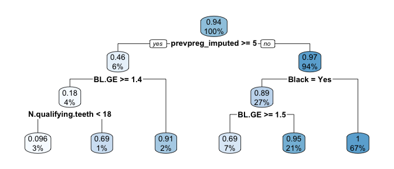
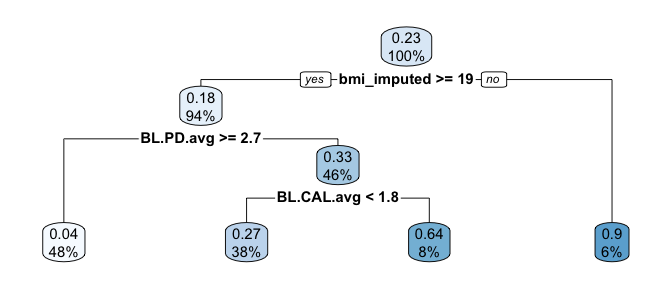

PUBH 7485 Homework 4
================

``` r
# Read in data
load(here("data", "OPT_Study_Mediation_PUBH7485_8485_v2.Rdata"))
```

## Impute

``` r
# Impute continuous data
# Calculate medians
median_bmi <- median(opt_mediation$BMI, na.rm = TRUE)
median_cigday <- median(opt_mediation$BL.Cig.Day, na.rm = TRUE)
median_drinksday <- median(opt_mediation$BL.Drks.Day, na.rm = TRUE)
median_prevpreg <- median(opt_mediation$N.prev.preg, na.rm = TRUE)
median_livingkids <- median(opt_mediation$N.living.kids, na.rm = TRUE)
median_birthweight <- median(opt_mediation$Birthweight, na.rm = TRUE)
median_V5..BOP <- median(opt_mediation$V5..BOP, na.rm = TRUE)

# Create new imputed columns
opt_mediation$bmi_imputed <- ifelse(is.na(opt_mediation$BMI), median_bmi, opt_mediation$BMI)
opt_mediation$cigday_imputed <- ifelse(is.na(opt_mediation$BL.Cig.Day), median_cigday,
  opt_mediation$BL.Cig.Day
)
opt_mediation$drinksday_imputed <- ifelse(is.na(opt_mediation$BL.Drks.Day),
  median_drinksday, opt_mediation$BL.Drks.Day
)
opt_mediation$prevpreg_imputed <- ifelse(is.na(opt_mediation$N.prev.preg),
  median_prevpreg, opt_mediation$N.prev.preg
)
opt_mediation$livingkids_imputed <- ifelse(is.na(opt_mediation$N.living.kids),
  median_livingkids, opt_mediation$N.living.kids
)
opt_mediation$birthweight_imputed <- ifelse(is.na(opt_mediation$Birthweight),
  median_birthweight, opt_mediation$Birthweight
)
opt_mediation$V5..BOP_imputed <- ifelse(is.na(opt_mediation$V5..BOP),
  median_V5..BOP, opt_mediation$V5..BOP
)
opt_mediation <- opt_mediation %>%
  fill(Any.live.ptb.sb.sp.ab.in.ab, .direction = "downup")

# Impute categorical data
# Create new imputed columns
opt_mediation$hisp_imputed <- ifelse(is.na(opt_mediation$Hisp), "Yes", opt_mediation$Hisp)
opt_mediation$diabtype_imputed <- ifelse(is.na(opt_mediation$BL.Diab.Type), "Type II",
  opt_mediation$BL.Diab.Type
)
opt_mediation$tobuse_imputed <- ifelse(is.na(opt_mediation$Use.Tob), "No", opt_mediation$Use.Tob)
opt_mediation$alcuse_imputed <- ifelse(is.na(opt_mediation$Use.Alc), "No", opt_mediation$Use.Alc)
opt_mediation$addiction_imputed <- ifelse(is.na(opt_mediation$Drug.Add), "No", opt_mediation$Drug.Add)


# Create change in proportion of sites that bleed variable
opt_mediation <- opt_mediation %>%
  mutate(BOP_change = (V5..BOP_imputed - BL..BOP))

# Create numeric group
opt_mediation <- opt_mediation %>%
  mutate(group_num = fct_recode(Group,
    "1" = "T",
    "0" = "C"
  )) %>%
  mutate(group_num = as.numeric(as.character(group_num)))

# Find median of mediator
median(opt_mediation$BOP_change)
```

    ## [1] -7

``` r
# -7
```

## Question 1: Mediation analysis

### a. Mediator model

``` r
mediator <- lm(BOP_change ~ Group + White + Nat.Am + Diabetes + cigday_imputed + Any.live.ptb.sb.sp.ab.in.ab + BL.PD.avg + I(BL.PD.avg^2) + BL.CAL.avg + I(BL.CAL.avg^2), data = opt_mediation)
round(summary(mediator)$coefficients, digits = 3)
```

    ##                                Estimate Std. Error t value Pr(>|t|)
    ## (Intercept)                      28.984     13.618   2.128    0.034
    ## GroupT                          -19.821      1.511 -13.121    0.000
    ## WhiteYes                          0.454      1.697   0.268    0.789
    ## Nat.AmYes                        -3.720      1.731  -2.149    0.032
    ## DiabetesYes                      -1.567      4.264  -0.367    0.713
    ## cigday_imputed                    0.082      0.329   0.251    0.802
    ## Any.live.ptb.sb.sp.ab.in.abYes   -2.330      1.390  -1.676    0.094
    ## BL.PD.avg                       -18.803      9.564  -1.966    0.050
    ## I(BL.PD.avg^2)                    2.255      1.516   1.487    0.137
    ## BL.CAL.avg                        6.508      3.966   1.641    0.101
    ## I(BL.CAL.avg^2)                  -1.817      1.309  -1.388    0.166

\###b. Outcome model with mediator

``` r
outcome_bw <- lm(birthweight_imputed ~ Group + BOP_change + Group:BOP_change + White + Nat.Am + Diabetes + cigday_imputed + Any.live.ptb.sb.sp.ab.in.ab + BL.PD.avg + I(BL.PD.avg^2) + BL.CAL.avg + I(BL.CAL.avg^2), data = opt_mediation)
round(summary(outcome_bw)$coefficients, digits = 3)
```

    ##                                Estimate Std. Error t value Pr(>|t|)
    ## (Intercept)                     3147.82     565.50   5.566    0.000
    ## GroupT                            10.48      89.00   0.118    0.906
    ## BOP_change                         3.79       2.15   1.763    0.078
    ## WhiteYes                          72.58      69.56   1.044    0.297
    ## Nat.AmYes                        -94.68      71.28  -1.328    0.185
    ## DiabetesYes                      247.60     174.92   1.415    0.157
    ## cigday_imputed                   -20.26      13.49  -1.502    0.134
    ## Any.live.ptb.sb.sp.ab.in.abYes  -153.03      57.08  -2.681    0.008
    ## BL.PD.avg                        111.36     396.28   0.281    0.779
    ## I(BL.PD.avg^2)                     8.80      62.57   0.141    0.888
    ## BL.CAL.avg                       -48.63     163.80  -0.297    0.767
    ## I(BL.CAL.avg^2)                  -28.73      53.81  -0.534    0.594
    ## GroupT:BOP_change                 -7.55       3.52  -2.146    0.032

``` r
outcome_preg <- glm(Preg.ended...37.wk ~ Group + BOP_change + Group:BOP_change + White + Nat.Am + Diabetes + cigday_imputed + Any.live.ptb.sb.sp.ab.in.ab + BL.PD.avg + I(BL.PD.avg^2) + BL.CAL.avg + I(BL.CAL.avg^2), data = opt_mediation, family = binomial)
round(summary(outcome_preg)$coefficients, digits = 3)
```

    ##                                Estimate Std. Error z value Pr(>|z|)
    ## (Intercept)                       0.411      2.377   0.173    0.863
    ## GroupT                            0.155      0.394   0.394    0.694
    ## BOP_change                       -0.003      0.009  -0.369    0.712
    ## WhiteYes                         -0.196      0.327  -0.599    0.549
    ## Nat.AmYes                         0.021      0.350   0.060    0.952
    ## DiabetesYes                       1.602      0.586   2.737    0.006
    ## cigday_imputed                    0.040      0.051   0.790    0.429
    ## Any.live.ptb.sb.sp.ab.in.abYes    0.721      0.287   2.510    0.012
    ## BL.PD.avg                        -1.594      1.691  -0.943    0.346
    ## I(BL.PD.avg^2)                    0.187      0.270   0.691    0.490
    ## BL.CAL.avg                       -0.076      0.774  -0.098    0.922
    ## I(BL.CAL.avg^2)                   0.013      0.255   0.050    0.960
    ## GroupT:BOP_change                 0.035      0.019   1.837    0.066

\###c. Calculating CDE and NIE

#### Birthweight

``` r
# 7 is the treatment*mediator interaction (13 in mine)
# 2 is the treatment parameter
# 3 is the mediator parameter
# Note: NDE + NIE should be close to ATE
# CDE
CDE <- outcome_bw$coefficients[2] + (outcome_bw$coefficients[13]*-7)
CDE
```

    ## GroupT 
    ##   63.3

``` r
### Add mean or median of the mediator value...

# NIE
opt_mediation0 <- opt_mediation
opt_mediation0$group_num <- 0
NIE <- outcome_bw$coefficients[3] * mediator$coefficients[2] +
  outcome_bw$coefficients[13] * mediator$coefficients[2]
NIE
```

    ## BOP_change 
    ##       74.5

``` r
# Note - the group has to be numeric
```

``` r
# Bootstrap for SE and CI
n <- nrow(opt_mediation)
CDE.boot <- NULL
NIE.boot <- NULL
B <- 100
set.seed((2123))
for (i in 1:B) {
  opt_mediation.boot <- opt_mediation[sample(1:n, n, replace = TRUE), ]
  outcome.boot <- lm(birthweight_imputed ~ Group + BOP_change + Group:BOP_change + White + Nat.Am + Diabetes + cigday_imputed + Any.live.ptb.sb.sp.ab.in.ab + BL.PD.avg + I(BL.PD.avg^2) + BL.CAL.avg + I(BL.CAL.avg^2), data = opt_mediation.boot)
  mediator.boot <- lm(BOP_change ~ Group + White + Nat.Am + Diabetes + cigday_imputed + Any.live.ptb.sb.sp.ab.in.ab + BL.PD.avg + I(BL.PD.avg^2) + BL.CAL.avg + I(BL.CAL.avg^2), data = opt_mediation.boot)
  opt_mediation0.boot <- opt_mediation.boot
  opt_mediation0.boot$group_num <- 0
  CDE.boot <- c(
    CDE.boot,
    outcome.boot$coefficients[2] + (outcome.boot$coefficients[13]*-7)
  )
  NIE.boot <- c(
    NIE.boot,
     outcome.boot$coefficients[3] * mediator.boot$coefficients[2] + 
      outcome.boot$coefficients[13] * mediator.boot$coefficients[2]
  )
}
```

``` r
# Results
CDE
```

    ## GroupT 
    ##   63.3

``` r
SE_CDE <- sd(CDE.boot)
SE_CDE
```

    ## [1] 77.7

``` r
CI_CDE <- CDE + c(-1, 1)*qnorm(0.975)*SE_CDE
CI_CDE
```

    ## [1] -88.9 215.5

``` r
NIE
```

    ## BOP_change 
    ##       74.5

``` r
SE_NIE <- sd(NIE.boot) 
SE_NIE
```

    ## [1] 52.5

``` r
CI_NIE <- NIE + c(-1, 1)*qnorm(0.975)*SE_NIE
CI_NIE
```

    ## [1] -28.3 177.4

#### Pregnancy ended

``` r
# 7 is the treatment*mediator interaction (13 in mine)
# 2 is the treatment parameter
# 3 is the mediator parameter
# if treatment*covariate interactions: add an additional term which is the expected value of the covariates

# Note: NDE + NIE should be close to ATE
# CDE
CDE <- outcome_preg$coefficients[2] + (outcome_preg$coefficients[13]*-7)
CDE
```

    ##  GroupT 
    ## -0.0886

``` r
### Add mean or median of the mediator value...

# NIE
opt_mediation0 <- opt_mediation
opt_mediation0$group_num <- 0
NIE <- outcome_preg$coefficients[3] * mediator$coefficients[2] +
  outcome_preg$coefficients[13] * mediator$coefficients[2]
NIE
```

    ## BOP_change 
    ##     -0.621

``` r
# Note - the group has to be numeric
```

``` r
# Bootstrap for SE and CI
n <- nrow(opt_mediation)
CDE.boot <- NULL
NIE.boot <- NULL
B <- 100
set.seed((2123))
for (i in 1:B) {
  opt_mediation.boot <- opt_mediation[sample(1:n, n, replace = TRUE), ]
  outcome.boot <- glm(Preg.ended...37.wk ~ Group + BOP_change + Group:BOP_change + White + Nat.Am + Diabetes + cigday_imputed + Any.live.ptb.sb.sp.ab.in.ab + BL.PD.avg + I(BL.PD.avg^2) + BL.CAL.avg + I(BL.CAL.avg^2), data = opt_mediation.boot, family = binomial())
  mediator.boot <- lm(BOP_change ~ Group + White + Nat.Am + Diabetes + cigday_imputed + Any.live.ptb.sb.sp.ab.in.ab + BL.PD.avg + I(BL.PD.avg^2) + BL.CAL.avg + I(BL.CAL.avg^2), data = opt_mediation.boot)
  opt_mediation0.boot <- opt_mediation.boot
  opt_mediation0.boot$group_num <- 0
  CDE.boot <- c(
    CDE.boot,
    outcome.boot$coefficients[2] + (outcome.boot$coefficients[13]*-7)
  )
  NIE.boot <- c(
    NIE.boot,
     outcome.boot$coefficients[3] * mediator.boot$coefficients[2] + 
      outcome.boot$coefficients[13] * mediator.boot$coefficients[2]
  )
}
```

``` r
# Results
CDE
```

    ##  GroupT 
    ## -0.0886

``` r
SE_CDE <- sd(CDE.boot)
SE_CDE
```

    ## [1] 0.34

``` r
CI_CDE <- CDE + c(-1, 1)*qnorm(0.975)*SE_CDE
CI_CDE
```

    ## [1] -0.755  0.578

``` r
NIE
```

    ## BOP_change 
    ##     -0.621

``` r
SE_NIE <- sd(NIE.boot) 
SE_NIE
```

    ## [1] 0.39

``` r
CI_NIE <- NIE + c(-1, 1)*qnorm(0.975)*SE_NIE
CI_NIE
```

    ## [1] -1.384  0.143

## Question 2:

Fit flexible regression models for the birthweight and whether or not
the pregnancy ended before 37 weeks outcomes in the OPT study, and find
the estimated optimal treatment rule.

``` r
# Regression Output - birthweight
m1 <- glm(birthweight_imputed ~ Group*(Clinic + Age + Black + White + Nat.Am + Education + Public.Asstce + bmi_imputed + Hypertension + Diabetes + cigday_imputed + drinksday_imputed + prevpreg_imputed + Any.live.ptb.sb.sp.ab.in.ab + N.qualifying.teeth + BL.GE + BL..BOP + BL.PD.avg + BL.CAL.avg + BL.Calc.I + BL.Pl.I), data = opt_mediation, family = "gaussian")
round(summary(m1)$coefficients, digits = 3)
```

    ##                                        Estimate Std. Error t value Pr(>|t|)
    ## (Intercept)                            2469.192     448.64   5.504    0.000
    ## GroupT                                 1436.815     833.55   1.724    0.085
    ## ClinicMN                                -53.800     141.93  -0.379    0.705
    ## ClinicMS                                404.178     215.74   1.873    0.062
    ## ClinicNY                                194.729     182.89   1.065    0.287
    ## Age                                       4.633       7.28   0.636    0.525
    ## BlackYes                               -349.134     151.28  -2.308    0.021
    ## WhiteYes                                -10.576     131.89  -0.080    0.936
    ## Nat.AmYes                              -142.248     136.23  -1.044    0.297
    ## EducationLT 8 yrs                      -114.866      92.61  -1.240    0.215
    ## EducationMT 12 yrs                       37.812      91.12   0.415    0.678
    ## Public.AsstceYes                       -101.609      84.44  -1.203    0.229
    ## bmi_imputed                               3.331       5.40   0.617    0.537
    ## HypertensionY                          -744.806     240.23  -3.100    0.002
    ## DiabetesYes                             269.095     245.48   1.096    0.273
    ## cigday_imputed                          -11.671      17.04  -0.685    0.494
    ## drinksday_imputed                        89.382     125.73   0.711    0.477
    ## prevpreg_imputed                         66.214      27.42   2.415    0.016
    ## Any.live.ptb.sb.sp.ab.in.abYes         -270.300      72.84  -3.711    0.000
    ## N.qualifying.teeth                       -0.932       9.50  -0.098    0.922
    ## BL.GE                                   398.474     166.50   2.393    0.017
    ## BL..BOP                                  -8.079       3.09  -2.614    0.009
    ## BL.PD.avg                               454.306     151.92   2.990    0.003
    ## BL.CAL.avg                             -345.948     123.98  -2.790    0.005
    ## BL.Calc.I                               111.602      99.07   1.126    0.260
    ## BL.Pl.I                                -261.226     108.64  -2.405    0.017
    ## GroupT:ClinicMN                        -114.278     295.58  -0.387    0.699
    ## GroupT:ClinicMS                       -1112.247     452.99  -2.455    0.014
    ## GroupT:ClinicNY                        -799.327     383.25  -2.086    0.037
    ## GroupT:Age                              -10.986      13.04  -0.842    0.400
    ## GroupT:BlackYes                          93.485     367.25   0.255    0.799
    ## GroupT:WhiteYes                        -442.209     306.49  -1.443    0.150
    ## GroupT:Nat.AmYes                       -370.988     324.66  -1.143    0.254
    ## GroupT:EducationLT 8 yrs                181.288     170.98   1.060    0.289
    ## GroupT:EducationMT 12 yrs                41.115     164.23   0.250    0.802
    ## GroupT:Public.AsstceYes                  47.504     159.13   0.299    0.765
    ## GroupT:bmi_imputed                       11.754       9.64   1.220    0.223
    ## GroupT:HypertensionY                    784.775     402.36   1.950    0.052
    ## GroupT:DiabetesYes                       74.565     363.43   0.205    0.838
    ## GroupT:cigday_imputed                   -13.558      29.57  -0.458    0.647
    ## GroupT:drinksday_imputed                -35.768     208.81  -0.171    0.864
    ## GroupT:prevpreg_imputed                 -36.790      48.78  -0.754    0.451
    ## GroupT:Any.live.ptb.sb.sp.ab.in.abYes   223.857     133.40   1.678    0.094
    ## GroupT:N.qualifying.teeth                -0.455      17.46  -0.026    0.979
    ## GroupT:BL.GE                            -25.632     352.31  -0.073    0.942
    ## GroupT:BL..BOP                            9.720       6.34   1.532    0.126
    ## GroupT:BL.PD.avg                       -674.482     272.38  -2.476    0.014
    ## GroupT:BL.CAL.avg                       322.805     259.17   1.246    0.213
    ## GroupT:BL.Calc.I                       -166.582     186.89  -0.891    0.373
    ## GroupT:BL.Pl.I                          231.209     200.31   1.154    0.249

``` r
# Regression Output - pregnancy 
m3 <- glm(Preg.ended...37.wk ~ Group*(Clinic + Age + Black + White + Nat.Am + Education + Public.Asstce + bmi_imputed + Hypertension + Diabetes + cigday_imputed + drinksday_imputed + prevpreg_imputed + Any.live.ptb.sb.sp.ab.in.ab + N.qualifying.teeth + BL.GE + BL..BOP + BL.PD.avg + BL.CAL.avg + BL.Calc.I + BL.Pl.I), data = opt_mediation, family = "binomial")
round(summary(m3)$coefficients, digits = 3)
```

    ##                                       Estimate Std. Error z value Pr(>|z|)
    ## (Intercept)                             -0.783      2.659  -0.294    0.768
    ## GroupT                                  -7.578      4.801  -1.578    0.114
    ## ClinicMN                                 1.076      0.698   1.541    0.123
    ## ClinicMS                                 0.335      1.042   0.322    0.747
    ## ClinicNY                                 0.761      0.914   0.833    0.405
    ## Age                                      0.002      0.036   0.052    0.959
    ## BlackYes                                 0.794      0.784   1.013    0.311
    ## WhiteYes                                 0.122      0.703   0.174    0.862
    ## Nat.AmYes                                0.515      0.744   0.691    0.489
    ## EducationLT 8 yrs                        0.290      0.459   0.632    0.527
    ## EducationMT 12 yrs                       0.040      0.439   0.092    0.927
    ## Public.AsstceYes                         0.404      0.448   0.901    0.367
    ## bmi_imputed                              0.013      0.025   0.536    0.592
    ## HypertensionY                            2.645      0.871   3.036    0.002
    ## DiabetesYes                              1.051      0.943   1.114    0.265
    ## cigday_imputed                           0.114      0.069   1.651    0.099
    ## drinksday_imputed                       -1.524      0.928  -1.644    0.100
    ## prevpreg_imputed                         0.009      0.127   0.067    0.946
    ## Any.live.ptb.sb.sp.ab.in.abYes           0.719      0.371   1.940    0.052
    ## N.qualifying.teeth                      -0.015      0.047  -0.321    0.748
    ## BL.GE                                   -2.186      0.839  -2.607    0.009
    ## BL..BOP                                  0.019      0.015   1.281    0.200
    ## BL.PD.avg                               -0.523      0.746  -0.701    0.484
    ## BL.CAL.avg                               0.230      0.610   0.377    0.706
    ## BL.Calc.I                               -0.006      0.482  -0.013    0.990
    ## BL.Pl.I                                  0.806      0.552   1.460    0.144
    ## GroupT:ClinicMN                          0.266      1.713   0.155    0.877
    ## GroupT:ClinicMS                          2.758      2.561   1.077    0.281
    ## GroupT:ClinicNY                          1.595      2.180   0.732    0.464
    ## GroupT:Age                               0.058      0.071   0.819    0.413
    ## GroupT:BlackYes                          1.944      1.997   0.974    0.330
    ## GroupT:WhiteYes                          2.436      1.540   1.582    0.114
    ## GroupT:Nat.AmYes                         2.609      1.791   1.457    0.145
    ## GroupT:EducationLT 8 yrs               -15.503    640.282  -0.024    0.981
    ## GroupT:EducationMT 12 yrs                0.416      0.871   0.477    0.633
    ## GroupT:Public.AsstceYes                  0.304      1.095   0.277    0.781
    ## GroupT:bmi_imputed                      -0.037      0.055  -0.681    0.496
    ## GroupT:HypertensionY                    -3.893      2.277  -1.709    0.087
    ## GroupT:DiabetesYes                       0.772      1.481   0.521    0.602
    ## GroupT:cigday_imputed                   -0.213      0.162  -1.314    0.189
    ## GroupT:drinksday_imputed                 1.308      1.379   0.949    0.343
    ## GroupT:prevpreg_imputed                 -0.067      0.305  -0.221    0.825
    ## GroupT:Any.live.ptb.sb.sp.ab.in.abYes    0.180      0.809   0.223    0.823
    ## GroupT:N.qualifying.teeth               -0.075      0.102  -0.737    0.461
    ## GroupT:BL.GE                             1.027      2.121   0.484    0.628
    ## GroupT:BL..BOP                          -0.030      0.037  -0.812    0.417
    ## GroupT:BL.PD.avg                         2.188      1.531   1.429    0.153
    ## GroupT:BL.CAL.avg                       -1.569      1.404  -1.118    0.264
    ## GroupT:BL.Calc.I                         0.517      1.082   0.478    0.633
    ## GroupT:BL.Pl.I                          -0.310      1.147  -0.270    0.787

Please summarize the proportion who would benefit from treatment.

``` r
# Determine Optimal Treatment Assignment for Each Subject
# Note: does not work well with the group_num variable - must be a factor?
# Birth weight
data_trt <- data_ctr <- opt_mediation
data_trt$Group = "T"
data_ctr$Group = "C"
pred1 <- predict(m1, newdata = data_trt, type = "response")
pred0 <- predict(m1, newdata = data_ctr, type = "response")
opt_treat <- ifelse(pred1 > pred0, 1, 0)
table(opt_treat)
```

    ## opt_treat
    ##   0   1 
    ## 216 374

``` r
# Pregnancy ended
data_trt <- data_ctr <- opt_mediation
data_trt$Group = "T"
data_ctr$Group = "C"
pred1 <- predict(m3, newdata = data_trt, type = "response")
pred0 <- predict(m3, newdata = data_ctr, type = "response")
opt_treat <- ifelse(pred1 > pred0, 1, 0)

table(opt_treat)
```

    ## opt_treat
    ##   0   1 
    ## 393 197

Write a simple piece of code which would return the optimal treatment
decision for a given set of covariates.

``` r
# Birth weight
# Create variable for select covariates: a baseline fraction of bleeding when probed greater than/equal to 60 and age greater than/equal to 30
opt_g <- opt_mediation %>%
  mutate(Group = if_else(BL..BOP >= 60 & Age >= 30, 1, 0),
           Group = as.factor(Group)
         )

m1 <- glm(birthweight_imputed ~ Group*(Clinic + Age + Black + White + Nat.Am + Education + Public.Asstce + bmi_imputed + Hypertension + Diabetes + cigday_imputed + drinksday_imputed + prevpreg_imputed + Any.live.ptb.sb.sp.ab.in.ab + N.qualifying.teeth + BL.GE + BL..BOP + BL.PD.avg + BL.CAL.avg + BL.Calc.I + BL.Pl.I), data = opt_g, family = "gaussian")

data_trt <- data_ctr <- opt_g
data_trt$Group = "1"
data_ctr$Group = "0"
pred1 <- predict(m1, newdata = data_trt, type = "response")
pred0 <- predict(m1, newdata = data_ctr, type = "response")
opt_treat <- ifelse(pred1 > pred0, 1, 0)
table(opt_treat)
```

    ## opt_treat
    ##   0   1 
    ##  98 492

``` r
# Is treatment optimal for individuals with the given covariates?
isTRUE(mean(pred1) > mean(pred0))
```

    ## [1] TRUE

``` r
# Pregnancy ended
m3 <- glm(Preg.ended...37.wk ~ Group*(Clinic + Age + Black + White + Nat.Am + Education + Public.Asstce + bmi_imputed + Hypertension + Diabetes + cigday_imputed + drinksday_imputed + prevpreg_imputed + Any.live.ptb.sb.sp.ab.in.ab + N.qualifying.teeth + BL.GE + BL..BOP + BL.PD.avg + BL.CAL.avg + BL.Calc.I + BL.Pl.I), data = opt_g, family = "binomial")

data_trt <- data_ctr <- opt_g
data_trt$Group = "1"
data_ctr$Group = "0"
pred1 <- predict(m3, newdata = data_trt, type = "response")
pred0 <- predict(m3, newdata = data_ctr, type = "response")
opt_treat <- ifelse(pred1 > pred0, 1, 0)
table(opt_treat)
```

    ## opt_treat
    ##   0   1 
    ## 495  95

``` r
# Is treatment optimal for individuals with the given covariates?
isTRUE(mean(pred0) > mean(pred1))
```

    ## [1] FALSE

## Question 3. C-learning

Taking a classification-learning (C-learning) perspective, estimate an
optimal “decision list” treatment rule for each outcome in the OPT
study.

### Birthweight

-   Step 1a: Fit a random forest to estimate $E(Y|A, X) = \mu(A, X)$

``` r
data_trt_only <- opt_mediation[which(opt_mediation$Group == "T"), ]
data_ctr_only <- opt_mediation[which(opt_mediation$Group == "C"), ]
m1_treat <- ranger(birthweight_imputed ~ Clinic + Age + Black + White + Nat.Am + Education + Public.Asstce + bmi_imputed + Hypertension + Diabetes + cigday_imputed + drinksday_imputed + prevpreg_imputed + Any.live.ptb.sb.sp.ab.in.ab + N.qualifying.teeth + BL.GE + BL..BOP + BL.PD.avg + BL.CAL.avg + BL.Calc.I + BL.Pl.I, data = data_trt_only, seed = 2123, probability = TRUE)
m1_ctr <- ranger(birthweight_imputed ~ Clinic + Age + Black + White + Nat.Am + Education + Public.Asstce + bmi_imputed + Hypertension + Diabetes + cigday_imputed + drinksday_imputed + prevpreg_imputed + Any.live.ptb.sb.sp.ab.in.ab + N.qualifying.teeth + BL.GE + BL..BOP + BL.PD.avg + BL.CAL.avg + BL.Calc.I + BL.Pl.I, data = data_ctr_only, seed = 2123, probability = TRUE)
```

-   Step 1b: Estimate the conditional average treatment effect as
    $Z_i = \hat{\mu}(1, X_i) - \hat{\mu}(0, X_i)$

``` r
pred1 <- predict(m1_treat, data = data_trt)$predictions[, 2]
pred1[opt_mediation$Group == "T"] <- m1_treat$predictions[, 2]
pred0 <- predict(m1_ctr, data = data_ctr)$predictions[, 2]
pred0[opt_mediation$Group == "C"] <- m1_ctr$predictions[, 2]
opt_mediation$Z <- pred1 - pred0
```

Step 2:

``` r
opt_mediation$Z_label <- ifelse(opt_mediation$Z > 0, 1, 0)
opt_mediation$Z_weight <- abs(opt_mediation$Z)
fit <- rpart(Z_label ~ Clinic + Age + Black + White + Nat.Am + Education + Public.Asstce + bmi_imputed + Hypertension + Diabetes + cigday_imputed + drinksday_imputed + prevpreg_imputed + Any.live.ptb.sb.sp.ab.in.ab + N.qualifying.teeth + BL.GE + BL..BOP + BL.PD.avg + BL.CAL.avg + BL.Calc.I + BL.Pl.I, 
    data = opt_mediation, weights = Z_weight,
    maxdepth = 3); rpart.plot(fit)
```

<!-- -->

### Pregnancy ended

-   Step 1a: Fit a random forest to estimate $E(Y|A, X) = \mu(A, X)$

``` r
data_trt_only <- opt_mediation[which(opt_mediation$Group == "T"), ]
data_ctr_only <- opt_mediation[which(opt_mediation$Group == "C"), ]
m1_treat <- ranger(factor(Preg.ended...37.wk) ~ Clinic + Age + Black + White + Nat.Am + Education + Public.Asstce + bmi_imputed + Hypertension + Diabetes + cigday_imputed + drinksday_imputed + prevpreg_imputed + Any.live.ptb.sb.sp.ab.in.ab + N.qualifying.teeth + BL.GE + BL..BOP + BL.PD.avg + BL.CAL.avg + BL.Calc.I + BL.Pl.I, data = data_trt_only, seed = 2123, probability = TRUE)
m1_ctr <- ranger(factor(Preg.ended...37.wk) ~ Clinic + Age + Black + White + Nat.Am + Education + Public.Asstce + bmi_imputed + Hypertension + Diabetes + cigday_imputed + drinksday_imputed + prevpreg_imputed + Any.live.ptb.sb.sp.ab.in.ab + N.qualifying.teeth + BL.GE + BL..BOP + BL.PD.avg + BL.CAL.avg + BL.Calc.I + BL.Pl.I, data = data_ctr_only, seed = 2123, probability = TRUE)
```

-   Step 1b: Estimate the conditional average treatment effect as
    $Z_i = \hat{\mu}(1, X_i) - \hat{\mu}(0, X_i)$

``` r
pred1 <- predict(m1_treat, data = data_trt)$predictions[, 2]
pred1[opt_mediation$Group == "T"] <- m1_treat$predictions[, 2]
pred0 <- predict(m1_ctr, data = data_ctr)$predictions[, 2]
pred0[opt_mediation$Group == "C"] <- m1_ctr$predictions[, 2]
opt_mediation$Z <- pred1 - pred0
```

Step 2:

``` r
opt_mediation$Z_label <- ifelse(opt_mediation$Z > 0, 1, 0)
opt_mediation$Z_weight <- abs(opt_mediation$Z)
fit <- rpart(Z_label ~ Clinic + Age + Black + White + Nat.Am + Education + Public.Asstce + bmi_imputed + Hypertension + Diabetes + cigday_imputed + drinksday_imputed + prevpreg_imputed + Any.live.ptb.sb.sp.ab.in.ab + N.qualifying.teeth + BL.GE + BL..BOP + BL.PD.avg + BL.CAL.avg + BL.Calc.I + BL.Pl.I, 
    data = opt_mediation, weights = Z_weight,
    maxdepth = 3); rpart.plot(fit)
```

<!-- -->
